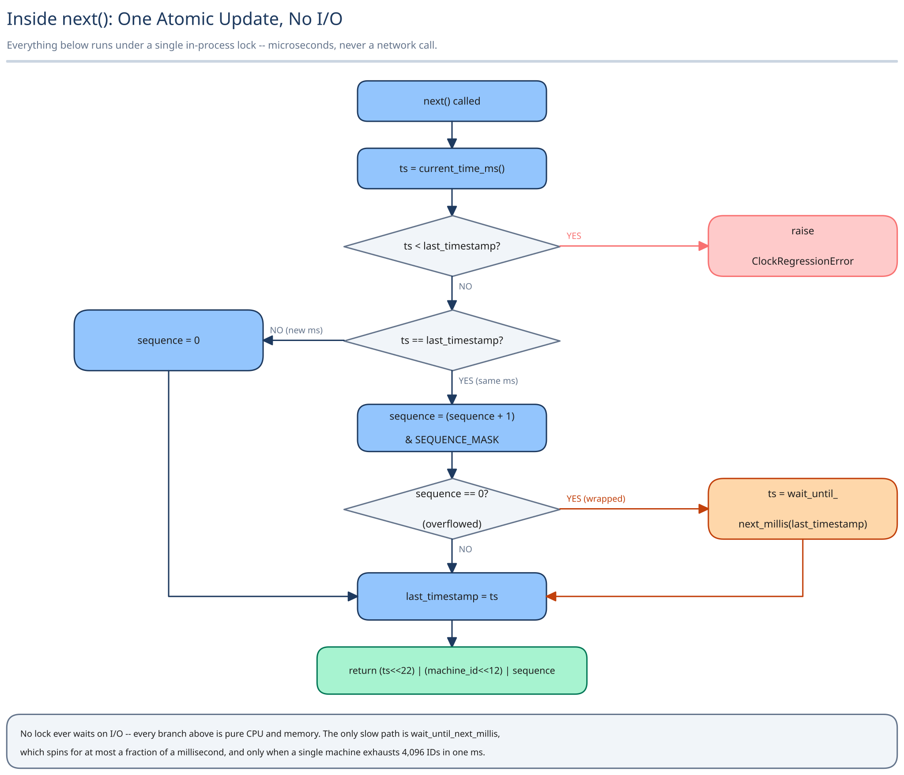

# Module 02 — Low-Level Design



## Interfaces vs. implementations

- **`IdGenerator`** *(interface)* → **`SnowflakeIdGenerator`** — owns the bit-composition logic; the only thing the rest of the application calls.
- **`MachineIdProvider`** *(interface)* → **`LeasedMachineIdProvider`** — talks to the registrar once, at construction, and caches the result for the process's lifetime.

## Pseudocode for `next()`

```
class SnowflakeIdGenerator implements IdGenerator:
    machine_id: int          # from MachineIdProvider, set once at construction
    last_timestamp: int = -1
    sequence: int = 0

    def next() -> uint64:
        atomic:                          # single in-process lock — see below
            ts = current_time_ms()

            if ts < last_timestamp:
                raise ClockRegressionError    # or: stall until ts catches up

            if ts == last_timestamp:
                sequence = (sequence + 1) & SEQUENCE_MASK   # 12 bits
                if sequence == 0:                            # exhausted this ms
                    ts = wait_until_next_millis(last_timestamp)
            else:
                sequence = 0

            last_timestamp = ts
            return (ts << 22) | (machine_id << 12) | sequence
```

## Error cases worth designing for deliberately

- **Clock regression** (`ts < last_timestamp`) — never silently proceed; either raise so the caller can decide, or stall until the clock catches up. Silently generating anyway risks a genuine duplicate.
- **Sequence exhaustion within one millisecond** (12 bits, 4,096 values) — don't wrap around and reuse `0`; wait for the next millisecond tick instead, which is what `wait_until_next_millis` does above.

## Concurrency at the code level

The only shared mutable state is the `(last_timestamp, sequence)` pair, and it's scoped to **one process** — a single in-process mutex (or a CAS loop) around it is sufficient. This deliberately does **not** need a distributed lock: uniqueness *across* machines already comes from the `machine_id` field, not from any cross-process coordination. The concurrency problem that does need care is fully contained inside one process's memory, matching this guide's general rule that concurrency handling should sit exactly where the actual race lives — not one level higher "to be safe."

## Design patterns you just used, named

- **Strategy** — `IdGenerator` is a strategy; `SnowflakeIdGenerator` is one implementation, and a `UuidV4Generator` or a wider 128-bit variant could sit behind the exact same interface without callers changing.
- **Provider** — `MachineIdProvider` hides *how* a machine ID was obtained (leased from a registrar, or hardcoded for a single-node test harness) behind one call the generator doesn't need to know the details of.

## Practice: extend it yourself

1. Add a region-ID bit field so IDs are disambiguated by region too — which existing field would you shrink to make room, and what's the new maximum machine count per region?
2. Implement the "stall" clock-regression strategy concretely: how long do you stall before giving up, and what does the caller see if the clock never catches up?
