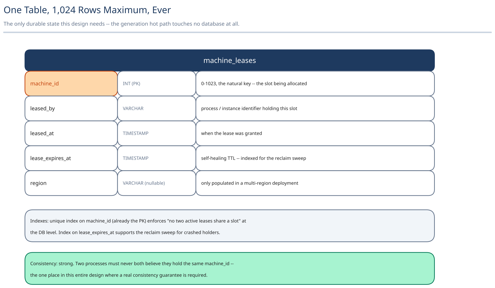

# Module 03 — Database Design

## From entities to schema

The generation hot path itself touches **no database at all** — that's the entire point of the architecture. The only durable state this design needs is the machine-ID lease registry:

**`machine_leases`**
- `machine_id` (PK, `0`–`1023`)
- `leased_by` (process/instance identifier)
- `leased_at`
- `lease_expires_at`
- `region` (if multi-region — see Module 01's "what you'd revisit")

### Why `machine_id` is the primary key, not a surrogate one

The entire job of this table is answering "which of the 1,024 slots is currently free" — the natural key *is* the thing being allocated. A surrogate key would just be an extra indirection over the one value that actually matters.

### Why `lease_expires_at`, not a boolean `in_use` flag

A process that crashes without releasing its lease must not permanently strand that machine ID. An expiring lease self-heals — the next registrar request past `lease_expires_at` can reclaim it. A boolean flag would need a dedicated reaper watching specifically for crashed holders of *this* table; the same TTL-style expiry this guide's caching pages already rely on covers it for free.

## Indexes

- **Unique index on `machine_id`** (already the PK) — enforces "no two active leases share a machine ID" at the database level, not just in application logic.
- **Index on `lease_expires_at`** — for the occasional sweep that opportunistically reclaims obviously-expired leases.

## Consistency

`machine_leases` needs **strong consistency** — two processes must never both believe they hold the same `machine_id`. This is the one place in the entire design where a real consistency guarantee matters, precisely because it's the one place coordination actually happens. Everything else — the ID-generation call itself — has no consistency requirement at the database level, because it never touches a database.

## Scaling the schema

**1,024 rows, maximum, ever** — bounded by the 10-bit machine-ID field. This table will never need sharding or read replicas; it's arguably the least scaling-sensitive table anywhere in this guide, worth saying explicitly since "shard it" is the wrong reflex here.

## Connecting it back

The "no coordination on the hot path" requirement drove the bit-field-composition architecture in Module 01, which meant the *only* interface needing a real backing store is `MachineIdProvider` — not `IdGenerator` itself. That's why the schema above is small, rarely written, and strongly consistent, while everything else in this design deliberately touches no database at all.
