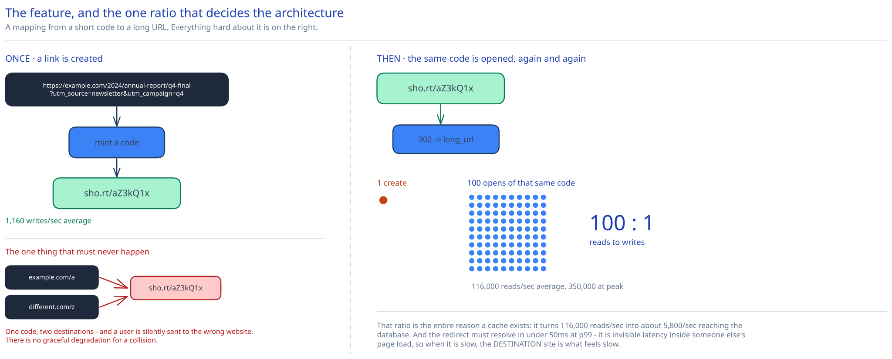

# Module 00 — Overview



> This case study is the interview-depth version of the URL shortener. The guide's three
> [fundamentals modules](../../../01-hld-fundamentals.md) use the same system as a teaching example to
> introduce HLD, LLD and DB design one layer at a time. This case study assumes you've seen that and
> goes after the parts a real interview actually pushes on — above all, **how the short code is
> generated and how collisions are prevented**, which gets [its own module](./02-short-code-generation.md).

## The feature, with no infrastructure in it yet

Someone pastes `https://example.com/2024/annual-report/q4-final-v3?utm_source=newsletter&utm_campaign=…` and gets back `sho.rt/aZ3kQ1x`. Later, anyone who opens that short link lands on the original page. That's the whole product surface: a mapping from a short string to a long one, plus a redirect.

The design problem is not the feature — it's that **the code is the primary key, and you have to mint it before you know whether it's free.** Every other hard constraint follows from that one fact:

- The code must be **short** (7 characters, not 32) because the entire value proposition is brevity. That means the code space is small enough that collisions are a real event, not a theoretical one.
- The code must be **unique** — handing out `aZ3kQ1x` for two different long URLs doesn't degrade the service, it *silently sends users to the wrong website*. There is no graceful degradation for a collision.
- The code must be **minted fast**, at write time, in a system where 1,000+ writes/second arrive at many independent app servers that cannot coordinate per-request.

Those three pull against each other, and how you resolve them is the interview. Everything else — the cache, the replica, the sharding key — is standard read-heavy-system machinery.

## Requirements

**Functional:**
- `POST` a long URL, get back a short one.
- `GET` a short code, redirect to the long URL.
- Optional custom alias (`sho.rt/my-launch`) — stated as in scope, because it introduces a genuinely different failure mode from generated codes (a user-chosen code can *collide on purpose*).
- Optional expiration date, after which the code stops resolving.
- Click analytics (count, referrer, geo, timestamp) — explicitly **asynchronous**, never on the redirect's critical path.

**Non-functional** (these are what actually drive the architecture):
- **Scale:** 100M new links/day, and a **100:1 read-to-write ratio**. People click links vastly more often than they mint them.
- **Latency:** p99 redirect under 50ms server-side. A redirect is an invisible hop in someone else's user journey; anything slower is perceived as the *destination site* being slow.
- **Availability:** reads target 99.99%, writes 99.9%. These are deliberately different — a link that already exists is more valuable to keep serving than a new one is to keep accepting. See [Load Handling](./01-architecture-hld.md#load-handling).
- **Uniqueness:** hard requirement, zero tolerance. Two long URLs must never map to one code.
- **Retention:** links live 5 years by default; expired links stop resolving immediately but are garbage-collected lazily.

## Capacity Estimation

Method and per-unit numbers come from [Back-of-the-Envelope Estimation](../../foundations/back-of-envelope-estimation.md).

**Write throughput**
- 100M writes/day ÷ 86,400 s ≈ **1,160 writes/sec** average.
- Peak at 3× average (link creation clusters around business hours and campaign launches) ≈ **3,500 writes/sec**.

**Read throughput**
- 100:1 ratio → **116,000 reads/sec** average; peak ≈ **350,000 reads/sec**.
- This is *the* number the design has to survive, and it is the entire justification for a cache tier. 116k reads/sec against a relational primary is not a tuning problem, it's an architecture problem.

**Storage**
- Row: `code` (7 B) + `long_url` (~200 B average, but the tail is long — tracking parameters routinely push URLs past 500 B) + `user_id` (8 B) + `created_at`/`expires_at` (16 B) + row/index overhead (~70 B) ≈ **~300 B/row**.
- 100M/day × 365 × 5 years = **182 billion rows**.
- 182B × 300 B ≈ **55 TB** of primary data, before indexes. With the secondary index on `long_url_hash` (Module 04) call it **~70 TB**.
- That is unambiguously past a single node. Sharding is not optional here — see [Scaling the schema](./04-db-design.md#scaling-the-schema).

**Cache sizing**
- Link popularity is severely Zipfian: a small set of links (active campaigns, viral posts) absorbs most traffic. Assume the hot 1% of the last 30 days' links serves ~95% of reads.
- 30 days × 100M = 3B links; 1% = 30M entries × ~250 B (code + URL + Redis overhead) ≈ **7.5 GB**. Comfortably a small Redis cluster — cross-ref [Caching Strategies](../../hld-building-blocks/caching-strategies.md).
- The important consequence: **a 95% hit rate turns 116k reads/sec into ~5,800 reads/sec reaching the database.** That is an ordinary read-replica workload. The cache isn't an optimization here, it's the thing that makes the storage tier tractable.

**Code space sanity check**
- 7 characters over a 62-symbol alphabet = 62⁷ ≈ **3.52 × 10¹²** (3.52 trillion) possible codes.
- 5 years of writes consumes 1.82 × 10¹¹ of them ≈ **5.2% of the space.**
- Hold onto that 5.2%. It is the number that decides whether a hashing scheme is viable at all, and Module 02 does the collision math on it directly.

## Approach Walkthrough

Mint a unique short code once, at creation time; store the `code → long_url` mapping; serve redirects as a single key lookup that hits a cache 95% of the time.

The one decision that everything else hangs off is **how that code is minted**. There are three families of answer — hash the URL and truncate, encode a globally unique counter, or pre-generate a pool of codes offline and hand them out — and they differ not in performance but in *where the uniqueness guarantee lives*. Module 02 works through all three with the actual probabilities, then picks one and says why.

Because reads outnumber writes 100:1, the read path is the one worth optimizing first, and it is deliberately kept trivial: one cache `GET`, and on a miss, one indexed point lookup against a replica. There is no join, no fan-out, and no computation on the redirect path — not even the analytics write, which is fired onto a queue after the response has already been sent.

## API Surface

```
POST /api/v1/urls
  Authorization: Bearer <token>
  Idempotency-Key: <client-generated UUID>     # optional but recommended
  { "long_url": "https://…", "custom_alias": "my-launch"?, "expires_at": "2027-01-01T00:00:00Z"? }

  → 201 { "short_code": "aZ3kQ1x", "short_url": "https://sho.rt/aZ3kQ1x", "expires_at": … }
  → 400  malformed URL, unsupported scheme, or self-referential (points back at sho.rt)
  → 409  requested custom_alias is already taken   ← only reachable with custom_alias
  → 422  long_url is on the abuse blocklist        (cross-ref: distributed-denylist case study)
  → 429  rate limited
```

```
GET /{short_code}
  → 302 Location: <long_url>      # 302, not 301 — see below
  → 404  unknown code, or the code existed and has expired
  → 410  Gone, if the link was explicitly deleted rather than expired (optional refinement)
```

```
GET  /api/v1/urls/{short_code}          → 200 metadata + click stats (owner only)
DELETE /api/v1/urls/{short_code}        → 204 (soft delete; see Module 04)
```

**Why 302 and not 301.** A `301 Moved Permanently` lets the browser cache the mapping and skip the service entirely on subsequent clicks — which sounds like a free win on a read-heavy system and is the answer most candidates give. It's the wrong choice here, for two reasons that both come straight from the requirements above:

1. **Analytics is a stated requirement.** A 301 that the browser caches means later clicks never reach the service, so they are never counted. You'd be trading the product's measurement story for infrastructure savings you don't need — the cache tier already absorbs the read volume.
2. **A 301 is effectively unrevocable.** Browsers cache permanent redirects aggressively and inconsistently, with no reliable invalidation. If a link is deleted for abuse, or expires, or the owner repoints it, clients holding a cached 301 keep going to the old destination indefinitely. Given that this system also has an abuse-blocklist requirement, permanently caching a destination in clients you can't reach is a liability, not an optimization.

`302 Found` (or `307` if you need the method preserved, which for a plain link click you don't) keeps every click observable and every mapping revocable. The cost — one round trip per click — is precisely the cost the 95% cache hit rate exists to make cheap.

## Where this goes next

| Module | The question it answers |
|---|---|
| [01 · Architecture & HLD](./01-architecture-hld.md) | What are the boxes, and how does a redirect actually move through them at 350k reads/sec? |
| [02 · Short-code generation](./02-short-code-generation.md) | **How is the code minted, and how are collisions prevented?** The core of this design. |
| [03 · LLD](./03-lld.md) | What are the interfaces inside the service, and which errors are worth modelling deliberately? |
| [04 · DB design](./04-db-design.md) | What's on disk, which indexes exist, and what's the shard key? |
| [05 · Interviewer Q&A](./05-interviewer-qna.md) | The ten follow-ups this design invites, answered from decisions already made here. |
