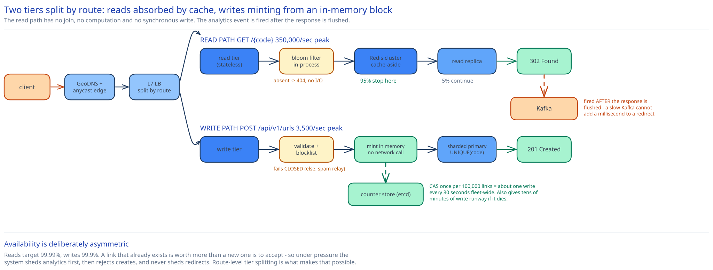

# Module 01 — Architecture & High-Level Design



## Monolith vs. microservices

**This stays a monolith, deliberately**, and that's the more defensible answer here than splitting it.

The system has exactly two operations — mint a code, resolve a code — sharing exactly one entity. There is no bounded context to draw a seam along: a "read service" and a "write service" would depend on the same table, the same schema migrations, and the same shard map, which is the definition of a distributed monolith rather than a microservice. Splitting would buy independent deployability of two components that always change together, at the cost of a network hop on the path whose entire budget is 50ms.

What *does* get separated, and why the distinction matters:

- **The read tier and write tier scale independently as separate deployments of the same binary.** A 100:1 read ratio means the read fleet needs roughly two orders of magnitude more instances. Running them as separate autoscaling groups behind different routes (`GET /{code}` versus `/api/v1/*`) gets you independent scaling *and* independent failure domains — a create-path bug that pins CPU cannot take down redirects — without the schema coupling of two codebases.
- **Analytics is a genuinely separate service**, because it has a different consistency model (eventual), a different store (columnar, cross-ref [OLTP vs OLAP considerations](../../database-design/sql-vs-nosql.md)), a different write pattern (append-only, high volume), and a different availability requirement (it can be down for an hour and nobody notices). That's four independent reasons, which is what a real service boundary looks like.
- **Abuse/blocklist checking is a separate service** because it's shared with other products and its data changes on a different cadence — cross-ref the [distributed denylist](../distributed-denylist/00-overview.md) case study.

The rule this is applying: split when the *reasons to change* differ, not when the nouns differ. Read and write share every reason to change; analytics shares none.

## Per-path walkthrough

**Redirect path (read, 350k/sec peak)**

```
Client → DNS (GeoDNS) → Anycast edge / CDN → L7 LB → Read tier
       → Redis cluster (GET code)                    [95% stop here]
       → Read replica (SELECT … WHERE code = ?)      [5% continue]
       → 302 Location: long_url
       ⤷ (after response is written) analytics event → Kafka
```

Everything on this path is one hop or a point lookup. There is no join, no aggregation, no second key lookup, and no synchronous write — deliberately, because the p99 budget is 50ms and a redirect is invisible latency inside someone else's page load. The analytics event is fired **after** the response has already been flushed to the socket, so a slow or unavailable Kafka cluster cannot add a millisecond to a redirect. That ordering is the single most important detail on this path.

Note what is *not* cached: nothing about the user, and no negative results by default. Negative caching is addressed under Load Handling below, because it turns out to be the path's real vulnerability.

**Create path (write, 3.5k/sec peak)**

```
Client → L7 LB → Write tier
       → validate URL (scheme, length, self-reference, DNS-resolvable host)
       → blocklist service (is this domain banned?)
       → [in-process] next counter value from the pre-allocated block
       → scramble + base62 → code                    (Module 02, Strategy B)
       → INSERT urls(code, long_url, long_url_hash, owner, expires_at)   ← UNIQUE(code) backstop
       → 201 { short_code }
       ⤷ block exhausted (every ~100k links)? → CAS the counter store for the next range
```

The code is minted **entirely in process memory** — one integer increment, one modular multiply, one base62 encode. No network call, no read-before-write, no retry loop. That is the payoff from Module 02's choice, and it's why the write path's p99 is a single database round trip rather than an unbounded one.

**Expiration path (async)**

```
Redirect encounters a row where expires_at < now() → 404 immediately, do not serve
   (the check is at read time — the row's continued existence is irrelevant to correctness)
Nightly batch → DELETE FROM urls WHERE expires_at < now() - grace_period
Cache: TTL on every entry is min(1 hour, time until expires_at) — so an entry can never outlive its link
```

Expiry is enforced **at read time, not by deletion**. Deletion is a storage-reclamation concern that runs on its own schedule; correctness never depends on the sweeper having run. That separation is what lets the sweeper fall days behind during an incident without serving a single expired link. The cache TTL clamp is the subtle half: a 1-hour TTL on a link expiring in 5 minutes would serve it for 55 minutes past its expiry, so the TTL has to be the minimum of the two.

## Building blocks

**GeoDNS + anycast edge** — resolves `sho.rt` to the nearest point of presence (cross-ref [DNS & Global Traffic Management](../../hld-building-blocks/dns-global-traffic.md)). Redirect latency is dominated by round trips, not compute, so cutting RTT by terminating TLS close to the user is the highest-leverage latency work available — the same reasoning [CDN](../../hld-building-blocks/cdn.md) makes generally.

**L7 load balancer, split by route** — `GET /{code}` to the read fleet, `/api/v1/*` to the write fleet (cross-ref [Load Balancing](../../hld-building-blocks/load-balancing.md)). Route-level splitting is what makes the two tiers independent failure domains.

**Read tier** — stateless, autoscaled on request rate. Stateless in the strict sense (cross-ref [Stateless vs Stateful](../../foundations/stateless-vs-stateful.md)): any instance can serve any code, so instances are freely interchangeable and scale-in is safe.

**Write tier** — stateless *except* for one thing worth being precise about: each instance holds a **pre-allocated counter block in memory**. That is per-instance state, but it is not state that needs to survive the instance — losing it discards unused codes, which Module 02 established is free. So the tier is still safely autoscalable and needs no draining logic, and it's worth being able to articulate why "holds local state" and "is not stateless" aren't the same claim.

**Redis cluster** — the `code → long_url` cache, cache-aside, LRU eviction (cross-ref [Caching Strategies](../../hld-building-blocks/caching-strategies.md)). Sharded by `code` via consistent hashing (cross-ref [Consistent Hashing](../../hld-building-blocks/consistent-hashing.md)) so adding capacity doesn't invalidate the whole keyspace. This is the component that makes the entire design viable: it's what converts 116k reads/sec into ~5.8k.

**Counter store** — a single strongly-consistent row or an etcd/ZooKeeper sequence, touched once per 100,000 links (cross-ref the [distributed coordination service](../distributed-coordination-service/00-overview.md) case study). Fleet-wide that's roughly one write every 30 seconds, so despite being a single logical point it is nowhere near a bottleneck — but it *is* a correctness-critical component, which is why Module 02 keeps the unique index as a backstop against it misbehaving.

**Sharded primary + read replicas** — 70 TB does not fit one node. Sharded by `hash(code)`; see [Scaling the schema](./04-db-design.md#scaling-the-schema) for why that key and not `created_at`.

**Kafka + analytics consumer** — click events land on a partitioned log and are aggregated into a columnar store (cross-ref [Kafka & the Distributed Log](../../hld-building-blocks/kafka-distributed-log.md)). At-least-once is fine here: a double-counted click is a rounding error in a click count, so paying for exactly-once would be buying a guarantee the data doesn't need. Contrast this with the [ad click aggregation](../ad-click-aggregation/00-overview.md) case study, where the same events feed billing and exactly-once becomes mandatory — same pipeline shape, different guarantee, purely because of what the number is used for.

## Trade-offs to make explicit

| Decision | Chosen | Alternative | Why |
|---|---|---|---|
| Redirect status code | `302 Found` | `301 Moved Permanently` | 301 lets browsers cache the mapping and skip the service, which kills the stated analytics requirement and makes deletion/expiry unenforceable against clients you can't reach. The cache tier already makes the extra round trip cheap. |
| Code generation | Block-allocated counter + bijective scramble | Hash-and-truncate with retry | Uniqueness from structure, not detection; flat create latency instead of a retry tail that worsens as the space fills. Full argument in [Module 02](./02-short-code-generation.md#chosen-b-block-allocated-counter-with-a-bijective-scramble). |
| Cache strategy | Cache-aside with clamped TTL | Write-through on create | New links are cold by definition — the median link is clicked zero times, so write-through would populate the cache with mostly-dead entries and evict genuinely hot ones. Let demand decide what's cached. |
| Analytics coupling | Async, fired after response flush | Synchronous counter increment on redirect | A synchronous `INCR` puts a second network hop and a write dependency on the path with the tightest latency budget and the highest availability target. Nothing about a click count justifies that. |
| URL deduplication | None — each create mints a new code | Same URL always returns the same code | Dedup collapses independent lifecycles (expiry, deletion, analytics, ownership) onto one row. Reasoned through in [Module 02](./02-short-code-generation.md#should-the-same-long-url-always-get-the-same-code). |
| Expiry enforcement | Checked at read time; deletion is a separate sweeper | Rely on a TTL/deletion job to remove expired rows | Correctness must not depend on a batch job having run. The sweeper can fall arbitrarily behind without ever serving an expired link. |
| Write availability target | 99.9%, lower than reads' 99.99% | One uniform target across both paths | Explicitly asymmetric: preserving existing links matters more than accepting new ones. Spending the budget where it's worth more is the point, and it licenses the degradation mode below. |

## Load Handling

- **Peak-vs-average tolerance.** Average is 116k reads/sec; peak is ~350k. But the number that actually threatens this design isn't the diurnal peak — it's a **single viral link**, where one code can absorb a six-figure QPS burst by itself. That's a hot-key problem, not a throughput problem, and it needs a different remedy: the affected Redis shard is the bottleneck, so hot keys get replicated across shards (or promoted into a small per-instance in-process LRU on the read tier, which is where a genuinely hot code belongs since it's read-only and immutable once minted). Cross-ref [Caching Strategies](../../hld-building-blocks/caching-strategies.md).

- **Where backpressure kicks in first.** At the **write path's connection pool to the primary**, not on reads. Reads are absorbed by cache and replicas and degrade gracefully; the create path terminates in a single-primary `INSERT` per shard, so a shard slowdown backs up into the pool and then into request queues. That's the right place for it to bite, given writes have the lower availability target.

- **What gets shed under overload.** In order, most-shed first:
  1. **Analytics events** — dropped at the producer if Kafka is unavailable or the local buffer is full. Already off the critical path; losing a minute of click data is invisible.
  2. **Create requests** — rejected with `429`/`503` and `Retry-After`. This is the explicit cash-out of the asymmetric availability target: under sufficient pressure the system stops accepting new links so it can keep resolving existing ones.
  3. **Redirects** — never shed. If redirects are failing, the product is down.

  Cross-ref [Backpressure & Load Shedding](../../scalability-resilience/backpressure-load-shedding.md).

- **The 404 amplification problem.** This deserves naming because it's the design's most realistic overload cause, and it isn't organic traffic. Scanners spray random 7-character strings looking for private links. Every one of those **misses the cache and reaches the database** — a cache-aside cache only holds things that exist, so unknown codes are a straight-through path to the storage tier. A scanner at 50k requests/sec would therefore deliver 50k QPS of index lookups to replicas that were sized assuming a 95% hit rate. Two mitigations, layered:
  1. **Negative caching** — cache the 404 itself with a short TTL (~60s). Bounded memory, immediate relief, and safe because a code that doesn't exist can only *start* existing via a create, which can invalidate the negative entry it just contradicted.
  2. **A Bloom filter of issued codes at the read tier** (cross-ref [Bloom Filters](../../scalability-resilience/bloom-filters.md)) — rejects definitely-unknown codes before any network call at all. False positives fall through to the normal path, so it can only ever save work. This is where the Bloom filter genuinely earns its place in this design, as opposed to the write-path role it would have played under a hashing scheme.

  Plus per-IP rate limiting on `GET /{code}` — but note that rate limiting alone is insufficient against a distributed scanner, which is why the caching layers do the structural work.

- **Autoscaling lag.** The read tier scales on a 1–3 minute horizon; a viral link peaks faster than that. The in-process LRU is what covers the gap, because it absorbs a hot key with zero added capacity. Cross-ref [Autoscaling considerations](../../scalability-resilience/backpressure-load-shedding.md).

- **Load-test target.** Sustain **350k redirects/sec at a 95% hit rate with p99 < 50ms**, while simultaneously (a) driving one single code at 100k QPS to prove the hot-key path, and (b) injecting 50k/sec of random nonexistent codes to prove negative caching holds. Separately: sustain 3.5k creates/sec for 10 minutes with **zero duplicate codes** and confirm block allocation fires roughly once per 30 seconds fleet-wide.

## Concurrent-User Handling

| Race | Mechanism | What the "loser" sees |
|---|---|---|
| Two write instances minting codes at the same instant | **Disjoint pre-allocated counter blocks.** Their code spaces cannot overlap, so no lock or coordination is needed per request. | Nothing — neither instance is aware of the other. |
| Two write instances allocating the next block simultaneously | Compare-and-swap on the counter store: `UPDATE counter SET v = v + 100000 WHERE v = :expected`. Exactly one succeeds. | The loser's CAS matches zero rows; it re-reads and retries in microseconds, once per ~100k links. |
| Two users claiming the same custom alias | `UNIQUE` index on `code`. | `409 Conflict`. A normal user-facing outcome, not an alert. |
| Client retries `POST /urls` after a network timeout | `Idempotency-Key`, stored under a unique constraint; a replay returns the **original** code (cross-ref [Idempotency Keys](../../scalability-resilience/idempotency-keys.md)). | The same `201` and the same code as the first attempt — not a second link. |
| A redirect reads a code in the instant it's being deleted for abuse | The read path resolves against whatever is committed; the deletion commits, then invalidates the cache entry. Worst case is one cache-TTL window (≤60s) of continued serving. | Possibly one more successful redirect. Accepted deliberately — cross-ref [Cache Invalidation](../../../cache-invalidation/00-overview.md) for why bounded staleness beats a synchronous purge here. For legally-mandated takedowns this window is too long, and the remedy is an edge-level blocklist push rather than tightening the TTL globally. |
| Concurrent `PUT` repointing a link and a `GET` resolving it | Single-row update on the primary; readers see either the old or the new destination, never a torn value. No application lock. | The old destination for up to one cache TTL. |

## Scaling & Reliability

- **Horizontal scaling.** Read tier scales on request rate; write tier on create rate; Redis by adding shards (consistent hashing keeps the reshuffle proportional); storage by adding shards on `hash(code)`. Every tier scales on a different signal, which is the concrete benefit of having split them by route.

- **Circuit breaker.** Around the blocklist service call on the create path (cross-ref [Circuit Breakers & Retries](../../scalability-resilience/circuit-breakers-retries.md)). When it trips, the decision is a policy question worth answering explicitly rather than defaulting: **fail closed** — reject creates — because a shortener that keeps minting links while its abuse checks are blind is a spam relay. This is the one place in the design where availability loses to safety on purpose.

- **Retries.** Reads retry once against a *different* replica (a failed replica read is almost always that node, not the query). Creates are retried by the client under the idempotency key rather than server-side, so a retry can never mint a second code.

- **Dead-letter queue.** Analytics events that repeatedly fail to process land in a DLQ rather than blocking the consumer group's progress. Because the data is non-critical, the DLQ here is a debugging aid, not a recovery mechanism — a distinction worth making, since the same component in the [payments case study](../payments-system/01-architecture-hld.md) carries genuine financial recovery duty.

- **Graceful degradation**, in the order it happens:
  1. **Redis down entirely** → all reads fall through to replicas. 116k QPS against the replica fleet is far above its design point, so this is where read latency degrades and shedding begins. The mitigation that makes this survivable is the read tier's in-process LRU, which continues serving the hot set with no external dependency at all.
  2. **Primary down (a shard)** → reads for that shard continue from replicas; **creates for that shard fail**. Exactly the asymmetry the availability targets were chosen to permit.
  3. **Counter store down** → creates continue on in-memory blocks until they exhaust (up to 100,000 links per instance, i.e. tens of minutes of runway at fleet scale), *then* fail. Block allocation is accidentally an excellent availability buffer, which is a nice property to be able to point out.
  4. **Analytics pipeline down** → silently dropped, zero user impact.

- **Multi-region.** Reads are trivially multi-region: rows are immutable once written, so replicas anywhere can serve them and there is no read-your-writes problem for the redirect path. Writes are the hard part and this design does not solve them — see below.

## What you'd revisit as this grows

- **Multi-region writes.** Reads globalize for free because the data is immutable; creates still route to a home region. Active-active would need per-region counter blocks (easy — partition the counter space by region prefix, which the scramble tolerates) plus a conflict story for custom aliases (hard — two regions can accept the same alias, and there's no way to detect it without cross-region coordination on the write path). The honest answer is that custom aliases need a globally-serialized allocator or a per-region namespace, and both are worse than they sound.

- **Analytics cardinality.** The design writes one event per click. At 116k/sec sustained that's 10 billion events/day, and the columnar store's cost is dominated by high-cardinality dimensions (full referrer URLs, user agents). A mature version pre-aggregates at the edge and keeps raw events only for a short window — the [ad click aggregation](../ad-click-aggregation/00-overview.md) case study's windowing and roll-up machinery is the right model, and this design currently has none of it.

- **Code space exhaustion.** 5.2% after 5 years is comfortable, but growth is not linear and this design has no migration path to 8 characters. Where the length lives (in the counter, in a version prefix, in the scramble modulus) is an unanswered question, and it's the second practice exercise in [Module 02](./02-short-code-generation.md#practice-extend-it-yourself) precisely because it's genuinely unresolved here.

- **Hot-key detection is manual.** The in-process LRU absorbs hot keys only if something decides to promote them. Automatic detection (a streaming heavy-hitters sketch on the read tier — the [top-k frequent visitors](../top-k-frequent-visitors/00-overview.md) case study builds exactly this) isn't wired in, so today a viral link is handled by autoscaling plus luck.

- **The counter store is a single logical point of failure** for the create path. The 100,000-link block gives real runway, but there is no automatic failover story here, and "we have tens of minutes to fix it manually" is a weaker answer than it first appears at 3am.
