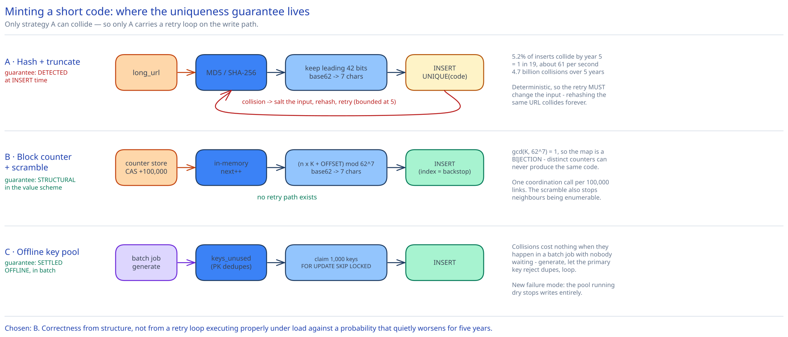

# Module 02 — Short-Code Generation & Collision Avoidance



This module exists because "how do you generate the short code" is the question a URL shortener interview is actually about, and "hash it and handle collisions" is not an answer. This works through the arithmetic, then picks a scheme and defends it.

## First, the size of the space

The alphabet is `[0-9a-zA-Z]` — 62 symbols. Length is 7 characters, which is the shortest length that comfortably covers the requirement:

| Length | Codes available (62ⁿ) | Enough for 182B links? |
|---|---|---|
| 5 | 916 million | No — exhausted in 9 days |
| 6 | 56.8 billion | No — exhausted in 1.6 years |
| **7** | **3.52 trillion** | **Yes — 5 years uses 5.2%** |
| 8 | 218 trillion | Yes, but a wasted character |

7 characters carries **log₂(62⁷) ≈ 41.7 bits** of identity. Note what that means for the hashing approach below: you are not storing an MD5, you are storing 42 bits of one. The other 86 bits are thrown away, and every collision argument follows from that.

Why base62 and not base64? Base64's alphabet includes `+` and `/`, which need percent-encoding in a URL path, and `=` padding. That defeats the point. Some services use **base58** (base62 minus the visually ambiguous `0`/`O`/`I`/`l`) when codes might be read aloud or transcribed from print. Dropping 4 of 62 symbols sounds cheap but compounds over 7 positions: 58⁷ = 2.21 trillion, which is **37% less space** than base62, taking 5-year utilisation from 5.2% to 8.3%. Still comfortably fine here — and worth naming as a product trade-off (transcription accuracy) paid for in a technical currency (code space), which is exactly the kind of exchange an interviewer wants to see you price rather than wave at.

## The collision math, done properly

Almost every candidate reaches for the birthday paradox here, and gets the wrong number out of it. Both numbers matter, but they answer different questions.

**Question 1: "Will I ever see a collision at all?"** This is the birthday bound. With a space of N = 3.52 × 10¹², you reach a 50% chance of having seen *at least one* collision after roughly:

```
√(2 · ln2 · N) = √(1.386 × 3.52×10¹²) ≈ 2.2 million codes
```

**2.2 million links.** At 1,160 writes/sec, that is **31 minutes of traffic.** So the answer to "will collisions happen" is: yes, on your first afternoon. Any design that treats a collision as an exceptional error to be alerted on is wrong.

**Question 2: "How often will a collision happen, at steady state?"** This is the number that actually sizes the retry logic, and the birthday bound tells you nothing about it. For a single new random code against `n` codes already taken, the collision probability is just the load factor:

```
P(collision on one insert) = n / N
```

| Point in time | Codes stored (n) | Space used | P(collision per insert) | Collisions/sec at 1,160 writes/s |
|---|---|---|---|---|
| Day 1 | 100 M | 0.003% | 1 in 35,000 | 0.03 |
| Year 1 | 36.5 B | 1.0% | 1 in 96 | 12 |
| Year 3 | 109 B | 3.1% | 1 in 32 | 36 |
| Year 5 | 182 B | 5.2% | **1 in 19** | **61** |

Total collisions across the 5 years is the integral of the load factor over all inserts:

```
Σ (n/N) ≈ n_total² / 2N = (1.82×10¹¹)² / (2 × 3.52×10¹²) ≈ 4.7 billion
```

**4.7 billion collisions over the system's life, averaging 2.6% of inserts and ending at 5.2%.** That's the real shape of the problem: collisions are routine, high-volume, and entirely predictable — which is good news, because predictable things can be engineered rather than alerted on.

The retries are cheap because they stack multiplicatively. At the year-5 worst case:

| Attempts needed | Probability | Inserts affected per day |
|---|---|---|
| 1 (no collision) | 94.8% | — |
| 2 | 5.2% | 5.2 M |
| 3 | 0.27% | 270 k |
| 4 | 0.014% | 14 k |
| 5 | 0.0007% | 700 |
| 6+ | 0.00004% | 40 |

So a **bounded retry of 5** covers all but ~40 inserts a day, and those 40 should return `503` rather than loop — because at that point the far more likely explanation is not six consecutive one-in-nineteen coincidences (probability ~4 × 10⁻⁷) but **a broken code generator emitting a constant or a tiny cycle.** An unbounded retry loop turns that bug into a CPU-pinned hang; a bounded one turns it into an error rate you can see on a dashboard. This is the single most important operational reason to bound the retry, and it has nothing to do with collision probability.

## Strategy A — Hash the URL and truncate

Take `MD5(long_url)` (or SHA-256, or CRC32 — the choice barely matters, see below), interpret the leading 42 bits as an integer, base62-encode to 7 characters.

```
code = base62( leading_42_bits( md5(long_url) ) )
```

**Why truncation is safe from a distribution standpoint.** A cryptographic digest's output bits are individually uniform and independent, so any 42-bit slice of MD5 is as uniformly distributed as a 42-bit random number. Truncating does not concentrate values or create hot spots. What it destroys is the *collision resistance* the hash was designed for — MD5's 128-bit collision resistance is irrelevant once you keep 42 bits, and the collision rate is governed purely by the arithmetic in the table above. This is also why MD5 being cryptographically broken doesn't matter here: you are not relying on any security property of the hash, only on uniformity. CRC32 would be a mistake for a different reason — it's only 32 bits, so it cannot fill a 42-bit code space at all, and 2³² = 4.3 billion codes is exhausted in six weeks.

**How the collision is detected and resolved.** Hashing is *deterministic*, which is the trap: retrying the same input produces the same colliding code forever. The retry has to change the input.

1. **Salt-and-rehash.** Append an attempt counter (or a random nonce) to the input and hash again: `md5(long_url + ":" + attempt)`. Each attempt is an independent draw from the space, so the probabilities in the table above apply. This is the standard fix and it works.
2. **Increment-on-collision.** Treat the 42-bit value as an integer and probe `v+1, v+2, …`. Simpler, but it degrades badly as the table fills — probes cluster, and you get the same primary-clustering pathology as linear probing in a hash table. Prefer salting.
3. **The unique index is the arbiter.** Detection must ultimately be `INSERT … ` failing against a `UNIQUE` constraint on `code`, not a preceding `SELECT`. A `SELECT`-then-`INSERT` is a textbook check-then-act race: two servers can both see the code as free, and both insert. The database's unique index is the only component that can serialize that decision, for exactly the reason [Idempotency Keys](../../scalability-resilience/idempotency-keys.md) gives generally — push the atomicity requirement down to the one system that can actually enforce it.
4. **A Bloom filter in front, to avoid the round trip.** With a 5.2% collision rate you'd be doing 61 failed inserts a second, each a wasted write round trip against the primary. A Bloom filter of all issued codes (cross-ref [Bloom Filters](../../scalability-resilience/bloom-filters.md)) answers "definitely free" / "possibly taken" locally. Sized for 182B codes at a 1% false-positive rate that's ~218 GB — too large for per-server memory, but viable as a partitioned in-memory service, and entirely reasonable if scoped to a recent window instead of all history. It is a latency optimization only: a false positive costs one unnecessary regeneration, and the unique index still has the last word.

**What hashing buys you.** Exactly one thing: **natural deduplication.** The same long URL hashes to the same code with no lookup, so re-shortening a URL is idempotent for free. That sounds attractive until you notice it's usually the *wrong* product behaviour — see [Should the same URL always get the same code?](#should-the-same-long-url-always-get-the-same-code) below.

**What it costs you.** A retry loop on the write path, so p99 create latency now has a tail that grows with table fullness; a failure mode (unique-violation) that must be tested and can be triggered by traffic; and a collision rate that silently worsens over years until someone re-runs the arithmetic.

## Strategy B — Encode a globally unique counter

Give every link a unique integer, then base62-encode it. Collisions become **structurally impossible** — not rare, impossible — because uniqueness is inherited from the integer.

Two details decide whether this works, and both are usually skipped.

### B.1 — Don't use Snowflake IDs directly

The obvious move is to reuse this guide's [unique ID generator](../unique-id-generator/00-overview.md) and base62 the Snowflake ID. It doesn't fit, for a reason that's pure arithmetic: a Snowflake ID is 64 bits with the *timestamp in the high bits*, so from the very first ID it is a number around 10¹⁸.

```
62¹⁰ = 8.4 × 10¹⁷      62¹¹ = 5.2 × 10¹⁹
```

A ~10¹⁸ value needs **11 base62 characters**, not 7. Snowflake's whole design goal — time-sortable, coordination-free — is achieved by burning entropy on a timestamp you don't need in a short code, and you pay for it in four extra characters. On a product whose entire value is brevity, that's a 57% longer URL.

### B.2 — Block-allocated dense counters

What you want instead is a **dense** counter: 1, 2, 3, … so the integer stays small and 7 characters go a long way. But a single shared counter is a coordination point on every write.

The fix is **block allocation**. A counter row (or a ZooKeeper/etcd sequence — cross-ref [Service Discovery](../../scalability-resilience/service-discovery.md) and the [distributed coordination service](../distributed-coordination-service/00-overview.md) case study) hands out *ranges*:

```
App server A: CAS the counter 0 → 100000. A now owns [0, 100000) and serves from memory.
App server B: CAS the counter 100000 → 200000. B owns [100000, 200000).
```

- Each server does **one** coordination call per 100,000 links. At 3,500 writes/sec across the fleet, that's roughly one allocation call every 30 seconds fleet-wide. The coordinator is not on the hot path in any meaningful sense.
- A server that crashes holding an unfinished block **loses** the rest of it. That is fine and worth saying out loud: with 3.5 trillion codes and 5.2% projected use, discarding a few million codes to crashes over five years is a rounding error. Trying to reclaim them would add a reconciliation process to protect a resource you have in vast surplus.
- Blocks are handed out monotonically, so codes are *globally* unique without any server ever talking to another server per-request.

### B.3 — Scramble the counter, or your links are crawlable

Dense counters have a real problem: `base62(1000)` and `base62(1001)` are adjacent strings. Anyone who has one of your short links can enumerate its neighbours and walk your entire corpus — every link anyone has ever created, including private documents, unlisted invites, and internal dashboards. This is not hypothetical; it's how several real shorteners have been dumped.

The fix is a **bijective scramble**: a reversible function that maps the counter onto the code space so that consecutive counters land far apart, while remaining one-to-one (so uniqueness survives).

The simplest version is modular multiplication by a constant coprime to the space size:

```
N     = 62⁷                       # 3,521,614,606,208
K     = 6_186_293_401_877         # a large constant, gcd(K, N) = 1
OFFSET= 62⁶                       # 56,800,235,584 — forces every code to exactly 7 chars

scrambled = (counter * K + OFFSET) mod N
code      = base62_pad7(scrambled)
```

Because `gcd(K, N) = 1`, `K` has a modular multiplicative inverse mod `N`, so the map is a **permutation** of the code space: distinct counters always produce distinct codes, and the code can be decoded back to the counter if you ever want to. Consecutive counters differ by `K` mod `N`, which puts them nowhere near each other in the output.

Two refinements worth knowing:
- `+ OFFSET` (or just seeding the counter at 62⁶) guarantees the value always needs all 7 digits, so you never emit a 1-character code for link #5 and you never have to decide whether to zero-pad.
- Modular multiplication is *linear*, so an attacker who collects several code/counter pairs can solve for `K`. If that matters, replace it with a small **Feistel network** over 42 bits (4 rounds, any keyed hash as the round function) — still a guaranteed bijection, but not linearly invertible. Reach for this if enumeration resistance is a security requirement rather than a privacy nicety.

### B.4 — Keep the unique index anyway

Collisions are impossible *if the block allocator is correct*. So the realistic failure mode is no longer probability, it's a bug: a coordinator failover that hands the same block to two servers, a botched deployment that resets the counter, a restored database snapshot that rewinds it. Every one of those produces **duplicate codes pointing at different URLs** — the exact silent-wrong-destination failure this system cannot tolerate.

So the `UNIQUE` index on `code` stays, even though the design says it can never fire. Its job changes from "resolve routine collisions" to "convert a catastrophic correctness bug into a loud, countable insert failure." An alert on *any* unique violation is then meaningful, which it never could be under Strategy A.

## Strategy C — Offline key-generation service (key pool)

Generate codes in advance, in bulk, offline, into a table of unused keys. Writers claim from the pool.

```
keys_unused(code CHAR(7) PRIMARY KEY)          -- pre-filled by a batch job
keys_used(code CHAR(7) PRIMARY KEY, claimed_at)
```

- Uniqueness is settled **at generation time**, by the primary key on `keys_unused`, in a batch job with no latency budget. Generate randomly, let the primary key reject duplicates, loop until the batch is full — collisions cost nothing when nobody is waiting.
- At write time, minting is a **claim**, not a computation: an app server takes a batch of ~1,000 keys in one statement (`DELETE … LIMIT 1000 RETURNING code`, or `SELECT … FOR UPDATE SKIP LOCKED` — cross-ref the [job scheduler's](../distributed-job-scheduler/02-lld.md) claim pattern) and serves them from memory.
- Create latency becomes **flat and predictable**: no retry loop, no probability, no tail that worsens as the table fills.
- Crashing with unclaimed keys in memory leaks them, same as Strategy B's blocks, and is equally acceptable at this scale.

The costs are operational rather than algorithmic: you now run a replenishment pipeline that must stay ahead of consumption (monitor `keys_unused` depth as a first-class metric — running dry means you cannot accept writes at all), and the pool table is a second stateful system to shard, replicate, and back up. On the other hand, the pool decouples generation from serving completely, which is genuinely valuable if you ever need codes to satisfy a property that's expensive to check per-request — filtering out codes that spell offensive words, for example, which is trivial in a batch job and awkward in a retry loop.

## Comparison

| | A · Hash + truncate | B · Scrambled block counter | C · Offline key pool |
|---|---|---|---|
| Collisions possible? | Yes — 2.6% of inserts on average, 5.2% by year 5 | No, by construction | No, resolved offline |
| Uniqueness enforced by | `UNIQUE` index at insert time, on the hot path | The counter (index is a backstop only) | Primary key on the pool table, offline |
| Code length | Fixed 7 | Fixed 7 (with the offset) | Fixed 7 |
| Create-path work | Hash, then 1–5 insert attempts | One in-memory increment + multiply | One in-memory pop from a batch |
| p99 create latency | Has a tail that grows with table fullness | Flat | Flat |
| Coordination needed | None | One block allocation per 100k links | A replenishment pipeline |
| Enumerable? | No (hash output is scattered) | No (only because of the scramble) | No (generated randomly) |
| Same URL → same code | **Yes, free** | No | No |
| Extra moving parts | Bloom filter (optional) | Counter store / coordinator | Pool table + batch job + depth alerting |
| Fails when… | Table gets full enough that retries dominate | The allocator double-issues a block | The pool runs dry |

## Chosen: B — block-allocated counter with a bijective scramble

**Why.** The requirement is zero-tolerance uniqueness, and B is the only option that gets it from *structure* rather than from *detection*. Strategy A's correctness depends on a retry loop executing properly under load, against a probability that quietly degrades for five years; B's depends on a monotonic counter, which is the single easiest invariant in distributed systems to reason about and to verify. And B's create path is a multiply and an increment — no hash, no round trip, no tail — which matters because the write path is the one with the tighter availability budget to spend elsewhere.

**Why not C**, given it also gets structural uniqueness: it buys the same guarantee at the price of a whole additional stateful subsystem whose exhaustion is a hard write outage. The block allocator in B is the same idea with the pool held as an integer range instead of a table of rows — strictly less machinery for the same property. C earns its keep only when codes must satisfy a per-code predicate that's expensive to evaluate inline (profanity filtering being the usual one); if that requirement appears, C is the right answer and this decision should be revisited.

**Why not A**, given it's the most common answer: its one real advantage is free deduplication, and as the next section argues, deduplication is a product misfeature here. Everything else about it is worse.

**What we keep from the others:** the `UNIQUE` index on `code` (from A) as a correctness backstop, and the *idea* of a monotonic claim served from local memory (from C) as the block-allocation mechanism.

## Should the same long URL always get the same code?

Strategy A gives this for free, and it's tempting to treat it as a feature. It usually isn't:

- **It breaks per-link analytics.** Two marketing teams shortening the same landing page would share one code and therefore one click count, with no way to attribute traffic to either campaign. The analytics requirement in Module 00 is incompatible with dedup.
- **It breaks per-link expiration and deletion.** If A sets `expires_at` and B doesn't, whose wins? If A deletes their link, B's breaks. Dedup collapses two independent lifecycles onto one row.
- **It makes abuse containment worse.** Revoking one code revokes it for everyone who ever shortened that URL, including legitimate users.
- **It costs a lookup anyway.** Under any non-hash strategy, deduplicating requires a read-before-write against an index on the URL — so you pay the round trip you were trying to avoid.

**Decision: no deduplication.** Each create mints a fresh code, and re-shortening the same URL is expected to produce a different one.

**But store `long_url_hash` indexed anyway**, because two other requirements need it and neither is dedup:
1. **Abuse response.** When a domain lands on the blocklist you need "find every code pointing at this URL" to be a single indexed lookup, not a 182-billion-row scan.
2. **An optional client-side convenience.** With the index present, the API *can* offer "you already shortened this — reuse `aZ3kQ1x`?" as an explicit opt-in (`?reuse_existing=true`), which gives users the ergonomics of dedup without imposing its semantics on everyone.

Index the hash, not the URL itself — a 200–500 byte variable-length URL is a poor index key, while a fixed 8-byte hash of it is a good one. See [Indexes](./04-db-design.md#indexes).

## Custom aliases are a different problem

A generated code collides by accident, at a rate you can compute. A custom alias collides **on purpose**, at whatever rate an adversary chooses, and the interesting cases are all adversarial:

- **Land-grabbing.** Someone scripts registration of every dictionary word and brand name. Mitigation is rate limiting per account (cross-ref [Rate Limiting](../../hld-building-blocks/rate-limiting.md)) plus reserving trademark-adjacent strings, not anything in the code generator.
- **Route shadowing.** An alias of `api`, `admin`, `login`, `static`, `health`, or `robots.txt` would shadow your own routes, because `GET /{short_code}` is a catch-all at the path root. A **reserved-word denylist, checked before insert**, is mandatory — this is a real vulnerability, not a nicety.
- **Homograph and confusable abuse.** `paypaI` (capital i) versus `paypal`. Normalize confusables before the uniqueness check, or the unique index will happily accept both.

The structural insight worth stating: **keep the custom and generated namespaces provably disjoint, so the two schemes can never collide with each other.** Generated codes are always exactly 7 characters from `[0-9a-zA-Z]`. So require custom aliases to be **either ≥ 8 characters, or to contain at least one character outside that alphabet** (`-` and `_` are both URL-safe and excluded from base62). With that rule in place:

- A generated code can never accidentally land on a taken custom alias, so the block counter needs no awareness of the custom-alias table at all.
- A custom alias can never squat a code the generator will later issue, so there's no "reserved but unissued" bookkeeping.
- The single `UNIQUE` index on `code` still covers both, because they live in one column — the disjointness is a property of the *values*, not of the storage.

Without that rule you would need every generated code to be checked against the custom-alias table before issue, reintroducing a read on the write path to defend against a collision the value scheme can rule out for free.

## Write-path race conditions

| Race | Mechanism | What the "loser" sees |
|---|---|---|
| Two app servers minting at the same instant | They hold **disjoint counter blocks**, so their codes cannot coincide. No lock, no coordination, no retry. | Nothing — neither is aware of the other. This is the payoff of block allocation. |
| Two servers allocating a block simultaneously | Compare-and-swap on the counter (`UPDATE counter SET v = v + 100000 WHERE v = :expected`), or an atomic `INCRBY`. Exactly one CAS succeeds. | The loser's CAS matches zero rows; it re-reads and retries, ~microseconds, once per 100,000 links. |
| Two users claiming the same custom alias | `UNIQUE` index on `code`. Second `INSERT` fails. | `409 Conflict` — the alias is taken. This is a normal, user-facing outcome, not an error to alert on. |
| A client retrying `POST /urls` after a timeout | `Idempotency-Key` header, stored with a unique constraint; a replay returns the **original** code rather than minting a second one (cross-ref [Idempotency Keys](../../scalability-resilience/idempotency-keys.md)). | The identical `201` and the same code as the first attempt. Without this, a flaky network silently doubles a user's link count. |
| Coordinator failover double-issues a block (the bug case) | `UNIQUE` index on `code` — the backstop from B.4. | An insert failure that is genuinely exceptional, alertable, and pages someone. |

## Practice: extend it yourself

1. **Re-run the arithmetic for 6-character codes.** At 62⁶ = 56.8 billion, when does the collision rate under Strategy A cross 50% per insert, and what does the retry-attempt distribution look like at that point? Then answer the design question: is 6 characters salvageable under Strategy B, and what changes about the block allocator if so?
2. **Design the migration from 7 to 8 characters** for a system that has been running Strategy B for five years and is approaching a code-space limit. Old codes must keep resolving. Where does the length live — in the counter's value, in a version prefix, in the scramble's modulus? What breaks if you simply widen the modulus, and why does that specific thing break?
