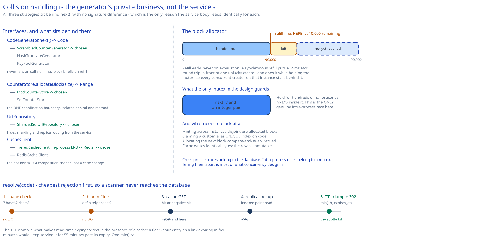

# Module 03 — Low-Level Design



The [LLD fundamentals module](../../../02-lld-fundamentals.md) introduces the basic shape of these classes. This module takes it to interview depth: the block allocator's concurrency, which errors are worth modelling as distinct types, and precisely which operations need no application-level lock and why.

## Interfaces vs. implementations

```
interface CodeGenerator
    next() -> Code                       # never fails on collision; may block briefly on refill

interface CounterStore                   # the coordination boundary, isolated behind one method
    allocateBlock(size: int) -> Range    # atomic; returns [start, start+size)

interface UrlRepository
    save(record: UrlRecord) -> void      # throws DuplicateCodeError on UNIQUE violation
    findByCode(code: Code) -> UrlRecord?
    findByUrlHash(hash: bytes) -> List<UrlRecord>
    softDelete(code: Code, reason: Reason) -> void

interface CacheClient
    get(code: Code) -> CacheEntry?       # CacheEntry is Hit(url) | NegativeHit
    set(code: Code, url: Url, ttl: Duration) -> void
    setNegative(code: Code, ttl: Duration) -> void
    invalidate(code: Code) -> void

interface AliasValidator
    validate(alias: String) -> void      # throws ReservedAliasError | MalformedAliasError

interface BlocklistClient
    isBlocked(url: Url) -> bool          # circuit-breaker wrapped; fails closed
```

**Implementations:** `ScrambledCounterGenerator` (the chosen Strategy B), `HashTruncateGenerator` (Strategy A, kept because it's a legitimate strategy for a different set of constraints), `KeyPoolGenerator` (Strategy C). `EtcdCounterStore` / `SqlCounterStore`. `ShardedSqlUrlRepository`. `RedisCacheClient` / `TieredCacheClient` (in-process LRU in front of Redis).

The interface worth defending is **`CodeGenerator`**. All three of Module 02's strategies sit behind `next()` with no signature difference, which is only true because of one deliberate decision: **collision handling is the generator's private business, not the service's.** Under Strategy A the retry loop lives inside `HashTruncateGenerator`; under B there is nothing to retry. If instead the service had owned the retry — the intuitive design, where the service catches `DuplicateCodeError` and asks for another code — then switching strategies would change the service, and the service would carry retry logic that is dead code for two of the three implementations. Pushing it down means the service reads the same either way, and it's the concrete payoff of the Strategy pattern here rather than a decorative use of it.

`CounterStore` is a separate interface from `CodeGenerator` for a related reason: it is the only component in the write path that talks to a strongly-consistent external store, so isolating it behind one method makes the coordination boundary explicit and testable. A fake `CounterStore` handing out sequential ranges is all you need to unit-test the generator's entire concurrency story.

## Pseudocode: the block allocator

This is the part that actually needs care, because it's the one place in the write path where threads contend.

```
class ScrambledCounterGenerator implements CodeGenerator:
    N       = 62**7
    K       = 6_186_293_401_877        # gcd(K, N) == 1 -> the map is a bijection
    OFFSET  = 62**6                    # forces every code to exactly 7 characters
    BLOCK   = 100_000
    REFILL_THRESHOLD = 10_000          # refill early; never let the block hit zero

    counterStore: CounterStore
    lock:    Mutex
    next_:   long                      # next unused counter value
    end_:    long                      # exclusive upper bound of the current block
    refilling: bool

    next() -> Code:
        with lock:
            if next_ >= end_:                  # block exhausted: must block the caller
                refillBlocking()
            value = next_
            next_ += 1
            remaining = end_ - next_

        if remaining < REFILL_THRESHOLD and not refilling:
            asyncRefill()                      # off the critical path

        scrambled = (value * K + OFFSET) % N
        return base62Pad7(scrambled)

    refillBlocking():                          # caller already holds lock
        range = counterStore.allocateBlock(BLOCK)   # retries CAS internally
        next_, end_ = range.start, range.end

    asyncRefill():
        refilling = true
        submit(() ->
            try:
                range = counterStore.allocateBlock(BLOCK)
                with lock:
                    if range.start == end_:    # contiguous: extend in place
                        end_ = range.end
                    else:                      # non-contiguous: abandon the tail, jump
                        next_, end_ = range.start, range.end
            finally:
                refilling = false
        )
```

Three details in there are the whole point:

**Why refill early rather than on exhaustion.** A synchronous refill puts an etcd round trip (~5ms) in front of one unlucky user's create request, and does it under the mutex, so every concurrent creator on that instance stalls behind it. Refilling at a 10,000-code threshold means the refill completes long before the block runs out, off the hot path, and `refillBlocking()` becomes the never-in-practice fallback for a pathological burst. Keeping it in the code anyway is correct — the alternative is failing a request because a background task hasn't finished.

**Why the mutex is fine.** It guards an integer increment: hundreds of nanoseconds held, no I/O inside it (the blocking refill is the sole, rare exception). At 3,500 creates/sec across a fleet, per-instance contention is negligible. A lock-free `AtomicLong.getAndIncrement()` with a compare-and-set on the bound is the natural refinement and is worth mentioning, but the mutex is not the bottleneck and pretending otherwise is premature optimization.

**Why abandoning the tail of a block is correct.** If a concurrent allocation moved the counter, the new range isn't contiguous with the old one, and the code jumps rather than trying to serve both ranges. That discards up to 10,000 codes. Module 02 established that discarded codes are free at 3.5 trillion capacity — so the simple thing (hold one range, jump when needed) beats the careful thing (maintain a list of owned ranges) because the resource being conserved has no scarcity value. Recognising *when* not to be careful is the actual skill being demonstrated.

## Pseudocode: create

```
UrlShortenerService.create(request, actor) -> CreateResult:
    # 1. Idempotency, before any side effect
    if request.idempotencyKey:
        prior = idempotencyStore.get(actor, request.idempotencyKey)
        if prior: return prior.result            # replay: same code, never a new one

    # 2. Validate — cheapest and most-likely-to-fail checks first
    url = UrlValidator.normalize(request.longUrl)     # throws MalformedUrlError
    if url.host in OUR_OWN_DOMAINS:
        throw SelfReferentialUrlError                 # prevents redirect loops
    if url.scheme not in (http, https):
        throw UnsupportedSchemeError

    # 3. Abuse check — the one remote call, circuit-broken, fails CLOSED
    if blocklist.isBlocked(url):
        throw BlockedUrlError                        # -> 422

    # 4. Mint the code
    if request.customAlias:
        aliasValidator.validate(request.customAlias)  # reserved words, length>=8 or non-base62
        code = request.customAlias
    else:
        code = codeGenerator.next()                   # in-memory; cannot collide

    # 5. Persist
    record = UrlRecord(code, url, sha256(url)[:8], actor.id, request.expiresAt, now())
    try:
        repository.save(record)
    except DuplicateCodeError:
        if request.customAlias:
            throw AliasTakenError                     # -> 409, expected
        else:
            metrics.increment("code.unexpected_collision")   # -> ALERT: allocator bug
            throw InternalError                       # -> 503, do NOT silently retry

    # 6. Record idempotency AFTER success
    result = CreateResult(code, shortUrl(code), record.expiresAt)
    if request.idempotencyKey:
        idempotencyStore.put(actor, request.idempotencyKey, result)
    return result
```

**The `except DuplicateCodeError` branch is the most important six lines in this module,** and it's where Module 02's reasoning becomes code. It handles the *same* database error two completely different ways depending on provenance:

- A **custom alias** collision is a routine user outcome. Someone asked for a taken name. Return `409`, don't log an error, don't alert.
- A **generated code** collision is, per Module 02, structurally impossible — probability ~0, not "rare". So if it ever happens, the cause is a bug: a double-issued block, a reset counter, a restored snapshot that rewound the sequence. The correct response is to **increment a dedicated counter, alert, and fail the request** — never to quietly retry. A retry would paper over exactly the class of bug that silently sends users to the wrong website, and the retry succeeding is precisely what makes the bug invisible.

Under Strategy A this same branch would instead be a bounded retry loop, and the alert would have to sit at "5 consecutive collisions" rather than "any collision". That the choice of generator changes what this error *means* is the reason the branch has to distinguish provenance at all.

## Pseudocode: resolve

```
UrlShortenerService.resolve(code) -> Redirect:
    if not CODE_SHAPE.matches(code):
        throw NotFoundError(reason=MALFORMED)   # reject garbage before any I/O

    if bloomFilter.definitelyAbsent(code):
        throw NotFoundError(reason=NEVER_EXISTED)   # scanner defence, zero network calls

    entry = cache.get(code)
    if entry is NegativeHit:
        throw NotFoundError(reason=NEVER_EXISTED)
    if entry is Hit:
        return Redirect(entry.url)              # ~95% of traffic stops here

    record = repository.findByCode(code)        # replica read
    if record is null:
        cache.setNegative(code, ttl=60s)        # stop the next scan hit at the cache
        throw NotFoundError(reason=NEVER_EXISTED)
    if record.deletedAt is not null:
        throw GoneError(reason=record.deleteReason)      # 410, distinct from 404
    if record.expiresAt is not null and record.expiresAt < now():
        cache.setNegative(code, ttl=60s)
        throw NotFoundError(reason=EXPIRED)

    ttl = min(1 hour, record.expiresAt - now())  # an entry must never outlive its link
    cache.set(code, record.url, ttl)
    return Redirect(record.url)
```

Two things worth calling out. **The shape check and Bloom filter come before any I/O**, so the cheapest rejection handles the highest-volume garbage — a scanner sending 7-character random strings is turned away without touching Redis or a replica, which is the structural half of the 404-amplification defence from [Module 01](./01-architecture-hld.md#load-handling). And **the TTL clamp** on the way out: a flat 1-hour TTL on a link expiring in five minutes would keep serving it for 55 minutes past expiry, so the TTL has to be the minimum of the two. That single `min()` is what makes read-time expiry enforcement actually correct in the presence of a cache.

## Error cases worth designing for deliberately

| Error | HTTP | Why it's its own type rather than a generic failure |
|---|---|---|
| `NotFoundError(NEVER_EXISTED)` | 404 | Distinguishing this from `EXPIRED` is what lets the API tell a user "that link has expired" instead of "that link is wrong". Collapsing both into one 404 destroys information the caller needs and the owner's dashboard wants. |
| `NotFoundError(EXPIRED)` | 404 | Same status code, different `reason` in the body. Deliberately not a different status: to an anonymous clicker, expired and nonexistent should be indistinguishable, so an expired code can't be used to prove a link once existed. |
| `GoneError` | 410 | An abuse takedown is semantically different from expiry, and `410` tells crawlers to drop the URL permanently — which is what you want for spam. |
| `AliasTakenError` | 409 | Routine. Must not be logged as an error or the log fills with normal user behaviour. |
| `SelfReferentialUrlError` | 400 | Shortening `sho.rt/abc` creates a redirect loop, and a chain of them is an amplification vector. Cheap to check, genuinely exploitable if you don't. |
| `BlockedUrlError` | 422 | Distinct from 400: the request is well-formed, the *target* is refused. |
| `DuplicateCodeError` (generated) | 503 | Never surfaced as-is — caught, alerted on, converted. Its existence in the type system is a tripwire. |
| `MalformedAliasError` | 400 | Enforces the ≥8-chars-or-non-base62 rule that keeps the custom and generated namespaces provably disjoint ([Module 02](./02-short-code-generation.md#custom-aliases-are-a-different-problem)). |

## Concurrency at the code level

**What needs no application-level lock, and why:**

- **Minting a code across instances.** No lock, no coordination — instances hold disjoint counter blocks, so their outputs cannot overlap by construction. This is the design's central concurrency claim, and it's worth stating in the negative: a language-level mutex here would be *useless* anyway, since it only guards threads within one process while the actual risk is another instance. Block allocation is what makes the cross-process problem disappear rather than being locked around.
- **Claiming a custom alias.** No lock. The `UNIQUE` index on `code` is the only component that can serialize two instances racing for one alias, exactly as [Idempotency Keys](../../scalability-resilience/idempotency-keys.md) argues generally: push the atomicity requirement into the one system that can enforce it, and let the loser get a constraint violation instead of trying to prevent the race.
- **Allocating the next block.** No lock — a compare-and-swap. `UPDATE counter SET v = v + :size WHERE v = :expected`; zero rows affected means someone else won, so re-read and retry. This is optimistic concurrency (cross-ref [Consistency Models](../../hld-building-blocks/consistency-models.md)) and it's the right fit because contention is near-zero: one allocation per 100,000 links means conflicts are vanishingly rare, which is precisely the condition under which optimistic beats pessimistic.
- **Cache writes.** No lock, and no correctness requirement either. Two threads that both miss and both write the same `code → url` pair write *identical* bytes, because the mapping is immutable once created. Last-write-wins is not a compromise here; there is genuinely nothing to lose. This immutability is why the cache needs no versioning, no CAS, and no read-repair.

**What does need an in-process lock, and it's exactly one thing:** the block allocator's `next_`/`end_` pair. Two threads on the same instance must not hand out the same counter value. This is the *only* genuine intra-process race in the system, which is why it's the only mutex — and it's a good illustration of the general pattern: cross-process races belong to the database, intra-process races belong to a mutex, and correctly telling them apart is most of what concurrency design is.

**Thundering herd on a hot key.** When a viral link's cache entry expires, thousands of concurrent readers miss simultaneously and all query the replica. Standard remedies apply (cross-ref [Caching Strategies](../../hld-building-blocks/caching-strategies.md)): a per-code in-process single-flight so only one thread per instance does the fetch while the rest await its result, plus jittered TTLs so a batch of entries written together don't expire together. Worth noting that single-flight is *sufficient* here rather than merely helpful, because the value is immutable — every waiting thread can safely receive the one fetched result with no staleness concern at all.

## Design patterns you just used, named

- **Strategy** — `CodeGenerator`. Three genuinely different algorithms with genuinely different failure models behind one method. This is the textbook case, and the tell that it's real rather than decorative is that the service body is byte-identical across all three.
- **Repository** — `UrlRepository` hides sharding, replica routing, and soft-delete semantics behind `findByCode` / `save`. The service never learns that the data is sharded.
- **Decorator** — `TieredCacheClient` wraps `RedisCacheClient` with an in-process LRU behind the identical `CacheClient` interface; the hot-key mitigation from Module 01 is therefore a composition change, not a code change in the service.
- **Circuit Breaker** — around `BlocklistClient`, configured to fail closed. Cross-ref [Circuit Breakers & Retries](../../scalability-resilience/circuit-breakers-retries.md).
- **Object Pool** — the block allocator is one, with the pooled resource being integers rather than connections. Naming it that way is what makes early refill (rather than refill-on-exhaustion) the obvious design instead of a clever trick.

## Practice: extend it yourself

1. **Make `resolve()` survive a total Redis outage** without exceeding replica capacity. You have the in-process LRU from `TieredCacheClient` and the Bloom filter. What's the eviction policy, how do you size it against a Zipfian popularity curve, and what's the p99 you can actually promise at 116k QPS with Redis gone? State the load-shedding rule that kicks in when the answer is "not 50ms".
2. **Add link editing** — an owner repoints an existing code at a new destination. Which interfaces change, and which don't? Then handle the case the current design cannot: the row is now mutable, so `resolve()`'s assumption that cached values are immutable is broken. Where does that assumption appear in this module (there are three places), and what does each one need instead?
