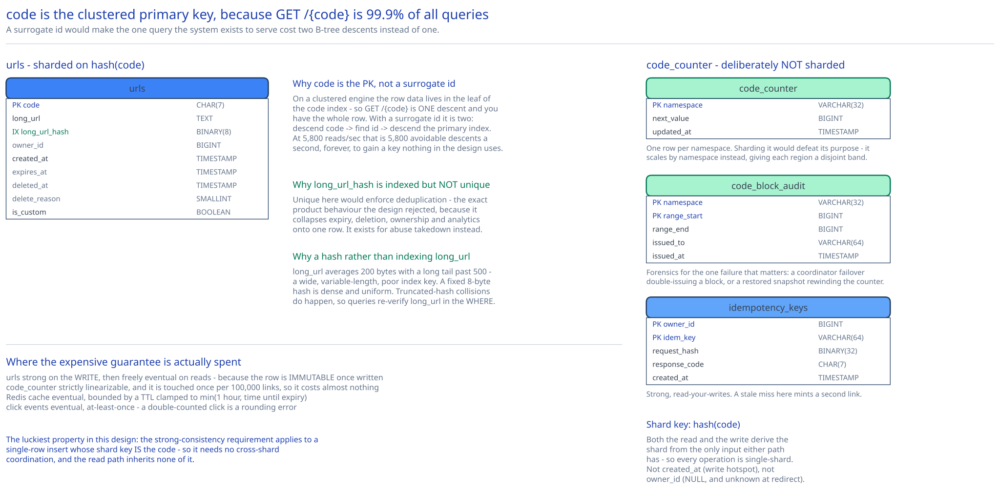

# Module 04 — Database Design



## From entities to schema

Four tables, and it's worth noticing how few that is — the entity model is genuinely small, and all the difficulty is in indexing and sharding rather than in modelling.

```sql
-- The one table that matters. Sharded on hash(code).
CREATE TABLE urls (
    code            CHAR(7)      NOT NULL,        -- or VARCHAR(64) if custom aliases are enabled
    long_url        TEXT         NOT NULL,
    long_url_hash   BINARY(8)    NOT NULL,        -- first 8 bytes of sha256(normalized long_url)
    owner_id        BIGINT       NULL,            -- NULL for anonymous creates
    created_at      TIMESTAMP    NOT NULL,
    expires_at      TIMESTAMP    NULL,            -- NULL = never expires
    deleted_at      TIMESTAMP    NULL,            -- soft delete; NULL = live
    delete_reason   SMALLINT     NULL,            -- abuse | owner_request | dmca
    is_custom       BOOLEAN      NOT NULL DEFAULT FALSE,
    PRIMARY KEY (code)
);

-- Counter block ledger. Single logical row per namespace; NOT sharded.
CREATE TABLE code_counter (
    namespace       VARCHAR(32)  NOT NULL,        -- e.g. 'default', 'us-east', 'eu-west'
    next_value      BIGINT       NOT NULL,
    updated_at      TIMESTAMP    NOT NULL,
    PRIMARY KEY (namespace)
);

-- Optional but strongly recommended: an audit trail of issued blocks.
CREATE TABLE code_block_audit (
    namespace       VARCHAR(32)  NOT NULL,
    range_start     BIGINT       NOT NULL,
    range_end       BIGINT       NOT NULL,
    issued_to       VARCHAR(64)  NOT NULL,        -- instance id
    issued_at       TIMESTAMP    NOT NULL,
    PRIMARY KEY (namespace, range_start)
);

-- Idempotency for POST /urls. Sharded on hash(owner_id, key). Aggressive TTL.
CREATE TABLE idempotency_keys (
    owner_id        BIGINT       NOT NULL,
    idem_key        VARCHAR(64)  NOT NULL,
    response_code   CHAR(7)      NOT NULL,
    created_at      TIMESTAMP    NOT NULL,
    PRIMARY KEY (owner_id, idem_key)
);
```

Click events are deliberately **not** in this schema. They live in Kafka and then a columnar store, for the reasons under [Consistency](#consistency) below.

### Why `code` is the primary key, not a surrogate `id`

The instinct is to add `id BIGINT AUTO_INCREMENT PRIMARY KEY` and make `code` a unique secondary index, because that's the default shape of almost every table anyone writes. It's wrong here, and the reason is specific to how this table is read.

`GET /{code}` is ~99.9% of all queries against this table, and it looks up by `code`. On a clustered-index engine (InnoDB, SQL Server), making `code` the primary key means **the row data lives in the leaf of the `code` index** — the lookup is one B-tree descent and you have the whole row. With a surrogate `id` primary key, the same query descends the secondary index on `code` to find an `id`, then descends the primary index to find the row: **two B-tree traversals instead of one**, on the query the entire system exists to serve. At 5,800 database reads/sec after caching that's ~5,800 avoidable extra index descents per second, forever, to gain a surrogate key nothing in the design uses.

The usual argument for a surrogate key is that natural keys change. `code` cannot change — it's the immutable public identity of the link, and if it changed, every link in the wild would break. It's about as safe a natural key as exists.

The counter-argument worth conceding: `CHAR(7)` (or worse, `VARCHAR(64)` once custom aliases are allowed) is a wider key than `BIGINT`, and in a clustered engine the primary key is copied into every secondary index. With only two secondary indexes on this table (below) that cost is small and clearly worth paying. If this table grew six secondary indexes, the calculation would change.

Cross-ref [Database Indexing](../../database-design/database-indexing.md) for the clustered-versus-secondary mechanics in general.

### Why `long_url_hash` exists, and why it isn't unique

`BINARY(8)` holding the first 8 bytes of `sha256(normalized_long_url)`.

**Why store a hash rather than index `long_url` directly.** `long_url` is a `TEXT` column averaging 200 bytes with a long tail past 500 (tracking parameters are brutal). Indexing it means a wide, variable-length key: fewer entries per B-tree page, deeper tree, larger index, and on MySQL you'd need a prefix index (`INDEX (long_url(255))`) which can't guarantee uniqueness and yields false-positive matches you have to re-check anyway. A fixed 8-byte hash is a dense, uniform, ideal index key.

**Why 8 bytes and not the full 32.** 8 bytes = 64 bits = 1.8 × 10¹⁹ values against 1.8 × 10¹¹ rows, so a load factor of 10⁻⁸. Truncated-hash collisions will happen (birthday bound on 64 bits is ~5 billion rows, so at 182 billion rows expect roughly 10⁹ colliding *pairs*), which is exactly why the queries that use this index re-verify `long_url` in the `WHERE` clause. Trading 24 bytes per row across 182 billion rows — 4.4 TB — for a re-check on a handful of rows is straightforwardly correct.

**Why it is emphatically NOT `UNIQUE`.** [Module 02](./02-short-code-generation.md#should-the-same-long-url-always-get-the-same-code) decided against deduplication: two users shortening the same URL must get two independent codes with independent expiry, ownership, deletion and analytics. A unique constraint here would enforce the exact product behaviour that decision rejected. This is the single easiest place to accidentally contradict a deliberate product decision with a schema keyword.

**What it's actually for:** abuse response. When `evil.example` lands on the blocklist, "revoke every code pointing anywhere on that domain" must be an indexed lookup, not a scan of 182 billion rows. Note the wrinkle — that query needs *domain* matching, not exact-URL matching, and this index only serves the latter. Honest answer: a separate `domain` column with its own index is needed for that, and its absence is named as a gap below.

### Why soft delete rather than `DELETE`

`deleted_at` + `delete_reason` instead of removing the row, for three reasons that each independently justify it:

1. **`410 Gone` needs the row.** [Module 03](./03-lld.md#error-cases-worth-designing-for-deliberately) returns `410` with a reason for takedowns, which tells crawlers to drop the URL permanently. A hard `DELETE` can only ever produce `404`, which invites retries.
2. **A hard delete frees the code for reissue.** Under Strategy B the counter never goes backwards, so reuse won't happen by accident — but a restored snapshot or a manual intervention could, and reissuing a code that was taken down for malware to a new legitimate link means inheriting all its poisoned reputation, blocklist entries and inbound spam traffic. The row is a tombstone that makes reuse detectable.
3. **Abuse investigation needs history.** "What did this code point at when it was reported" is unanswerable if the row is gone.

The cost is that dead rows accumulate. Mitigation: the nightly sweeper hard-deletes rows `deleted_at < now() - 90 days` (retention window, not a correctness mechanism), and every read path filters `deleted_at IS NULL` — which is why it appears in the partial index below rather than being left to the query planner.

### Why expiry is a column, not a TTL feature

`expires_at TIMESTAMP NULL`, checked at read time, rather than a database-native row TTL (Cassandra's `USING TTL`, MongoDB's TTL index, DynamoDB's TTL attribute).

Native TTLs delete rows on the database's own schedule — which is best-effort and can lag by minutes to hours under load. That makes the *database's sweeper* responsible for correctness: a lagging sweeper means expired links keep resolving. Making it a column and checking `expires_at < now()` in application code (or the `WHERE` clause) means correctness is enforced on every single read, and deletion becomes purely a storage-reclamation concern that can fall arbitrarily far behind without ever serving an expired link. Same reasoning as [Module 01](./01-architecture-hld.md#per-path-walkthrough): never let a batch job be load-bearing for correctness.

The cache is the loophole, and it's why `resolve()` clamps TTL to `min(1 hour, expires_at - now())`.

## Indexes

| Index | Serves |
|---|---|
| `PRIMARY KEY (code)` — clustered | `GET /{code}`. ~99.9% of all queries. One B-tree descent to the full row. |
| `INDEX (long_url_hash)` | Abuse response ("every code pointing at this exact URL") and the opt-in `?reuse_existing=true` convenience. Deliberately non-unique. |
| `INDEX (owner_id, created_at DESC) WHERE deleted_at IS NULL` | "List my links, newest first" — the owner dashboard. Partial (filtered) so tombstones don't bloat it, and `created_at DESC` in the index means pagination needs no sort. |
| `INDEX (expires_at) WHERE expires_at IS NOT NULL AND deleted_at IS NULL` | The nightly expiry sweeper. Partial is essential: most links never expire, so a full index would be mostly `NULL` entries the sweeper never reads. |
| `PRIMARY KEY (namespace)` on `code_counter` | The CAS in block allocation. One row per namespace, so this is a formality — but it's the correctness-critical formality. |
| `PRIMARY KEY (owner_id, idem_key)` on `idempotency_keys` | Idempotency replay detection, and the uniqueness that makes concurrent replays safe. |

**Indexes deliberately absent:**

- **Nothing on `created_at` alone.** Tempting for "links created today", but that's an analytics question and analytics reads from the columnar store, not from this table. An index here would be paid for on every one of 1,160 inserts/sec to serve a query that should never run against the OLTP store.
- **Nothing on `long_url`.** Superseded by the hash, per above.
- **Nothing on `is_custom`.** A boolean over 182 billion rows has cardinality 2; the planner would ignore it and correctly so.

## Consistency

| Data | Model | Why |
|---|---|---|
| `urls` — the `code → long_url` mapping | **Strong** on the write, then freely eventual on reads | The uniqueness invariant must hold absolutely at insert (`UNIQUE(code)` on a single shard primary — no cross-shard coordination needed, since the code *is* the shard key). But once written the row is **immutable**, so any replica anywhere can serve it with no read-your-writes problem. This is the design's luckiest property: the strong-consistency requirement applies to a single-row insert, and the read path inherits none of it. |
| `code_counter` | **Strictly linearizable** | The one place in the system that genuinely needs it. Two instances must never receive overlapping ranges, so this cannot be an eventually-consistent store — it needs a consensus-backed value (etcd/ZooKeeper, or a single primary row with CAS). Cross-ref [Replication & Consensus](../../hld-building-blocks/replication-consensus.md). Note the payoff: it's touched once per 100,000 links, so buying linearizability here costs almost nothing. |
| `idempotency_keys` | **Strong**, read-your-writes | A replay that reads a stale "no such key" would mint a second code and defeat the entire mechanism. Must be read from the primary, never a replica. |
| Redis cache | **Eventual**, bounded by TTL ≤ 1 hour | Staleness is only possible for deletion and expiry (creates are cold, and the mapping is immutable). Bounded staleness is accepted deliberately — see the deletion race in [Module 01](./01-architecture-hld.md#concurrent-user-handling). |
| Click analytics | **Eventual**, at-least-once, minutes behind | A double-counted click is a rounding error. The contrast with [ad click aggregation](../ad-click-aggregation/00-overview.md), where identical events feed billing and demand exactly-once, is the clearest illustration in this guide that the required guarantee is a property of *what the number is used for*, not of the pipeline. |

**Why click events aren't in this database at all.** One row per click at 116k/sec is 10 billion rows/day — 55× the entire link table's daily growth, for data nobody queries by primary key. It would dominate the write load on a store whose job is a 5,800/sec point-lookup workload, and its natural queries (`SUM` over time ranges grouped by dimensions) are exactly what a row store is worst at. Kafka into a columnar store is the right home; cross-ref [SQL vs NoSQL](../../database-design/sql-vs-nosql.md).

## Scaling the schema

**Shard key: `hash(code)`.** 70 TB and 182 billion rows is far past one node, so this isn't optional.

**Why `hash(code)` and not `code` directly (range sharding).** Under Strategy B, codes come from a scrambled counter, so consecutive creates already land at scattered points in the code space — range sharding on `code` would *appear* to distribute writes fine. But it breaks on reads: link popularity is Zipfian, and range shards would let a cluster of viral codes that happen to be lexicographically adjacent concentrate on one shard with no way to split them. Hashing decouples the shard assignment from the code's value entirely.

**Why not shard on `created_at`.** Time-based sharding is the classic mistake for this workload. All 1,160 writes/sec would hit the newest shard while every historical shard sits idle — the write hotspot is total, not marginal. It's the right choice for append-mostly time-series data queried by range, which is the opposite of this table.

**Why not `owner_id`.** It's `NULL` for anonymous creates (so it can't be a shard key at all), and it would send `GET /{code}` — 99.9% of traffic — to a shard it cannot compute from the code, forcing a scatter-gather across every shard on every redirect. Fatal.

**What `hash(code)` buys, precisely:** every read and every write is a **single-shard operation**, because the shard key is derivable from the only input either path has. No scatter-gather on the hot path, no cross-shard transactions, no distributed commit. Cross-ref [Data Partitioning & Sharding](../../hld-building-blocks/data-partitioning-sharding.md).

**What it costs:**
- `INDEX (owner_id, created_at)` becomes **local per shard**, so the owner dashboard is a scatter-gather across all shards with in-application merge and awkward pagination. Acceptable: that query is low-volume and latency-tolerant. If it mattered, the fix is a separate `links_by_owner` table sharded on `owner_id` — a denormalized secondary index, cross-ref [Normalization & Schema Design](../../database-design/normalization-schema-design.md).
- The expiry sweeper must run per shard. Fine, and actually desirable — it parallelizes.
- Resharding requires consistent hashing with virtual nodes (cross-ref [Consistent Hashing](../../hld-building-blocks/consistent-hashing.md)) so adding a shard moves ~1/n of rows rather than remapping everything.

**Read replicas versus sharding — these solve different problems and conflating them is the common error.** Sharding splits *data* to get past 70 TB on one node; it does nothing for read throughput on a single hot row. Replicas duplicate data to get read *throughput*; they do nothing for capacity, since every replica holds a full copy of its shard. This design needs both, for the two independent reasons: shard because 70 TB doesn't fit, replicate because 5,800 reads/sec against a primary that's also absorbing 1,160 writes/sec is a poor use of the primary. Cross-ref [DB Replication & Failover](../../database-design/db-replication-failover.md).

**`code_counter` is explicitly not sharded** — it's one row per namespace, and sharding it would defeat its purpose. It scales by *namespace partitioning* instead: give each region its own namespace with a disjoint counter range, so `us-east` allocates from a different band of integers than `eu-west`. Because the scramble is a bijection over the whole space, disjoint input ranges guarantee disjoint output codes with zero cross-region coordination. That's the seed of the multi-region write story Module 01 lists as unfinished.

## Connecting it back

Trace the chain from requirement to column:

**"Two different long URLs must never collide on the same short code"** (Module 00) → chose a block-allocated counter with a bijective scramble so uniqueness is structural rather than probabilistic (Module 02) → which requires a linearizable `code_counter` row and a `CounterStore` interface isolating that one coordination point (Module 03) → which appears here as a deliberately unsharded `code_counter` table plus `code_block_audit` for forensics, and as the `UNIQUE`/`PRIMARY KEY (code)` constraint retained purely as a backstop against allocator bugs.

**"p99 redirect under 50ms at 116k reads/sec"** (Module 00) → a cache-aside tier converting that to 5,800 database reads/sec, plus route-split read and write fleets (Module 01) → `resolve()` structured as Bloom filter, then cache, then a single point lookup, with the TTL clamped so caching can't break expiry (Module 03) → and here as **`code` being the clustered primary key**, so that point lookup is one B-tree descent, and as `hash(code)` sharding, so it's one *shard's* B-tree descent with no scatter-gather.

**"Analytics, and abuse takedown"** (Module 00) → analytics moved off the critical path onto Kafka, blocklist checked synchronously on create and failing closed (Module 01) → distinct `GoneError` and `BlockedUrlError` types (Module 03) → and here as `long_url_hash` indexed but *non-unique* (so takedown is a lookup while deduplication stays off), plus `deleted_at`/`delete_reason` as a tombstone that both enables `410` and prevents a poisoned code from being reissued.

## What you'd revisit as this grows

- **No `domain` column.** Abuse response overwhelmingly needs "block every link pointing anywhere at `evil.example`", and `long_url_hash` only answers exact-URL matching. A separate indexed `domain` column (or a `links_by_domain` table sharded on domain) is the real fix, and its absence means today's takedowns are either exact-URL-only or a full scan.
- **The owner dashboard is a scatter-gather.** Tolerable now, and the named fix is a `links_by_owner` table sharded on `owner_id`. Worth deciding before someone with 10 million links signs up.
- **`idempotency_keys` has no TTL enforcement in the schema.** It needs one — the table grows monotonically otherwise — and the retention window (24h? 7d?) is a product decision that hasn't been made.
- **`CHAR(7)` versus custom aliases.** Enabling custom aliases forces `VARCHAR(64)`, which widens the clustered key and therefore every secondary index. The cleaner design is **two tables** — a `CHAR(7)` table for generated codes and a `VARCHAR(64)` table for custom aliases — which is only viable *because* Module 02's disjointness rule guarantees the two namespaces can never overlap. That's the payoff of that rule showing up a layer down, and this schema hasn't taken it.
