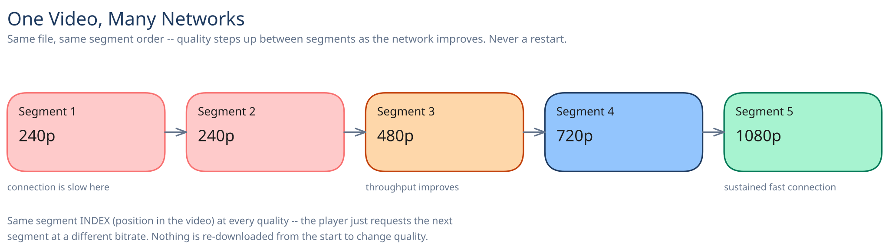

# Module 00 — Overview

## The feature, with no infrastructure in it yet

A creator uploads a video once. Every future viewer needs to watch it smoothly — a viewer on a fiber connection with a 4K TV and a viewer on a train's flaky 3G both hit play on the exact same file. The system has no way to know in advance which one it's talking to, and it can't ask: **the same encoded content has to serve wildly different network conditions without the viewer ever seeing a spinning buffer wheel or waiting through a re-download to change quality.**

That's the one hard constraint everything else in this module answers to.

## Requirements

**Functional:** a creator uploads a video; the system processes it for playback; a viewer streams it back on whatever device and network they happen to have.

**Non-functional** (stated as assumptions, interview-style):
- Tens of millions of hours watched per day.
- Playback should start within ~2 seconds of hitting play.
- A viewer on a typical mobile connection should never see a stall mid-video if the design is doing its job — dropping quality is acceptable, freezing is not.

## Capacity Estimation

Using this guide's [back-of-envelope method](../../foundations/back-of-envelope-estimation.md):

- **Concurrent viewers:** 50M hours watched/day ÷ 24 ≈ **2.1M average concurrent viewers**. At a 3x evening-peak factor: **~6.25M concurrent viewers**.
- **Peak egress bandwidth:** at a blended ~3 Mbps average bitrate across all the quality tiers a typical viewer actually lands on, 6.25M viewers × 3 Mbps ≈ **~18.75 Tbps at peak** — a number no single origin could ever serve directly, which is the entire reason the CDN section below isn't optional.
- **New-upload storage:** assume 500K hours of new content uploaded/day, transcoded into four renditions (240p ≈0.3 Mbps, 480p ≈1 Mbps, 720p ≈2.5 Mbps, 1080p ≈5 Mbps). Summed bitrate ≈8.8 Mbps → **~4GB of encoded video per hour of source content**, across all four renditions. 500,000 hours/day × 4GB/hr ≈ **~2PB/day** of new encoded storage.

## Approach Walkthrough

Before any boxes: upload and encoding happen once, off to the side, asynchronously — a creator's upload finishes in seconds regardless of how long transcoding takes afterward. What actually gets served on every playback is a **manifest** (which qualities exist, where their chunks live) plus short, independently-requestable **segments** at each quality, so a viewer's player can switch quality between segments instead of committing to one bitrate for the whole video. Almost none of that playback traffic ever reaches the origin — it's served from a CDN edge that already has the segment cached from an earlier viewer.

## API Surface

- `POST /videos {creator_id, title}` → `{video_id, upload_url}` — `upload_url` is a pre-signed URL straight to object storage (cross-ref [Object / Blob Storage](../../scalability-resilience/object-blob-storage.md)); the API server never touches the raw bytes.
- `POST /videos/{id}/complete` → enqueues the transcoding job; returns immediately, doesn't wait on encoding.
- `GET /videos/{id}/manifest` → the list of ready renditions and their segment location pattern, once transcoding has produced at least one usable quality.
- Segment fetches (`GET .../segment_N.ts` for a given quality) go to the **CDN**, not this API — the manifest just tells the player where to ask.
