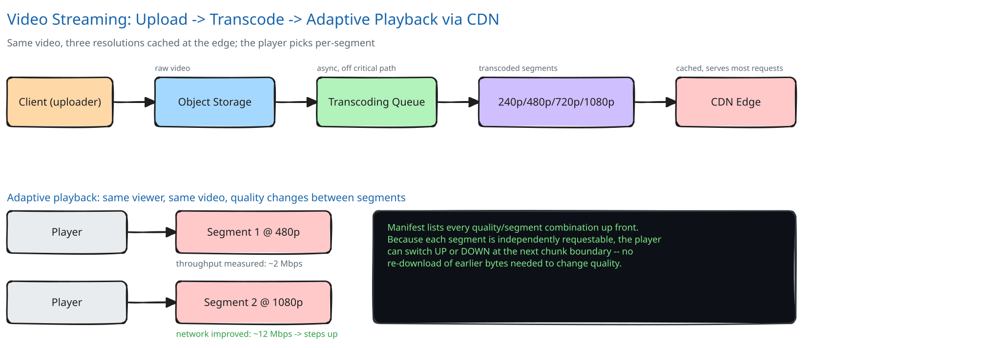

# Module 01 — Architecture & High-Level Design

## Monolith vs. microservices

Transcoding and playback-serving are pulled apart into separate services because they're fundamentally different workloads scaling on different signals: transcoding is CPU-bound batch work where a popular upload can occupy a worker for minutes, and it scales on **queue depth**; playback-serving is I/O-bound, latency-sensitive, and scales on **request rate** — mostly absorbed by the CDN before it ever reaches an app server at all. Sharing a deploy/scaling unit between the two would mean either over-provisioning the low-latency serving tier to also absorb encoding spikes, or letting a transcoding burst starve CPU that playback requests need. If this were a small site with a handful of uploads a day, that split isn't buying anything yet — the two workloads only need to be separate once either one's scaling behavior would otherwise punish the other.

## Building blocks

| Block | Role |
|---|---|
| **Upload Service** (stateless) | issues pre-signed upload URLs; on upload-complete, enqueues a transcode job — never touches raw video bytes itself |
| **Transcoding Worker Pool** | CPU-bound, pulls jobs from a queue, encodes the source into several resolution/bitrate renditions, writes segments to object storage |
| **Manifest Service** (stateless) | tracks which renditions are ready per video; serves manifest requests to players |
| **CDN** | caches segments at the edge; absorbs the overwhelming majority of playback traffic before it ever reaches origin |
| **Object Storage** | durable store for the raw upload and every encoded segment |

## Per-path walkthrough

**Upload path (write)** — `Creator → Upload Service (pre-signed URL) → Object Storage (direct PUT, bypassing the API server entirely) → Upload Service (mark complete) → Queue (enqueue transcode job)`.

**Transcode path (async)** — `Queue → Transcoding Worker (claims job) → Object Storage (read raw source) → encode N renditions → Object Storage (write segments to a staging key) → Manifest Service (promote rendition to ready)`.

**Playback path (read)** — `Viewer → Manifest Service (GET manifest) → CDN (GET segment, quality chosen by the player) → cache hit: edge serves directly / cache miss: CDN pulls once from Object Storage and caches it for every viewer after`.

## Trade-offs to make explicit

| Decision | Chosen | Alternative | Why |
|---|---|---|---|
| Transcode timing | Async, off the critical path, queued | Synchronous at upload time | Sync would block a creator for minutes-to-hours on the highest resolution; async lets upload complete in seconds regardless |
| Encoding strategy | Multiple resolutions pre-encoded once | Transcode-on-request, live per viewer | Pre-encoding pays the CPU cost once per video; on-demand would pay it again on every single view, multiplied by millions |
| Segment size | Short chunks (2–10s), independently requestable | One file per quality, whole-video | Chunking lets the player switch quality at the *next* chunk boundary instead of restarting the download at a new bitrate |
| Where playback traffic is served | CDN edge, cache-first | Origin object storage, directly | The same RTT argument [CDN](../../hld-building-blocks/cdn.md) makes — no origin absorbs millions of concurrent viewers without an edge in front of it |
| Rendition visibility | A rendition only appears in the manifest once every one of its segments is fully written | Mark it ready as soon as encoding starts | A partially-encoded rendition appearing "ready" would 404 mid-playback the moment the player requests a segment that isn't there yet |

## Load Handling

- **Peak-vs-average tolerance:** the ~6.25M concurrent viewers at peak (Module 00) are almost entirely a CDN cache-hit workload — origin and the app tiers see a much smaller, *decoupled* load, since a cache hit never reaches them at all.
- **Where backpressure kicks in first:** the transcoding **queue**, not the viewer-facing path. A burst of uploads (many creators posting right after a live event) grows the queue rather than degrading anyone's playback — the fix is autoscaling worker count against queue depth, not touching the serving tier at all.
- **What gets shed under overload:** nothing on the viewer-facing read path — a CDN cache hit is cheap enough that there's rarely anything to shed there. On the transcode side, lower-priority renditions can be deferred under a sustained backlog (finish 480p/720p first, catch up on 1080p once the queue drains) so a video becomes watchable quickly even if every quality isn't ready yet.
- **Load-test target:** sustain the ~18.75 Tbps peak-hour egress at the CDN layer with segment-fetch p99 latency holding steady, and separately, absorb a 10x upload-rate burst for an hour without the transcode queue growing unboundedly — workers autoscale to drain it within a bounded window rather than falling permanently behind.

## Concurrent-User Handling

| Race | Mechanism | What the "loser" sees |
|---|---|---|
| Thousands of viewers request the same just-uploaded, suddenly-viral segment from a cold CDN edge simultaneously | Request coalescing at the edge (single-flight to origin; every other concurrent request waits on that one in-flight fetch) — cross-ref [Caching Strategies](../../hld-building-blocks/caching-strategies.md)'s stampede point | Everyone gets the segment once it arrives; only one origin fetch happens, not thousands |
| A creator replaces/re-uploads a video while it's actively being watched | Every upload gets a new `video_id`; a manifest already handed to a player never mutates in place, and its segments stay valid for that session | The in-progress viewer's session finishes cleanly on the old version; a *new* playback request gets the new version's manifest |
| A transcoding worker crashes mid-job; another worker (or a retry) picks up the same at-least-once-delivered job | Encoding writes to a staging object key, only promoted to the manifest-visible key on full success — a half-finished job is never visible, and re-running the same job safely overwrites the same staging key | No visible effect to any viewer — the video simply isn't marked ready until a complete, successful run finishes |

## Scaling & Reliability

- **Horizontal scaling:** the Transcoding Worker Pool scales on queue depth; Upload Service and Manifest Service are both stateless and scale on request rate like any tier in this guide.
- **Circuit breaker:** a CDN edge's fetch to origin on a cache miss is wrapped in a circuit breaker (cross-ref [Circuit Breakers & Retries](../../scalability-resilience/circuit-breakers-retries.md)) — if origin storage is degraded, the breaker trips rather than piling up retries against a store that's already struggling.
- **Retries:** a failed transcode job retries a bounded number of times; because the staging-then-promote write is idempotent, a retry redoing the same encoding work is always safe.
- **Dead-letter queue:** a video whose source file is genuinely corrupt fails every retry and lands in a DLQ for manual review, rather than looping forever and starving the queue for every other video behind it.
- **Graceful degradation:** if CDN capacity in one region is constrained, serving only the lower-bitrate renditions there (rather than failing playback entirely) keeps video watchable at reduced quality instead of not at all.
- **Multi-region:** the CDN layer is inherently multi-region by design; origin storage and transcoding are treated as single-region here — a real gap, named honestly below rather than glossed over.

## What you'd revisit as this grows

- **Live streaming** needs a genuinely different pipeline — encoding happens in near-real-time under time pressure instead of ahead of time, trading end-to-end latency for the "encode once, distribute forever" luxury this on-demand design has.
- **Per-title encoding.** A fixed bitrate ladder (240p/480p/720p/1080p for every video) wastes storage on simple content and under-serves complex content; a mature system tunes the ladder per video based on its actual visual complexity.
- **DRM and content protection** — deliberately out of scope here so the caching/transcoding design could be reasoned about on its own; it's a real, separate layer a production system needs.
- **Multi-region origin and transcoding** for creators far from wherever origin currently lives, so upload latency doesn't degrade for a global creator base the way this single-region version would.
