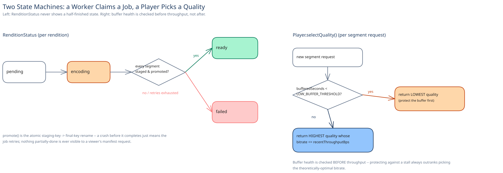

# Module 02 — Low-Level Design



**`RenditionStatus`**, as an explicit state machine matching this guide's convention elsewhere: `pending → encoding → ready | failed`. A rendition only ever becomes visible to a viewer's manifest request in the `ready` state — there's no partial or "encoding, but some segments are up" state a player could observe.

## Interfaces vs. implementations

- **`TranscodeJobQueue`** *(interface)* → **`SqsTranscodeQueue`** — `enqueue(videoId)`, `dequeue()` with at-least-once delivery; a job can be redelivered, and everything downstream is built to tolerate that.
- **`RenditionEncoder`** *(interface)* → **`FfmpegRenditionEncoder`** — `encode(sourceUrl, targetBitrate) → segmentUrls[]`. Every codec/bitrate combination is one implementation behind this same interface.
- **`SegmentStore`** *(interface)* → **`ObjectStorageSegmentStore`** — `putStaging(videoId, quality, segments)`, `promote(videoId, quality)` (atomic rename/copy from the staging key to the final, manifest-visible key).
- **`ManifestRepository`** *(interface)* → **`SqlManifestRepository`** — `markRenditionReady(videoId, quality)`, `getManifest(videoId)`.

## Pseudocode for the transcode-job flow

```
TranscodeWorker.processJob(videoId):
    source = objectStorage.read(videoId, "raw")

    for quality in [240p, 480p, 720p, 1080p]:
        segments = encoder.encode(source, bitrateFor(quality))
        segmentStore.putStaging(videoId, quality, segments)   # not yet visible to any manifest
        segmentStore.promote(videoId, quality)                # atomic: staging key -> final key
        manifestRepo.markRenditionReady(videoId, quality)      # only NOW can a player see this quality

    # a crash or redelivered job here just re-runs the loop; promote() and
    # markRenditionReady() are both safe to repeat against the same target
```

```
Player.selectQuality(availableQualities, recentThroughputBps, bufferedSeconds):
    if bufferedSeconds < LOW_BUFFER_THRESHOLD:
        return lowestQuality(availableQualities)              # protect against a stall first

    best = highest quality in availableQualities whose bitrate <= recentThroughputBps
    return best
```

## Error cases worth designing for deliberately

- **One rendition fails to encode while the others succeed** (a codec edge case on a specific bitrate target): the video is still marked partially ready — whatever renditions *did* succeed become visible, and the failed one alone retries or lands in the dead-letter queue. A single bitrate failing shouldn't block every other quality from being watchable.
- **A redelivered job re-runs encoding that already finished successfully:** `promote()` and `markRenditionReady()` are both idempotent against the same target key/row, so re-running the whole loop wastes CPU but changes nothing observable — never a duplicate or corrupted rendition.

## Concurrency at the code level

`segmentStore.promote()` and `manifestRepo.markRenditionReady()` need no application-level lock: the Transcoding Worker Pool runs many instances, and correctness comes from the storage layer's own atomic rename (an object either fully exists at the final key or it doesn't — there's no partially-visible intermediate state a concurrent reader could observe) and from the manifest update being a simple idempotent write, not a read-modify-write that could race. Pushing the atomicity requirement down into the one layer that already provides it for free is the same discipline this guide applies everywhere two writers might touch the same target.

## Design patterns you just used, named

- **Repository pattern** — `ManifestRepository` and `SegmentStore` hide storage behind method calls; nothing above them issues SQL or object-storage calls directly.
- **Strategy pattern** — `RenditionEncoder` is a strategy: swapping codecs or adding a new bitrate target is a new implementation behind the same interface, not a rewrite of the worker loop.
- **Staging-then-promote** — the same shape this guide's payments case study uses for atomic intent-then-outcome: nothing partially-done is ever visible, only a fully-committed final state.
- **Queue-based load leveling** — the transcode queue absorbs an upload burst without that burst ever reaching the viewer-facing tier at all.

## Practice: extend it yourself

1. **Per-title encoding.** Instead of a fixed bitrate ladder for every video, add a step that measures a video's visual complexity and picks a tailored set of bitrates. Which existing interface changes, and which one stays exactly the same?
2. **DRM licensing.** Before a segment fetch is allowed to succeed, the player needs a valid license for that video. Where would you check this — at the CDN edge, at the Manifest Service, or somewhere else — and what does that decision cost in latency versus what it costs in security?

Neither has one clean answer — the point is noticing which existing interface boundary already knows how to absorb each change.
