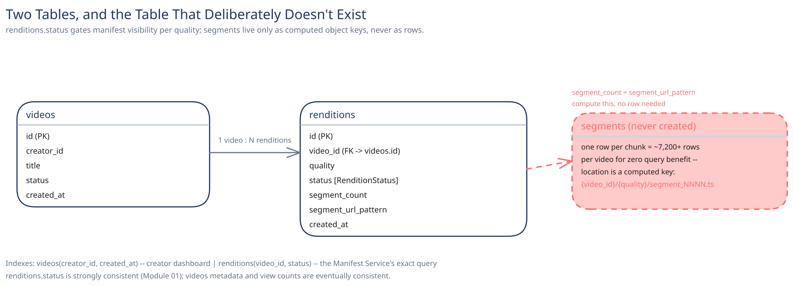

# Module 03 — Database Design & Scaling

## From entities to schema

- **`videos`** `(id, creator_id, title, status, created_at)` — one row per uploaded video.
- **`renditions`** `(id, video_id, quality, status, segment_count, segment_url_pattern, created_at)` — one row per (video, quality) pair; `status` is the `RenditionStatus` state machine from Module 02.

## Why there's no `segments` table

The obvious-looking design puts one row per segment — but a video with, say, 2 hours of content at 4-second segments and 4 renditions is already ~7,200 rows for a *single* video, and nothing ever queries a segment individually by anything other than its position: "give me segment 40 of the 720p rendition" is a computed object key (`{video_id}/{quality}/segment_0040.ts`), not a lookup that benefits from a row. Storing `segment_count` and a URL pattern on the `renditions` row lets the Manifest Service compute every segment's location without a single extra row existing anywhere — the segments themselves live only as objects in storage, never as database rows.

## Why `renditions.status` gates manifest visibility, not `videos.status` alone

A video can be genuinely, permanently watchable at 480p and 720p while 1080p is still encoding or has failed outright (Module 02's error-handling case) — gating visibility at the per-rendition level is what lets a video go live the moment its *first* rendition finishes, instead of waiting for every quality to be ready.

## Indexes

- `videos(creator_id, created_at)` — a creator's own video list/dashboard, filtered by owner then sorted by recency.
- `renditions(video_id, status)` — the Manifest Service's exact query: "every ready rendition for this video."

## Consistency

- **`renditions.status`:** strongly consistent — a viewer must never see a rendition in the manifest before every one of its segments has actually finished uploading (Module 01's Trade-offs table names exactly this failure mode).
- **`videos` metadata (title, creator):** eventually consistent is fine — a creator editing a title and a viewer seeing the update a few seconds later has no correctness cost, unlike a half-ready rendition.
- **View counts / watch-time analytics:** the same eventually-consistent, async-aggregated pattern this guide's [Counting a Billion Likes](../../../like-counting-at-scale/00-overview.md) case study already covers — nobody needs a viral video's view counter to be exact to the second.

## Scaling the schema

- **Sharding, once volume demands it:** by `video_id` — nearly every query (a video's renditions, its manifest) is scoped to one video, so this key matches the access pattern that actually runs constantly, the same reasoning this guide applies to every other case study's shard-key choice.
- **This table stays small relative to the actual data.** The overwhelming majority of this system's bytes live in object storage as segments, not in this schema at all — `videos` and `renditions` together are a thin metadata layer over a much larger blob store, which is exactly why sharding pressure here is lighter than in a system whose real data lives in its relational tables.

## Connecting it back

Module 00's "no re-download to change quality" requirement is why segments exist as short, independently-requestable chunks in the first place; that same requirement is why `renditions` is the unit of readiness rather than `videos` as a whole; and the decision to store a segment *count and pattern* instead of a row per segment is what keeps this schema thin even as the platform's actual video-hours scale into the millions. Every choice here traces back to a decision already made in Module 01, not an arbitrary schema preference.
