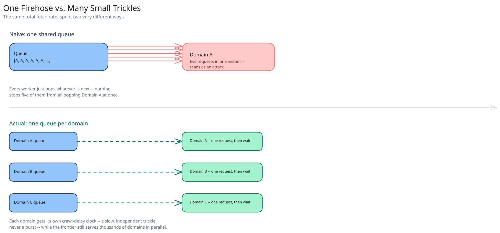

# Module 00 — Overview

## The feature, with no infrastructure in it yet

Given a handful of seed URLs, keep discovering and fetching pages forever, growing a searchable index — without ever fetching the same URL twice, and without ever sending enough concurrent requests at one domain to look like a denial-of-service attempt. That second constraint is the one that makes this hard: a crawler with unlimited fetching capacity and zero politeness would get every domain it touches to block it within minutes. **The entire design exists to be fast in aggregate while being deliberately slow against any single target.**

## Requirements

**Functional:**
- Given a set of seed URLs, fetch each page, extract its outbound links, and add newly-discovered URLs back into the crawl.
- Never re-fetch a URL that's already been crawled (unless it's due for a scheduled recrawl).
- Respect each site's `robots.txt` and its declared crawl-delay.

**Non-functional** (stated as assumptions, interview-style):
- Crawl on the order of **1 billion pages/month**.
- **Politeness is non-negotiable**: no domain should ever see a concurrent request rate that reads as abusive, regardless of how much spare fetcher capacity the crawler has.
- **Freshness matters unevenly**: a fast-changing, high-value page should be recrawled far more often than an obscure page that hasn't changed in years — recrawl priority isn't uniform.

## Capacity Estimation

Using this guide's [back-of-envelope method](../../foundations/back-of-envelope-estimation.md):

- **Pages/sec, average:** 1B / (30 × 86,400) ≈ **~385 pages/sec**. At a 3x peak factor (a burst of freshly-discovered high-priority URLs): **~1,150 pages/sec peak**.
- **Link-extraction volume:** assume ~50 outbound links per page → **~19,000 candidate URLs/sec** flowing through the seen-URL check at peak — this, not the fetch rate itself, is the busiest, most latency-sensitive path in the whole system.
- **Storage/month:** assume ~100KB average page size (raw HTML, pre-compression) → 1B × 100KB = **~100TB/month** of raw content, which is exactly the kind of large-blob volume that has no business living in a primary database.
- **Seen-URL set size:** billions of distinct URLs accumulate over the crawl's lifetime — a plain hash set doesn't fit in memory on one machine at this scale, which is precisely the gap a Bloom filter closes (see Architecture & HLD).

## Approach Walkthrough

Before any boxes: a crawler isn't hard because fetching one page is hard — it's hard because of two things that only show up at scale. **Politeness vs. throughput**: there's no shortage of URLs to fetch, but there's a hard ceiling on how fast any *one* domain can be hit before it looks like an attack, so throughput has to come from breadth (thousands of domains in flight at once, each throttled independently) rather than from draining any single domain's queue as fast as possible. **Duplicate detection at scale**: with billions of URLs discovered, "have I already crawled this?" can't be a row lookup against a billion-row table on every single link extracted from every single page — it needs a cheap first-pass filter that only asks the real store the rare "actually not sure" question.

## API Surface

This is an internal batch/pipeline system, not a public-facing API — its "surface" is the control-plane operations an operator or a scheduling job calls:

- `POST /seeds {urls: [...]}` → injects new seed URLs into the frontier at high priority.
- `GET /domains/{domain}/status` → `{queued, in_flight, last_crawled_at, robots_txt_cached_at, crawl_delay_ms}` — operational visibility into one domain's politeness state.
- `POST /domains/{domain}/pause` → stops popping new URLs for one domain (e.g. a site owner complains, or a domain starts erroring heavily) without affecting any other domain's crawl.
- Internal `FrontierQueue.dequeue(workerId) -> CrawlTask | None` — the fetcher pool's only entry point into the frontier; see Low-Level Design.
