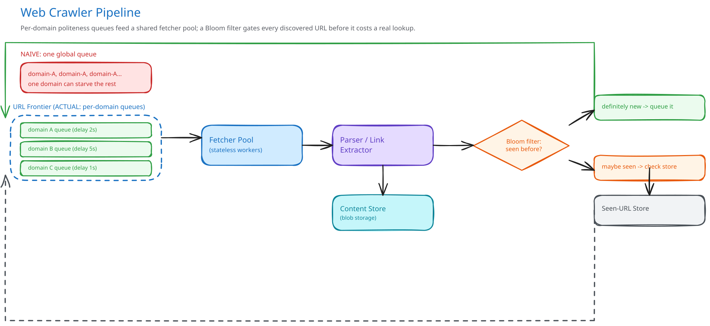

# Module 01 — Architecture & High-Level Design

## Monolith vs. microservices

The one seam worth pulling out deliberately is the **URL Frontier** — it's the single piece of shared, stateful coordination every fetcher depends on (which domain gets to send a request next, and when). Everything else — fetchers, the parser, the seen-URL check — is stateless and scales by adding instances. Folding the frontier's coordination logic into the same processes as the fetchers would mean every fetcher instance needs its own view of "is domain X's crawl-delay up yet," which either duplicates the politeness state everywhere (and lets two fetchers both think it's their turn) or forces a shared lock that defeats the purpose of having many fetchers at all. Keeping the frontier as its own tier means politeness is enforced in exactly one place, and fetchers stay simple: ask the frontier for work, do it, report back.

If the crawl volume were small — a few thousand pages, a handful of domains — a single process holding an in-memory priority queue would be the right call, and reaching for a distributed frontier here would be solving a problem the workload doesn't have yet.

## Building Blocks

| Block | Role |
|---|---|
| **URL Frontier** (stateful) | Owns one priority queue per domain, ordered by politeness delay and recrawl priority; the only component that decides "whose turn is it" |
| **Fetcher pool** (stateless) | Workers that call `Frontier.dequeue()`, fetch the returned URL (respecting a cached `robots.txt`), and hand the raw page to the parser |
| **Parser / link extractor** (stateless) | Extracts and normalizes outbound links from fetched HTML, then hands each candidate to the seen-URL check |
| **Seen-URL Bloom filter + store** | First-pass "definitely not seen" gate, backed by a real store for the rare "probably seen, confirm" case |
| **Content store** | Crawled HTML/assets — large blobs with no query pattern beyond "fetch by URL" |

## Per-path walkthrough

**Discovery path (write)** — `Parser → Seen-URL Bloom Filter (check) → [definitely new] → Frontier.enqueue(url, priority) → per-domain queue`. The Bloom filter check happens on every single extracted link, at the ~19,000/sec peak rate from Capacity Estimation — this is why it has to be an in-memory, O(1) check rather than a query against the real store.

**Fetch path (read-and-claim)** — `Fetcher → Frontier.dequeue(workerId) → [claims one URL, atomically, from a domain whose crawl-delay has elapsed] → Fetcher (GET, respecting cached robots.txt) → Parser`. "Atomically" is load-bearing: two fetchers must never be handed the same URL (see Concurrent-User Handling).

**Async path — recrawl scheduling** — a background scorer periodically re-enqueues already-crawled URLs into their domain's queue at a priority blended from change-frequency and importance, decoupled entirely from the live discovery path so a slow scoring pass never blocks a fetcher waiting on new work.

## Trade-offs to make explicit

| Decision | Chosen | Alternative | Why |
|---|---|---|---|
| Queue structure | One priority queue per domain | One global queue, drained by all workers | A global queue lets many workers pop the same popular domain's URLs back-to-back with nothing enforcing a delay between them; per-domain queues make politeness a property of the queue itself, not something every fetcher has to remember to check |
| Duplicate detection | Bloom filter first, real store only on a "maybe" | Query the real seen-URL store on every extracted link | At ~19,000 checks/sec, a real lookup on every single one saturates the store; a Bloom filter answers "definitely new" in-memory and only asks the store the rare ambiguous case |
| Content storage | Blob store, referenced by a small pointer row | Store raw HTML directly in the primary database | Crawled pages are exactly the large, query-pattern-free blob shape [Object / Blob Storage](../../scalability-resilience/object-blob-storage.md) already argues doesn't belong in a primary DB |
| `robots.txt` handling | Fetch once per domain, cache with a TTL | Fetch it fresh before every single page request | Refetching it constantly wastes a full request against the domain's own politeness budget on a file that rarely changes |
| Freshness vs. breadth | One blended priority score (change-frequency + importance) | A hard split, e.g. "80% of capacity to new URLs, 20% to recrawls" | A fixed split wastes capacity on stale recrawls when discovery is thin, or starves recrawls entirely during a discovery burst; a blended score naturally shifts weight as either signal changes |

## Load Handling

- **Peak-vs-average tolerance:** the fetcher pool and parser tier are both stateless and absorb the 3x peak factor from Capacity Estimation (~1,150 pages/sec) by adding instances — an ordinary horizontal-scaling problem.
- **Where backpressure kicks in first:** the frontier itself, since it's the one stateful coordination point. If dequeue requests start queuing because the frontier can't keep up, that's the signal to shard the frontier by domain hash (see Scaling the Schema in Module 03) before adding more fetchers, which would only increase contention against an already-saturated frontier.
- **What gets shed under overload:** recrawl scheduling is the first thing paused — it's explicitly lower-priority than fresh discovery (see Trade-offs), so a background scorer falling behind for a while costs staleness, not correctness. The fetch-and-discover path itself is never shed; a fetcher that can't get work simply waits.
- **Load-test target:** sustain 1,500 pages/sec and 25,000 seen-URL checks/sec for 30 minutes with zero duplicate fetches of the same URL and zero politeness violations (no domain receiving a request before its crawl-delay has elapsed).

## Concurrent-User Handling

| Race | Mechanism | What the "loser" sees |
|---|---|---|
| Two fetchers both call `dequeue()` for the same domain at the same instant | The frontier's dequeue is a single atomic claim-and-remove operation against one domain's queue — the same shape as an atomic job claim, not two independent reads followed by two independent removes | The second fetcher's `dequeue()` simply returns the *next* URL in that domain's queue (or `None` if it was the only one ready) — never the same URL twice |
| The same new URL is discovered from two different pages, parsed concurrently by two workers | Both hit the Bloom filter at roughly the same time; a Bloom filter set operation is checked-then-set as one atomic step against the shared filter, so only the first insert actually flips the bits | The second parser's check now (correctly) sees "probably seen" against the just-updated filter and skips re-queuing — a brief race window can occasionally let both through, which is a cheap, acceptable duplicate enqueue, not a correctness bug, since the frontier itself dedupes on the URL again before fetching |
| A domain's `robots.txt` is being refreshed by one fetcher at the exact moment another fetcher is deciding whether a URL is disallowed | The cache is read-through with a short-lived lock only around the *refresh* itself; a fetcher reading during a refresh gets the previous (still-valid, not-yet-expired) cached copy rather than blocking | No one blocks — a reader mid-refresh gets the slightly-stale-but-still-valid version, since a `robots.txt` refresh is a rare, low-stakes event compared to the fetch rate |

## Scaling & Reliability

- **Horizontal scaling:** fetcher pool and parser tier scale by request/parse rate, same as any stateless tier in this guide; the frontier scales by sharding its per-domain queues across multiple frontier instances, keyed by domain hash (see Module 03).
- **Circuit breaker:** a domain returning a high error rate (5xx, connection failures) trips a per-domain circuit breaker (cross-ref [Circuit Breakers & Retries](../../scalability-resilience/circuit-breakers-retries.md)) — fetchers stop hammering a domain that's clearly down rather than burning capacity on requests destined to fail.
- **Retries:** a single transient fetch failure gets a small number of retries with backoff; a URL that fails repeatedly is parked in a dead-letter state rather than retried forever.
- **Dead-letter queue:** URLs that permanently fail (404, persistent timeout, blocked by `robots.txt`) move to a DLQ for periodic review rather than silently disappearing or endlessly retrying and starving that domain's queue of real work.
- **Graceful degradation:** if the content store is temporarily unavailable, fetchers can still dequeue and fetch — the fetched page is held briefly and retried against the store, rather than failing the whole fetch and losing the crawl-delay slot that was just spent.
- **Multi-region:** not built here — see "what you'd revisit" below.

## What you'd revisit as this grows

- **Near-duplicate content detection.** This design catches identical URLs; it says nothing about two different URLs serving near-identical content (a tracking-param variant, a mirror). A content-fingerprint pass (shingling/minhash) layered after fetch would close that gap, at real additional cost per page.
- **Multi-region crawling.** Fetching every domain worldwide from one region adds latency and looks less "local" to geo-aware sites; a mature crawler runs fetcher pools per region, which reopens the politeness-state-sharing question across regions.
- **Frontier sharding at real scale.** A single frontier (even with per-domain queues) becomes the bottleneck this module's Load Handling section already flags; sharding it by domain hash is straightforward until a handful of enormous domains (a huge blogging platform) overload one shard disproportionately, which needs its own rebalancing story.
- **Smarter prioritization.** This design blends two signals (change-frequency, importance) into one score; a mature crawler folds in more — user-reported staleness, topical trends — without which the crawl slowly drifts toward whatever's easiest to fetch rather than what's actually valuable to have fresh.
