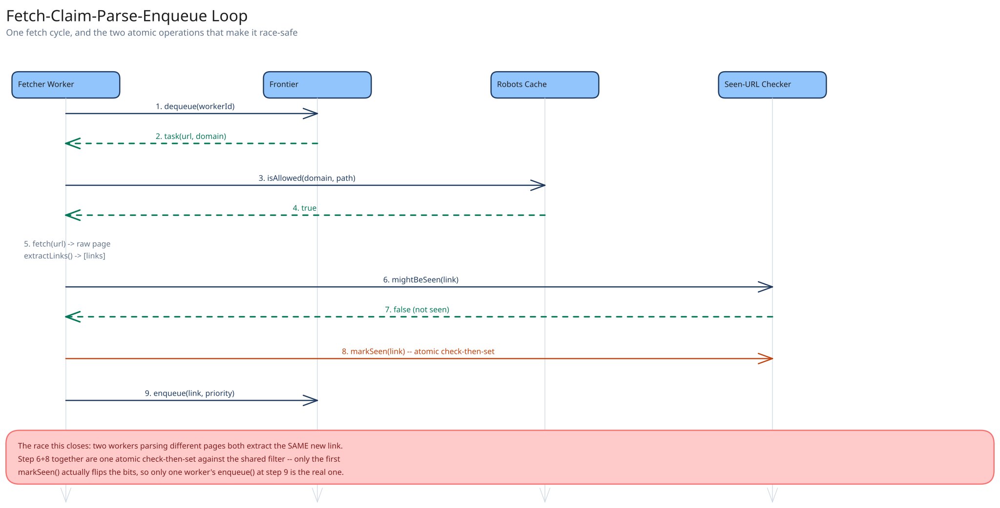

# Module 02 — Low-Level Design



**`CrawlTaskStatus`**, as an explicit state machine, matching this guide's convention elsewhere: `queued → claimed → fetched → parsed`, with `failed` reachable from `claimed` or `fetched` and `dead_lettered` reachable from `failed` after repeated retries. Modeling this as a named enum with enforced transitions — not a free-text status column — is what makes "a URL can't be claimed twice while already claimed" checkable at the type level.

## Interfaces vs. implementations

- **`FrontierQueue`** *(interface)* → **`PerDomainPriorityQueue`** — `enqueue(url, priority)`, `dequeue(workerId) -> CrawlTask | None`, where `dequeue` atomically claims and removes the highest-priority URL from whichever domain's crawl-delay has elapsed.
- **`SeenUrlChecker`** *(interface)* → **`BloomFilterChecker`** — `mightBeSeen(url) -> bool`, `markSeen(url)` — the cheap first-pass gate from Module 01.
- **`RobotsTxtCache`** *(interface)* → **`TtlRobotsTxtCache`** — `isAllowed(domain, path) -> bool`, refreshing its cached copy on a TTL rather than on every call.
- **`Fetcher`** *(interface)* → **`HttpFetcher`** — `fetch(url) -> RawPage | FetchError`.
- **`ContentStore`** *(interface)* → **`BlobContentStore`** — `put(url, content) -> contentRef`.

## Pseudocode for the fetch-and-discover loop

```
FetcherWorker.run(workerId):
    loop:
        task = frontierQueue.dequeue(workerId)         # atomic claim; None if nothing is ready
        if task is None:
            sleep(backoff); continue

        if not robotsCache.isAllowed(task.domain, task.path):
            markDead(task, reason="disallowed"); continue

        page = fetcher.fetch(task.url)
        if page is FetchError:
            handleFetchFailure(task, page)              # retry with backoff, or dead-letter
            continue

        contentRef = contentStore.put(task.url, page.body)
        links = parser.extractLinks(page.body, baseUrl=task.url)

        for link in links:
            if seenChecker.mightBeSeen(link):
                continue                                 # probably already crawled, skip
            seenChecker.markSeen(link)                    # atomic check-then-set against the filter
            frontierQueue.enqueue(link, priority=score(link))

        markFetched(task, contentRef)
```

The `dequeue(workerId)` call is the same atomic-claim discipline this guide's [payments case study](../payments-system/02-lld.md) uses for its conditional status update: the frontier only hands out a URL it can mark as claimed in the same step, so no two workers ever receive the same task.

## Error cases worth designing for deliberately

- **`robots.txt` disallows the path, or is unreachable:** both are treated as "don't fetch" — an unreachable `robots.txt` fails closed (assume disallowed) rather than assuming permission, since guessing wrong the other way risks fetching something a site owner explicitly blocked.
- **Fetch succeeds but returns a 3xx redirect chain that never terminates:** cap redirect-follow depth (e.g. 5 hops) and dead-letter the task past that, rather than looping indefinitely on a single URL and burning that domain's crawl-delay slots on a URL that will never resolve.

## Concurrency at the code level

`frontierQueue.dequeue(workerId)` needs no in-process lock, and this is worth stating explicitly: fetcher workers run on many horizontally-scaled instances, so a language-level mutex would only protect threads on the *same* instance. Correctness comes entirely from the frontier enforcing the claim atomically wherever its own state actually lives (a single-writer in-memory structure per shard, or a conditional update against a shared store if the frontier itself is distributed) — the same pattern this guide uses everywhere two workers might race for the same unit of work: push the atomicity requirement down into the one component that can actually provide it.

The one place an in-process guard genuinely matters: within a *single* fetcher instance handling many concurrent fetches, `seenChecker.mightBeSeen()` followed by `markSeen()` is two calls, not one — a bug here would be calling them on different objects/connections such that the check-then-set isn't actually atomic against the shared filter. The real safety net is the Bloom filter's own atomic bit-set operation, not a lock the application code has to remember to take.

## Design patterns you just used, named

- **Repository pattern** — `FrontierQueue` and `ContentStore` hide storage/coordination behind method calls; `FetcherWorker` never touches the underlying queue or blob store directly.
- **Strategy pattern** — `Fetcher` is a strategy: swapping `HttpFetcher` for a headless-browser-based fetcher (for JavaScript-rendered pages) doesn't change anything else in the loop.
- **State pattern (via an explicit enum)** — `CrawlTaskStatus`'s enforced transitions are the same state-machine discipline this guide applies consistently, rather than a free-text status field.

## Practice: extend it yourself

Before moving to Database Design, sketch (pseudocode is fine) how you'd add:

1. **Per-domain concurrency limits, not just a time-based crawl-delay** — a domain that allows one request every 100ms but never more than 2 requests in flight at once. Which component enforces the "in flight" count, and what does a fetcher do if it claims a task but the domain's concurrency slot is already full?
2. **A "recrawl this specific URL now" operator command** — bypassing the normal priority score entirely for one URL. Does this need a new priority tier, or can it reuse the existing `enqueue(url, priority)` interface with a sufficiently extreme priority value — and what happens if that URL is *already* queued at a lower priority?

Neither has one clean answer — the point is noticing that the interfaces already drawn (`FrontierQueue`, `RobotsTxtCache`) make it obvious which component *should* own each new piece of behavior.
