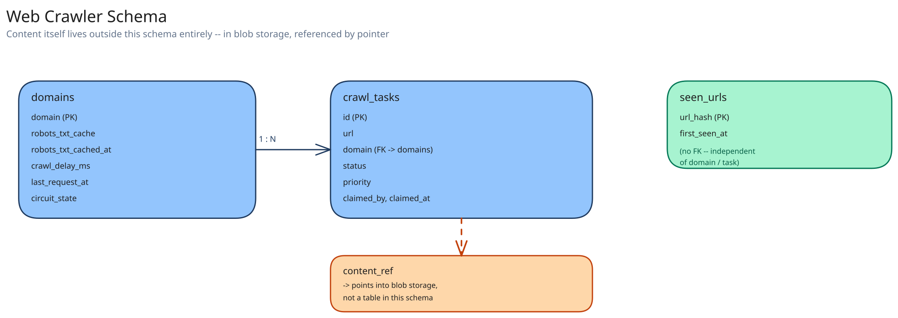

# Module 03 — Database Design & Scaling

## From entities to schema

Three entities fall out of the requirements directly:

- **`domains`** `(domain, robots_txt_cache, robots_txt_cached_at, crawl_delay_ms, last_request_at, circuit_state)` — one row per domain, the home of every piece of politeness state.
- **`crawl_tasks`** `(id, url, domain, status, priority, claimed_by, claimed_at, created_at)` — the frontier's durable backing (an in-memory queue per domain is the hot path; this table is what survives a frontier restart).
- **`seen_urls`** `(url_hash PRIMARY KEY, first_seen_at)` — the real store backing the Bloom filter's rare "probably seen, confirm" case. Note: crawled *content* itself is deliberately **not** a table here — it lives in blob storage (cross-ref [Object / Blob Storage](../../scalability-resilience/object-blob-storage.md)), with only a `content_ref` pointer stored per task.

## Why `domains` is its own table, not a column on every task

Politeness state (crawl-delay, last request time, circuit-breaker state) changes on every single fetch against a domain, while a domain's identity itself almost never changes — exactly the write-frequency split this guide's [e-commerce schema](../../database-design/ecommerce-schema-worked-example.md) uses to justify splitting `inventory` from `products`. Bundling politeness state onto every `crawl_tasks` row would mean updating potentially thousands of task rows every time a domain's `last_request_at` changes, instead of updating one row in `domains`.

## Why `seen_urls` keys on a hash, not the raw URL

A URL can be arbitrarily long; hashing it to a fixed-width key (e.g. a 128-bit hash) keeps the index compact and every lookup a fixed-cost operation regardless of URL length — the actual URL isn't needed back out of this table, only "have I seen something that hashes to this."

## Indexes

- `domains(domain)` — **primary key**; every fetcher's `dequeue()` call and every politeness check goes through this lookup first.
- `crawl_tasks(domain, status, priority)` — the frontier's core query, "the next highest-priority queued task for this domain," is exactly this composite index read in priority order.
- `crawl_tasks(status)` where `status = 'claimed'` (a partial index) — the recovery job's query ("tasks claimed but never completed — a fetcher crashed mid-fetch") stays cheap even as the historical task table grows into the billions of rows.
- `seen_urls(url_hash)` — **primary key**, the Bloom filter's backing confirmation lookup; already fixed-width by construction.

## Consistency

- **`domains`:** must be strongly consistent for `crawl_delay_ms` and `last_request_at` — two fetchers reading a stale `last_request_at` could both think a domain's delay has elapsed and both fetch at once, exactly the politeness violation this whole design exists to prevent.
- **`crawl_tasks`:** the claim (`status: queued → claimed`) must be strongly consistent for the same reason Module 01's Concurrent-User Handling names — but the eventual `fetched`/`parsed` transition tolerates a small amount of replication lag before it's visible to, say, an operator's dashboard.
- **`seen_urls`:** can tolerate eventual consistency across replicas — a replica lagging by a few hundred milliseconds just means the Bloom filter's rare "probably seen" confirmation occasionally reads a slightly-stale "not yet seen," which results in a harmless duplicate enqueue, not a correctness failure (see Module 01's Concurrent-User Handling).

## Scaling the schema

- **Sharding `domains` and `crawl_tasks`, once volume demands it:** by a hash of `domain`, so every query and update for one domain's politeness state and queued tasks stays on one shard — this matches the access pattern that runs constantly (per-domain claim-and-fetch) exactly the way [Data Partitioning & Sharding](../../hld-building-blocks/data-partitioning-sharding.md) argues a shard key should.
- **`seen_urls` shards independently, by `url_hash`** — it has no relationship to domain at all, and hashing already distributes it evenly by construction.
- **Read replicas vs. sharding:** replicas would help a reporting/dashboard query pattern ("how many pages crawled today"); they do nothing for the claim-and-fetch hot path, which needs write throughput and total row count solved by sharding, not read throughput solved by replicas.

## Connecting it back

Module 00's "never hammer one domain" requirement is why `domains` exists as its own strongly-consistent table at all; that same requirement is why `crawl_tasks` is sharded by domain rather than an arbitrary hash, keeping one domain's politeness decision on one shard instead of scattered across many. And `seen_urls`'s tolerance for eventual consistency is a direct consequence of the Bloom filter's own false-positive-only guarantee from Module 01 — a store backing a check that can already be wrong in one direction doesn't need to be perfectly fresh to stay correct.
