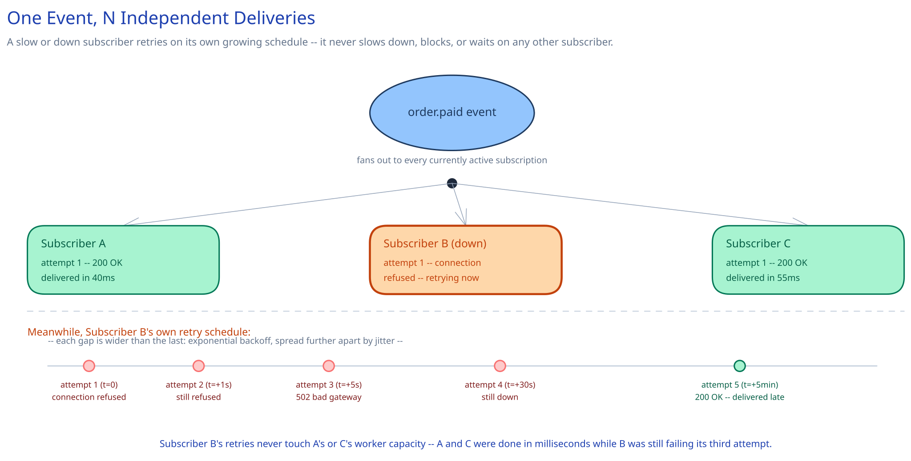

# Module 00 — Overview

## The feature, with no infrastructure in it yet

A merchant's `order.paid` event fires. Some customer of this platform registered a URL months ago — `https://their-warehouse-system.example.com/webhooks/orders` — code they wrote, running on infrastructure this platform doesn't control and can't see the health of. That URL might answer in 40ms. It might be down for maintenance. It might be mid-deploy and returning 502s for the next six minutes. It might belong to a customer who churned eighteen months ago and never took the endpoint down. Every one of those is a normal Tuesday, not an incident — and the one hard constraint this whole module exists to satisfy is: **deliver that event to every subscriber who asked for it, at least once, without one slow or dead subscriber ever slowing down or blocking delivery to any other subscriber.**

That's a different shape of problem than most of this guide's other systems. [Notification System](../notification-system/00-overview.md) delivers to channels this platform *operates* (its own push/email/SMS providers); [Payments System](../payments-system/00-overview.md)'s own webhook relay emits a handful of payment-lifecycle events to notify a merchant of an outcome it already knows. This system is the general-purpose, opposite-direction version of both: an arbitrary number of producing services, an arbitrary event catalog, delivered to potentially thousands of independently-flaky third-party HTTP servers this platform has never operated and never will. The receiving side isn't a trusted internal dependency with an SLA — it's exactly as reliable as whoever wrote it decided to make it, and this system has to treat that as a given, not a bug to file.

## Requirements

**Functional:**
- A customer registers one or more endpoints, each subscribed to one or more event types (`invoice.paid`, `order.shipped`, ...); a single event type can have several endpoints registered against it.
- Deliver every matching event to every subscribed endpoint **at least once**, retrying failures with exponential backoff, up to a bounded schedule.
- Preserve delivery order **per subscriber** — if event A precedes event B for the same subscription, the subscriber never observes B before A, even while A is mid-retry.
- After exhausting the retry schedule, move the delivery to a dead-letter state with its full attempt history, visible on a dashboard and manually replayable.
- Sign every delivered payload so the subscriber can verify it actually came from this platform, not a forgery.

**Non-functional** (stated as assumptions, interview-style):
- 200M events/day ingested platform-wide, across all producing services and event types.
- 500K active subscriptions (registered endpoint + event-type pairs); roughly 5% unhealthy (slow, erroring, or fully down) at any given moment — this isn't a rare edge case, it's a standing feature of having thousands of independently-operated receivers.
- p50 delivery latency under 5 seconds for a healthy endpoint; a down endpoint may take up to ~72 hours across its full retry schedule before landing in the dead-letter queue.
- One subscriber's failure must have **zero** measurable effect on delivery latency to any other subscriber — isolation is a hard requirement, not a nice-to-have.

## Capacity Estimation

Using this guide's [back-of-envelope method](../../foundations/back-of-envelope-estimation.md):

- **Deliveries/sec:** 200M events/day, and events fan out to an average of ~1.6 matching subscriptions each (most events match zero or one; a handful of high-traffic types like `invoice.paid` are registered by several endpoints per merchant) → 320M deliveries/day ≈ **~3,700/sec average, ~18,500/sec at a 5x peak** (a producer's own backlog clearing, or a platform-wide event type firing for every tenant at once).
- **Retry overhead:** roughly 6% of deliveries need at least one retry before succeeding, and roughly 0.05% exhaust the full schedule and land in the dead-letter queue — at 320M deliveries/day that's **~160K dead-lettered/day**, small as a fraction but large enough in absolute terms to need its own indexed, queryable home, not an afterthought table nobody can page through.
- **Attempt volume, the real load on the delivery workers:** counting retries, roughly 350M HTTP attempts/day ≈ **~4,050/sec average** — this, not the raw delivery count, is what the worker pool and per-subscriber circuit breakers are actually sized against.
- **Storage:** a `delivery_attempts` row (delivery id, attempt number, response code, error, timestamp) is small, ~250 bytes — 350M/day × 250B ≈ **~87GB/day**, the single fastest-growing table in the system, for the same reason payments' `ledger_entries` outgrows `payment_intents`: one logical unit of work produces more than one append-only row.

## Approach Walkthrough

Before any boxes: fan-out happens **once, up front**, not at delivery time. The moment an event is ingested, it's resolved against every currently-active subscription and turned into one durable `(event, subscription)` row per match — the delivery unit is a pair, never a bare event. From that point on, each row's retry state, circuit-breaker health, and ordering position belong entirely to its own subscription; a worker claiming one subscriber's overdue retry has no way to even see, let alone block, a claim against a different subscriber's row. Isolation isn't bolted on with a bulkhead pattern after the fact — it falls directly out of modeling the delivery unit correctly from the start.

## API Surface

- `POST /subscriptions {tenant_id, event_type, endpoint_url}` → `{subscription_id, secret}` — the signing secret is generated here and shown once, exactly like an API key.
- `DELETE /subscriptions/{id}` — stop delivering to an endpoint; deliveries already fanned out before the delete are still attempted (see Module 01).
- `GET /deliveries?subscription_id=&status=` → paginated delivery history, including dead-lettered rows, for the customer's own dashboard.
- `POST /deliveries/{id}/replay` → manually re-attempt a dead-lettered delivery, explicitly out of order (see Module 02).
- Outbound, per delivery: `POST <endpoint_url>` with headers `Webhook-Signature: t=<timestamp>,v1=<hmac-sha256>` and `Webhook-Id: <delivery_id>`, body = the event payload — signed the same way Stripe signs its `Stripe-Signature` header. Cross-ref [Idempotency Keys](../../scalability-resilience/idempotency-keys.md) for why `Webhook-Id` matters to the *subscriber's* own handler, not just this system's.
