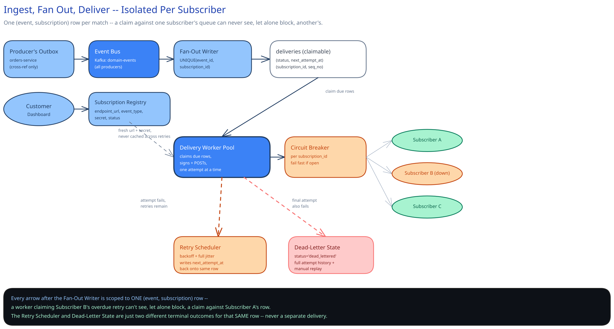

# Module 01 — Architecture & High-Level Design

## Monolith vs. microservices

Webhook delivery is pulled out as its own service, never folded into whichever service happens to own an event (orders, billing, inventory — whoever wants to tell the outside world something happened). Two independent reasons the seam holds:

The first is that the retry/backoff/circuit-breaker/dead-letter machinery this module builds is large, generic, and has nothing to do with what any producing service actually does — every service that wanted its own webhooks would otherwise need its own retry engine, its own per-endpoint circuit breaker, its own dead-letter dashboard, and those N implementations would drift out of sync with each other on exactly the details that matter (does service A's retry schedule match service B's? does a customer see one unified delivery history, or five?). Centralizing it means there's exactly one component whose entire job is "deliver reliably to a URL you don't control," built once, correctly.

The second is that this is the one place in the whole platform whose downstream dependency is: an arbitrary, customer-supplied URL, on infrastructure this platform has zero visibility into, that can be slow, wrong, actively malicious (an SSRF target dressed up as a webhook endpoint), or simply gone. That's a categorically different reliability and security profile than any internal service call, and isolating it means a subscriber's broken endpoint — or a customer registering an internal-looking URL out of curiosity — is a blast radius contained to one audited egress path, not a risk every producing service inherits by association.

If a platform only ever calls a handful of fixed, well-known partner URLs it operates alongside, this dedicated service isn't earning its cost yet, and it's worth saying so rather than defaulting into a platform because it looks more serious.

## Building blocks

| Block | Role |
|---|---|
| **Event Ingestion Consumer** (stateless) | Consumes producer events off the shared event bus — itself fed by each producing service's own [transactional outbox / CDC](../../hld-building-blocks/transactional-outbox-cdc.md), a mechanism this module reuses rather than re-derives |
| **Subscription Registry** | Stores each customer's registered endpoints, their event-type filters, status, and signing secret |
| **Fan-Out Writer** | For each ingested event, resolves matching active subscriptions and inserts one `deliveries` row per `(event, subscription)` pair, unique-constrained so re-consuming the same event is a no-op |
| **Delivery Worker Pool** (stateless, horizontally scaled) | Claims due deliveries in bounded batches, signs the payload, makes the outbound HTTP call, records the attempt |
| **Per-Subscription Circuit Breaker** | One breaker per `subscription_id`; trips on that one subscriber's own failure rate, independent of every other subscriber |
| **Retry Scheduler** | Computes a failed delivery's `next_attempt_at` via exponential backoff + jitter and writes it back onto the same claimable row |
| **Dead-Letter State** | Deliveries that exhaust the retry schedule land here with full attempt history intact, for dashboard visibility and manual replay |

## Per-path walkthrough

**Registration path** — `Customer dashboard → LB → Subscription Registry (write endpoint_url + event_type filter, generate signing secret, shown once)`.

**Ingestion & fan-out path (write)** — `Producer's own outbox/CDC (cross-ref, not re-derived) → Event Bus → Event Ingestion Consumer → Fan-Out Writer (resolve matching active subscriptions, insert one deliveries row per match, UNIQUE(event_id, subscription_id), SAME transaction as committing the consumer's own progress) → claimable deliveries queue`. The unique constraint is what makes re-consuming the same bus message (a producer's own at-least-once redelivery) a cheap no-op instead of a duplicate fan-out.

**Delivery path (async, per-subscriber ordered)** — `Delivery Worker (claim the lowest pending sequence_number per subscription_id whose prior sequence is already terminal) → Circuit Breaker check (fail fast if this subscription's breaker is open) → Signer (HMAC-SHA256 over timestamp + payload, per-subscription secret) → HTTPS POST to subscriber endpoint (bounded timeout) → record delivery_attempt`.

**Retry path** — `Attempt fails → Retry Scheduler computes next_attempt_at = now + backoff(attempt_number) + jitter → delivery row stays status='pending', remains the head of its subscription's queue → re-claimed once due`.

**Dead-letter & replay path** — `Final attempt fails → delivery marked status='dead_lettered' (terminal -- this is what unblocks the next sequence number for that subscription) → visible on dashboard with full delivery_attempts history → operator or customer calls POST /deliveries/{id}/replay → a fresh attempt sequence begins, explicitly and deliberately out of order`.

## Trade-offs to make explicit

| Decision | Chosen | Alternative | Why |
|---|---|---|---|
| Per-subscriber ordering | Strict in-order delivery: one in-flight attempt per subscription, next sequence number blocked until the prior one reaches a terminal state | No ordering guarantee; subscriber reorders using each event's own timestamp/sequence number (the position Stripe's own docs actually take) | Centralizing the ordering guarantee once, in the one component built to enforce it, beats asking thousands of third-party integrators to each correctly implement reordering logic -- most won't, and the ones who get it wrong fail silently on their own side |
| Delivery unit | `(event, subscription)` row, fanned out once at ingestion | A single event row, joined against subscriptions at delivery time | Retry state, attempt count, and circuit-breaker health are per-subscriber facts; a join-at-delivery-time model can't let one subscriber's retry sequence exist independently of another's without the same row |
| Fan-out durability | Unique constraint on `(event_id, subscription_id)`, written before acknowledging the bus offset | Acknowledge the bus message first, fan out after | Acking first risks losing the entire fan-out on a crash between ack and write, with no durable trace it should have happened; writing first and letting the unique constraint absorb a redelivered event costs nothing but an ignored insert |
| Endpoint isolation mechanism | Shared claimable queue across all subscribers; a per-subscription circuit breaker plus growing backoff naturally shrinks a dead endpoint's share of claim attempts over time | A dedicated worker thread or pool per subscriber | Millions of subscriptions rule out a dedicated thread per subscriber outright; a shared queue means a chronically-failing endpoint's deliveries simply come up for claim less and less often as its own backoff grows |
| Signature scheme | HMAC-SHA256 over `timestamp + "." + payload`, per-subscription secret, sent as a header | Mutual TLS per subscriber endpoint | HMAC needs only a shared secret a subscriber stores once; mTLS would require every third-party integrator to provision and rotate a client certificate -- real webhook providers (Stripe, GitHub, Shopify) all ship the HMAC-header version, not mTLS |

## Load Handling

- **Peak-vs-average tolerance:** the Event Ingestion Consumer, Fan-Out Writer, and Delivery Worker Pool are all stateless and scale horizontally against the ~5x peak from Capacity Estimation (~18,500 deliveries/sec) the same way any stateless tier in this guide does. The harder stress case isn't raw throughput -- it's a **synchronized retry storm**: this platform's own hour of downtime clears, and every delivery whose backoff matured during that hour becomes due in the same few seconds.
- **Where backpressure kicks in first:** at fan-out. The Fan-Out Writer consumes the event bus in bounded batches (Little's Law reasoning, cross-ref [Message Queues & Pub/Sub](../../hld-building-blocks/message-queues-pubsub.md)) -- the bus itself absorbs a producer-side burst, and fan-out never falls behind trying to drain it in one pass.
- **What gets shed under overload:** nothing on the correctness path. A due delivery not claimed this cycle simply waits, still durable, for the next one -- "shedding" here means a few extra seconds of delay, never a lost or silently dropped delivery.
- **Jitter is what actually saves this design during the retry-storm case above:** without it, every delivery that failed during the same outage window computes the *same* backoff and becomes due at the *same* instant, hitting the worker pool's claim query as one synchronized spike -- full jitter (randomizing the actual wait within the computed backoff window, cross-ref [Circuit Breakers & Retries](../../scalability-resilience/circuit-breakers-retries.md)) spreads that spike back out into something the claim query and the worker pool can absorb smoothly.
- **Autoscaling lag:** the worker pool scales on the age of the oldest still-due delivery, not on queue depth -- depth alone doesn't distinguish "500K deliveries, all fresh" from "500K deliveries, the oldest one three hours overdue," and only the second is actually an incident.
- **Load-test target:** simulate an hour-long platform outage across 10,000 active subscriptions, let their retry backoffs mature during that window, then confirm the recovery burst is smoothed by jitter across several seconds rather than landing as one synchronized spike, with zero duplicate claims and zero deliveries left permanently unclaimed.

## Concurrent-User Handling

| Race | Mechanism | What the "loser" sees |
|---|---|---|
| Two delivery workers claim the same due delivery at once | Atomic conditional claim: the claim query's own `WHERE` clause checks `status='pending'` and the sequence-gate condition together, in one statement -- not a separate read-then-decide step | The losing worker's claim affects zero rows; it moves on to the next due delivery in its batch, no error |
| A delivery's HTTP response is lost after the subscriber actually processed it (our timeout fires, but their server already returned 200) | At-least-once is accepted, not avoided: the delivery is retried, and the subscriber's own idempotent handling -- keyed on the `Webhook-Id` header -- is what makes the duplicate harmless on their side | The subscriber sees the same event twice; unlike this guide's [payments case study](../payments-system/00-overview.md), there is no processor status API to query here, so retrying and relying on subscriber-side idempotency is the only option, not a fallback |
| A subscription's endpoint URL or signing secret is rotated mid-retry-sequence | Every attempt reads the subscription's current config fresh from the Subscription Registry, not a cached copy captured when the delivery was first fanned out | The next attempt uses the new URL/secret automatically; earlier, already-succeeded attempts are never retroactively re-signed or replayed |
| A subscriber's sequence number N+1 becomes due while sequence N is still mid-retry | The claim query's sequence-gate excludes N+1 from the due set entirely -- this isn't resolved after a race, it's never a candidate in the first place | N+1 simply isn't claimable yet; no error, no wasted attempt -- it surfaces as due the moment N reaches `succeeded` or `dead_lettered` |

## Scaling & Reliability

- **Horizontal scaling:** ingestion consumers, the fan-out writer, and the delivery worker pool all scale by adding instances against their own claim/consume throughput -- none of them hold state that pins them to a specific subscriber.
- **Circuit breaker:** per `subscription_id`, never global (cross-ref [Circuit Breakers & Retries](../../scalability-resilience/circuit-breakers-retries.md)) -- a global breaker would mean one dead endpoint tripping delivery to every other, healthy endpoint too, which is exactly the isolation failure this whole design exists to avoid. An open breaker skips the network call entirely rather than paying a full connect-and-timeout cost against an endpoint already known to be down.
- **Retries:** exponential backoff with full jitter, roughly `1s, 5s, 30s, 5min, 30min, 2hr, 6hr, 24hr, 72hr` across up to 10 attempts -- a schedule spanning about 3 days before a delivery is dead-lettered, long enough to survive a subscriber's own multi-hour incident without giving up early, bounded enough that a dead endpoint doesn't hold a delivery "in flight" forever.
- **Dead-letter queue:** an exhausted delivery moves to a terminal `dead_lettered` state with its full `delivery_attempts` history intact -- for dashboard visibility, for manual replay, and critically, to unblock the next sequence number for that same subscriber, which is the mechanism that stops one truly-dead endpoint from holding its own queue hostage forever.
- **Graceful degradation:** if the worker pool degrades or the event bus backs up, deliveries simply queue longer -- nothing is lost, because fan-out already durably committed one row per `(event, subscription)` before any attempt was ever made. Subscribers see webhooks arrive late, never not at all.
- **Multi-region:** not built here -- named as a real gap below, not glossed over.

## What you'd revisit as this grows

- **Per-tenant fairness.** A shared claimable queue is what lets a dead endpoint's share of worker attention shrink naturally, but the same sharing means one extremely high-volume tenant can crowd out smaller tenants' claim latency -- this design doesn't rate-limit or prioritize by tenant, and a mature version would need to, the same "hot shard" gap this guide's [distributed job scheduler](../distributed-job-scheduler/01-architecture-hld.md) names for its own shared-claim model.
- **Endpoint SSRF protection.** A customer-supplied `endpoint_url` is untrusted input pointed at an outbound HTTP call -- this module assumes that validation (rejecting internal IP ranges, cloud metadata endpoints, redirects to disallowed hosts) happens somewhere, but doesn't design it in depth here; it's a real, separate security surface worth naming rather than assuming away.
- **Multi-region active-active**, with the same conflict-avoidance care this guide's other case studies name for their own multi-region gaps -- a single-region design is a single point of regional failure for a system whose whole premise is reliable delivery.
- **Large payloads.** This design assumes event payloads are small (a few KB); a genuinely large payload would need the claim-check pattern (cross-ref [Message Queues & Pub/Sub](../../hld-building-blocks/message-queues-pubsub.md)'s "fat payloads" anti-pattern) -- store the blob, deliver a reference -- rather than inlining it into every `deliveries` row.
