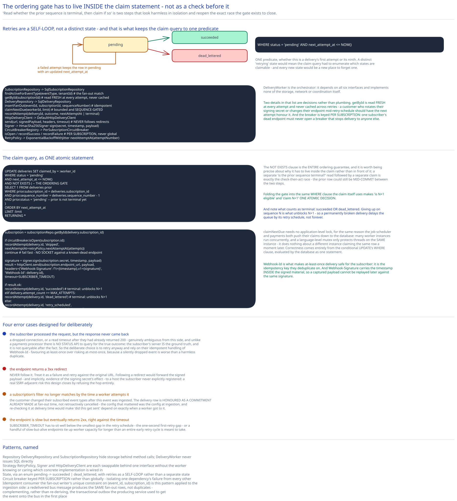

# Module 02 — Low-Level Design



**`DeliveryStatus`**, matching this guide's state-machine convention: `pending → succeeded | dead_lettered`, where a failed attempt keeps the row in `pending` with an updated `next_attempt_at` -- a self-loop, not a distinct "retrying" state. Modeling it this way means the claim query only ever needs one predicate (`status='pending' AND next_attempt_at<=now()`) whether this is a delivery's first attempt or its ninth.

## Interfaces vs. implementations

- **`SubscriptionRepository`** *(interface)* → **`SqlSubscriptionRepository`** -- `findActiveForEventType(eventType, tenantId)` (the fan-out writer's match query), `getById(subscriptionId)` (read fresh at every attempt, never cached across retries).
- **`DeliveryRepository`** *(interface)* → **`SqlDeliveryRepository`** -- `insertFanOut(eventId, subscriptionId, sequenceNumber)` (idempotent via the unique constraint), `claimNextDue(workerId, limit)` (the bounded, sequence-gated claim), `recordAttempt(deliveryId, outcome, nextAttemptAt | terminal)`.
- **`HttpDeliveryClient`** *(interface)* → **`DefaultHttpDeliveryClient`** -- `send(url, signedPayload, headers, timeout)`, never follows redirects (see Error Cases).
- **`Signer`** *(interface)* → **`HmacSha256Signer`** -- `sign(secret, timestamp, payload) -> signature`.
- **`CircuitBreakerRegistry`** *(interface)* → **`PerSubscriptionCircuitBreaker`** -- `isOpen(subscriptionId)`, `recordSuccess(subscriptionId)`, `recordFailure(subscriptionId)` -- one breaker instance keyed per subscription, never a shared global one.
- **`RetryPolicy`** *(interface)* → **`ExponentialBackoffWithJitter`** -- `nextAttemptAt(attemptNumber)`.
- **`DeliveryWorker`** -- the orchestrator. Depends on all six interfaces, implements none of the storage, network, or coordination itself.

## Pseudocode for the claim-and-attempt loop

```
DeliveryWorker.tick(worker_id):
    due = deliveryRepo.claimNextDue(worker_id, limit=BATCH_SIZE)
    # the claim query, as one atomic statement:
    #   UPDATE deliveries SET claimed_by = :worker_id
    #   WHERE status = 'pending'
    #     AND next_attempt_at <= NOW()
    #     AND NOT EXISTS (                         -- the ordering gate
    #           SELECT 1 FROM deliveries prior
    #           WHERE prior.subscription_id = deliveries.subscription_id
    #             AND prior.sequence_number = deliveries.sequence_number - 1
    #             AND prior.status = 'pending'      -- prior isn't terminal yet
    #         )
    #   ORDER BY next_attempt_at LIMIT :limit
    #   RETURNING *

    for delivery in due:
        subscription = subscriptionRepo.getById(delivery.subscription_id)   # fresh, never cached

        if circuitBreaker.isOpen(subscription.id):
            deliveryRepo.recordAttempt(delivery.id, outcome="skipped",
                                        nextAttemptAt=retryPolicy.nextAttemptAt(delivery.attempt_count))
            continue   # fail fast -- no socket opened against a known-dead endpoint

        timestamp = now()
        signature = signer.sign(subscription.secret, timestamp, delivery.payload)
        result = httpClient.send(subscription.endpoint_url, delivery.payload,
                                  headers={"Webhook-Signature": f"t={timestamp},v1={signature}",
                                           "Webhook-Id": delivery.id},
                                  timeout=SUBSCRIBER_TIMEOUT)

        if result.ok:
            circuitBreaker.recordSuccess(subscription.id)
            deliveryRepo.recordAttempt(delivery.id, outcome="succeeded")        # terminal -- unblocks N+1
        else:
            circuitBreaker.recordFailure(subscription.id)
            if delivery.attempt_count >= MAX_ATTEMPTS:
                deliveryRepo.recordAttempt(delivery.id, outcome="dead_lettered")  # terminal -- unblocks N+1
            else:
                nextAt = retryPolicy.nextAttemptAt(delivery.attempt_count)        # backoff + full jitter
                deliveryRepo.recordAttempt(delivery.id, outcome="retry_scheduled", nextAttemptAt=nextAt)
```

The `NOT EXISTS` clause is the entire ordering guarantee, and it's worth being precise about why it has to live *inside* the claim statement rather than as a check beforehand: a separate "is the prior sequence terminal?" read, followed by a separate claim, is exactly the check-then-act race [Idempotency Keys](../../scalability-resilience/idempotency-keys.md) warns about -- the prior row could still be mid-commit between the two steps. Folding the gate into the same `WHERE` clause the claim itself uses makes "is N+1 eligible" and "claim N+1" one atomic decision.

## Error cases worth designing for deliberately

- **The subscriber actually processed the request, but the response never arrived back** (a dropped connection, a read timeout after they'd already returned 200): genuinely ambiguous from this system's side, and unlike this guide's [payments case study](../payments-system/00-overview.md), there's no processor status API to query for the true outcome -- the subscriber's server *is* the ground truth, and it's not queryable after the fact. The deliberate choice is to retry anyway and rely on the subscriber's own idempotent handling of `Webhook-Id`, favoring at-least-once over risking at-most-once (a silently dropped event is worse than a harmless duplicate).
- **The endpoint returns a 3xx redirect.** Never follow it. Treat it as a failure and retry against the original URL. Following a redirect would forward the signed payload -- and implicitly, evidence of the signing secret's effect -- to a host the subscriber never explicitly registered, a real SSRF-adjacent risk this design closes by refusing the hop entirely.
- **A subscription's filter no longer matches by the time a worker attempts a delivery already fanned out** (the customer changed their subscribed event types after this event was ingested). The delivery row is honored as a commitment already made at fan-out time, not retroactively canceled -- the config that mattered was the config at ingestion, and re-checking it at delivery time would make "did this get sent" depend on exactly when a worker got to it.
- **The endpoint is slow but eventually returns 2xx**, right up against the timeout. `SUBSCRIBER_TIMEOUT` has to sit well below the smallest gap in the retry schedule (the 1-second first-retry gap), or a handful of slow-but-alive endpoints can tie up worker capacity for longer than an entire early retry cycle is supposed to take.

## Concurrency at the code level

`deliveryRepo.claimNextDue` needs no application-level lock, for the same reason this guide's [distributed job scheduler](../distributed-job-scheduler/02-lld.md) and [payments](../payments-system/02-lld.md) both push their own claims down to the database: many worker instances run concurrently, and a language-level mutex only ever protects threads on the *same* instance -- it does nothing about a different instance claiming the same row a moment later. Correctness comes entirely from the conditional `UPDATE`'s `WHERE` clause, evaluated by the database as one atomic statement.

The one place that specifically deserves calling out here, beyond what payments and the job scheduler already establish: the ordering gate (`NOT EXISTS ...`) has to be *part of* that same atomic statement, not a preceding read. It would be easy to write this as "read whether the prior sequence is terminal, then claim if so" -- two steps that look harmless in isolation but reopen exactly the race the gate exists to close, the moment two workers evaluate the read at nearly the same instant against rows that are still mid-transition.

## Design patterns you just used, named

- **Repository pattern** -- `DeliveryRepository` and `SubscriptionRepository` hide storage behind method calls; `DeliveryWorker` never issues SQL directly.
- **Strategy pattern** -- `RetryPolicy`, `Signer`, and `HttpDeliveryClient` are each swappable behind one interface without `DeliveryWorker` knowing or caring which concrete implementation is wired in.
- **State pattern (via an enforced enum, not a class hierarchy)** -- `DeliveryStatus`'s `pending → succeeded | dead_lettered` shape, with retries modeled as a self-loop rather than a separate state, is the same state-machine discipline this guide applies to every lifecycle it models.
- **Circuit breaker** -- named explicitly, keyed per subscription rather than global, exactly as [Circuit Breakers & Retries](../../scalability-resilience/circuit-breakers-retries.md) recommends for isolating one dependency's failure from every other.
- **Idempotent consumer** -- the Fan-Out Writer's unique constraint on `(event_id, subscription_id)` is this pattern applied to the ingestion side: a redelivered bus message produces the same fan-out rows, not duplicates, complementing (not re-deriving) the [transactional outbox](../../hld-building-blocks/transactional-outbox-cdc.md) pattern the producing service used to get the event onto the bus in the first place.

## Practice: extend it yourself

Before moving to Database Design, sketch (pseudocode is fine) how you'd add:

1. **A per-subscription max retry budget shorter than the platform default** (a customer says "give up after 1 hour, not 3 days"). Which interface owns this -- `RetryPolicy`, `SubscriptionRepository`, or a new field entirely -- and does the ordering gate's definition of "terminal" need to change, or does it already cover this for free?
2. **Bulk replay for a date range** (a subscriber fixes a bug on their end and wants every dead-lettered delivery from the last 48 hours re-attempted). The replayed deliveries are now competing for claim slots against whatever new, live events are also queued for that same subscription -- does a replayed delivery get its own new sequence number at the *end* of the subscriber's queue, or does it need a separate, unordered lane so it doesn't block genuinely current traffic?

Neither has one clean answer -- the point is noticing which interface already drawn above is the natural home for each piece of new behavior, before you've fully worked out what that behavior should do.
