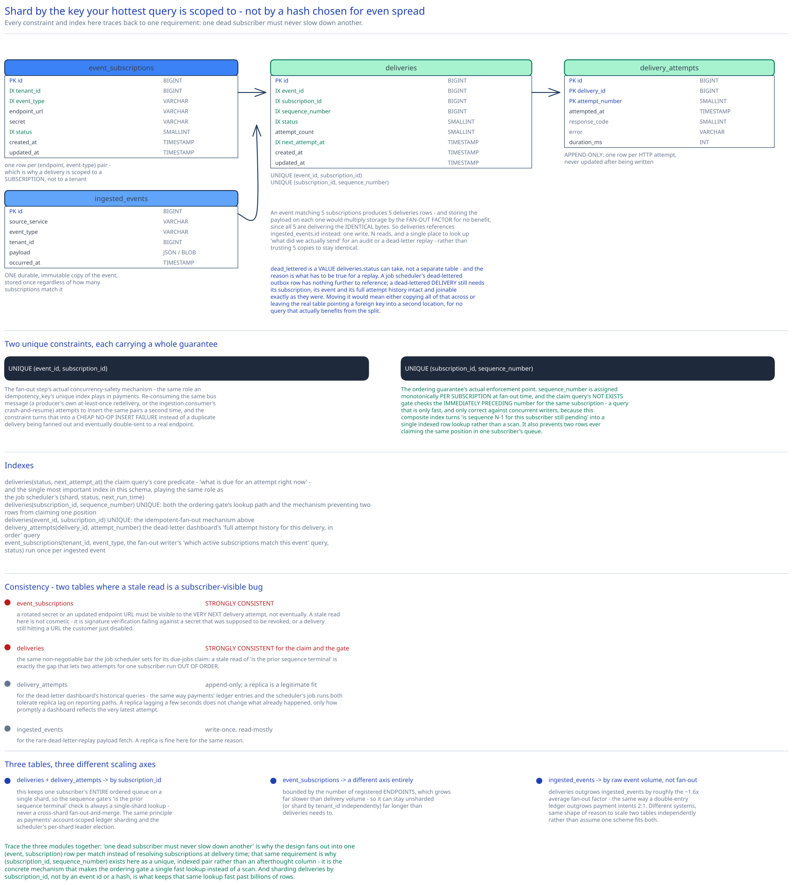

# Module 03 — Database Design & Scaling

## From entities to schema

- **`event_subscriptions`** `(id, tenant_id, event_type, endpoint_url, secret, status: active|paused|disabled, created_at, updated_at)` -- one row per registered (endpoint, event-type) pair; a tenant can register several endpoints for the same event type, which is exactly why a delivery is scoped to a subscription, not to a tenant.
- **`ingested_events`** `(id, source_service, event_type, tenant_id, payload, occurred_at)` -- a single durable, immutable copy of the event as consumed off the bus, stored once regardless of how many subscriptions match it.
- **`deliveries`** `(id, event_id FK, subscription_id FK, sequence_number, status: pending|succeeded|dead_lettered, attempt_count, next_attempt_at, created_at, updated_at)` -- the `(event, subscription)` pair Module 01 argues is the real delivery unit, one row per match.
- **`delivery_attempts`** `(id, delivery_id FK, attempt_number, attempted_at, response_code, error, duration_ms)` -- append-only, one row per HTTP attempt, never updated after being written.

## Why the payload lives in `ingested_events` once, not copied onto every `deliveries` row

An event matching 5 subscriptions produces 5 `deliveries` rows; storing the payload on each one would multiply storage by the fan-out factor for no benefit, since every one of those 5 rows is delivering the *identical* bytes. `deliveries` references `ingested_events.id` instead -- one write, N reads, and a single place to look up "what did we actually send" for an audit or a dead-letter replay, rather than trusting 5 copies to stay identical.

## Why `(event_id, subscription_id)` gets a unique constraint, non-negotiably

This is the fan-out step's actual concurrency-safety mechanism, the same role `idempotency_key`'s unique index plays in the payments case study: re-consuming the same bus message (a producer's own at-least-once redelivery, or the ingestion consumer's own crash-and-resume) attempts to insert the same `(event_id, subscription_id)` pairs a second time, and the constraint turns that into a cheap no-op insert failure instead of a duplicate delivery being fanned out and eventually double-sent to a real endpoint.

## Why `(subscription_id, sequence_number)` is unique, and why the claim query depends on it existing

This is the ordering guarantee's actual enforcement point. `sequence_number` is assigned monotonically per subscription at fan-out time, and the claim query's `NOT EXISTS` gate (Module 02) checks the *immediately preceding* sequence number for the same subscription -- a query that's only fast, and only correct against concurrent writers, because the composite index below turns "is sequence N-1 for this subscriber still pending" into a single indexed row lookup rather than a scan.

## Why the dead-letter queue is a status value, not a separate table

`dead_lettered` is a value `deliveries.status` can take, not a distinct `dead_letter_deliveries` table the way [the job scheduler's design](../distributed-job-scheduler/03-db-design.md) uses one for its outbox relay. The difference is what has to be true for a replay: a job scheduler's dead-lettered outbox row has nothing further to reference, while a dead-lettered delivery still needs its subscription, its event, and its full `delivery_attempts` history intact and joinable exactly as they were before it exhausted retries -- moving it to a separate table would mean either copying all of that across or leaving the "real" table pointing a foreign key into a second location for no query that actually benefits from the split.

## Indexes

- `deliveries(status, next_attempt_at)` -- the claim query's core predicate, "what's due for an attempt right now" -- the single most important index in this schema, playing the same role `job_definitions(shard, status, next_run_time)` plays in the [distributed job scheduler](../distributed-job-scheduler/03-db-design.md).
- `deliveries(subscription_id, sequence_number)` -- **unique**, both the ordering gate's lookup path and the mechanism preventing two rows from ever claiming the same position in one subscriber's queue.
- `deliveries(event_id, subscription_id)` -- **unique**, the idempotent-fan-out mechanism above.
- `delivery_attempts(delivery_id, attempt_number)` -- the dead-letter dashboard's "full attempt history for this delivery, in order" query.
- `event_subscriptions(tenant_id, event_type, status)` -- the fan-out writer's "which active subscriptions match this event" query, run once per ingested event.

## Consistency

- **`event_subscriptions`:** strongly consistent -- a rotated secret or updated endpoint URL must be visible to the very next delivery attempt, not eventually. A stale read here isn't a cosmetic staleness issue, it's a subscriber-visible bug (signature verification failing against a secret that was supposed to be revoked, or a delivery still hitting a URL the customer just disabled).
- **`deliveries`:** the claim and the ordering gate must be strongly consistent, the same non-negotiable bar this guide's [distributed job scheduler](../distributed-job-scheduler/03-db-design.md) sets for its own due-jobs claim -- a stale read of "is the prior sequence terminal" is exactly the kind of gap that lets two attempts for the same subscriber run out of order.
- **`delivery_attempts`:** append-only audit history; a read replica is a legitimate fit for the dead-letter dashboard's historical queries, the same way payments' `ledger_entries` and the job scheduler's `job_runs` both tolerate replica lag on their own reporting paths -- a replica lagging by a few seconds doesn't change what already happened, only how promptly a dashboard reflects the very latest attempt.
- **`ingested_events`:** write-once, read-mostly for the rare dead-letter-replay payload fetch; a read replica is fine here for the same reason.

## Scaling the schema

- **Shard `deliveries` and `delivery_attempts` by `subscription_id`** -- this keeps one subscriber's *entire* ordered queue on a single shard, so the sequence gate's "is the prior sequence terminal" check is always a single-shard lookup, never a cross-shard fan-out-and-merge. This is the same principle payments' account-scoped ledger sharding and the job scheduler's per-shard leader election both apply: shard by the key your hottest, most latency-sensitive query is actually scoped to, not by a hash chosen for even spread.
- **`event_subscriptions` scales on a different axis entirely** -- bounded by the number of registered endpoints, which grows far slower than delivery volume, and can stay unsharded (or shard by `tenant_id` independently) far longer than `deliveries` needs to, mirroring the job scheduler's `job_runs`-scales-independently-of-`job_definitions` distinction.
- **`ingested_events` grows with raw event volume, not with fan-out** -- the Capacity Estimation math makes the multiplier explicit: `deliveries` outgrows `ingested_events` by roughly the ~1.6x average fan-out factor, the same way payments' `ledger_entries` outgrows `payment_intents` 2:1 by the double-entry write pattern. Different systems, same shape of reason to scale two tables independently rather than assume one scheme fits both.

## Connecting it back

Trace the three modules together: Module 00's "one dead subscriber must never slow down another" requirement is why Module 01 fans out into one `(event, subscription)` row per match instead of resolving subscriptions at delivery time; that same requirement is why `(subscription_id, sequence_number)` exists here as a unique, indexed pair rather than an afterthought column -- it's the concrete mechanism that makes the ordering gate a single fast lookup instead of a scan. And sharding `deliveries` by `subscription_id`, not by an event id or a hash, is what keeps that same lookup fast as the system grows past billions of rows. Nothing in this schema is arbitrary -- every constraint and index traces back to the isolation requirement this case study opened with.
