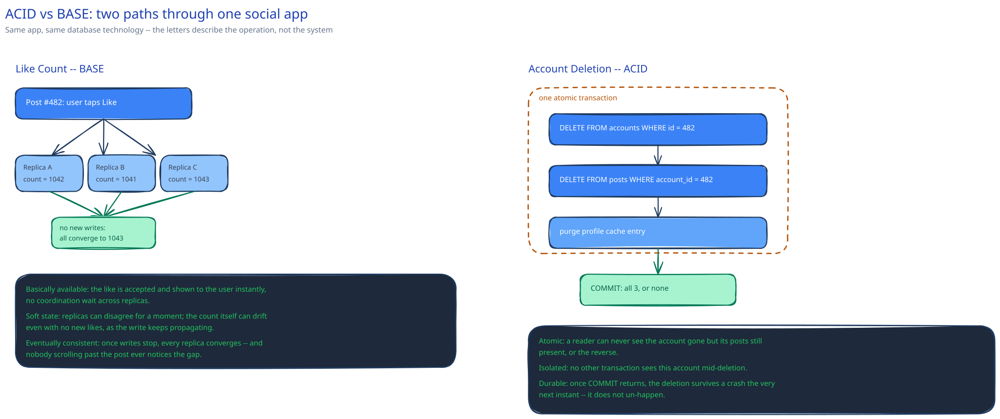

# ACID vs BASE

## ACID, and the specific failure each letter prevents

- **Atomicity.** A multi-step write either all happens or none does. The failure it prevents: a bank transfer that debits one account, then crashes before crediting the other — money that's simply gone.
- **Consistency.** The database only ever moves between states that satisfy its declared constraints (foreign keys, check constraints) — not even a mid-crash write can leave one of those violated.
- **Isolation.** Concurrent transactions don't see each other's uncommitted, in-progress changes. The failure it prevents: two transactions both read "1 seat left" before either commits, and both sell it.
- **Durability.** Once a transaction commits, it survives a crash — normally by writing to a write-ahead log and flushing that to disk *before* acknowledging the commit, so a crash a moment later can replay it.

## BASE is a different philosophy, not a sloppier one

- **Basically available.** The system stays responsive during a fault rather than blocking until it can guarantee strict correctness — this is the [AP side of the CAP theorem](../foundations/latency-throughput-cap.md), not an accident.
- **Soft state.** A given node's local copy may not reflect the latest write yet, and can even change with no new input as data keeps propagating in the background.
- **Eventual consistency.** Given no further writes, every replica converges to the same value — eventually, not immediately.

BASE isn't "ACID but sloppier." It's a deliberate trade of immediate consistency for availability and lower latency, made exactly where that trade is the right one — not everywhere.

## One system, two paths: a social app's like count vs. its account deletion

**Like count (BASE):** briefly disagreeing counts across replicas or caches are invisible to a user scrolling past a post, and forcing every like to go through a single consistent path would tax the highest-write-volume counter in the whole system for no benefit anyone would notice. (This guide's [like-counting-at-scale](../../like-counting-at-scale/00-overview.md) deep dive is this exact trade, worked in full.) Cheap, fast, eventually right.

**Account deletion (ACID):** you cannot half-delete an account — credit a deletion as done while orphaned posts and a still-cached profile page linger — because a user relying on that deletion (for privacy, for compliance) is relying on it being *actually* true the moment it's confirmed, not eventually true. This has to be one transaction, or a chain of steps with the same all-or-nothing guarantee.

Same application, same database technology in many real stacks — the letters that apply are a property of the *operation*, not the system as a whole.

## Isolation isn't binary

Inside ACID, isolation is a dial, not a switch, and each level fixes one more anomaly at a throughput cost:

- **Read uncommitted** — allows dirty reads (seeing another transaction's uncommitted write). Fixes nothing; fastest.
- **Read committed** — no dirty reads, but a value can still change between two reads in the same transaction (a non-repeatable read). Most systems' default.
- **Repeatable read** — the same row reads the same value all transaction long, but a query re-run can still see new *rows* appear (a phantom read).
- **Serializable** — behaves as if every transaction ran one at a time. Fixes phantoms too, at the largest throughput cost.

Most systems default to read committed and reach for serializable only on the specific operations that would actually break under a weaker guarantee — not everywhere, for the same reason full ACID isn't used for a like count.

## Interviewer follow-ups

**Can a single database support both ACID and BASE-style operations depending on the query?**
Yes — isolation and durability are properties you can dial per-transaction in most relational databases, and even single-leader systems often serve BASE-style reads from an async replica while keeping writes fully ACID on the primary. The label describes the operation, not a permanent property of the engine.

**What's a real example of a "lost update" anomaly under weak isolation?**
Two transactions both read a counter as 10, each independently compute 10 + 1 = 11, and both write 11 back — one increment is silently lost, and the counter reads 11 instead of the correct 12. Repeatable read or an explicit row lock (`SELECT ... FOR UPDATE`) prevents it; read committed alone does not.

**Would you rather a payments system briefly reject a write or briefly accept an inconsistent one?**
Reject — a declined charge is a known, retriable state; an inconsistent balance is a silent correctness bug that surfaces later, possibly as real money mismatched against a ledger. This is the same CP-over-AP call the [CAP theorem page](../foundations/latency-throughput-cap.md) makes for exactly this kind of system.
