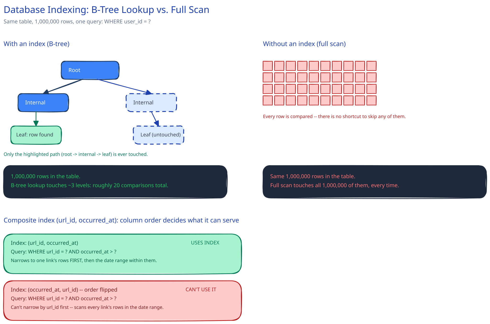

# Database Indexing

## What an index actually is, and what it costs

An index is a separate, ordered data structure — usually a B-tree — that lets the database find rows matching a condition without walking every row in the table. It is not a free speedup: every index adds storage, and every WRITE to the table now also has to update every index on it. An index is a read/write trade-off, not a free win, and this guide's own [URL Shortener database design](../../03-db-design-fundamentals.md) makes exactly this call when it puts a unique index on `short_code` — it accepts the write cost because the redirect read path is the highest-traffic query in the entire system.

## The B-tree, concretely

A B-tree keeps rows sorted and lets both equality lookups and range scans stay fast, because the tree's structure narrows the search by an order of magnitude at each level and a range of sorted keys sits close together on disk. On a table with 1,000,000 rows, a full scan touches all 1,000,000 rows; a B-tree lookup on an indexed column touches roughly 3-4 tree levels — on the order of 20 comparisons, not a million. That gap is why "add an index" is usually the first fix for a slow query, and why it stops mattering once the query planner can't use the index at all (see below).

## Composite indexes and the leftmost-prefix rule

An index on `(a, b)` can serve a query that filters on `a` alone, or on `a AND b` — but generally *not* a query that filters on `b` alone, because the index is physically sorted by `a` first. This guide's URL Shortener already has the worked example: `click_events` gets a composite index on `(url_id, occurred_at)`, in that specific order, because every real analytics query filters by one link's `url_id` first and only then narrows by a date range. Putting `url_id` first lets the index jump straight to that link's rows before it even looks at the timestamp. Flip the column order to `(occurred_at, url_id)` and a "clicks on link X in the last 7 days" query can no longer use the index to narrow by link at all — it would have to scan every row in the date range across *every* link first.

## When an index doesn't help, or actively hurts

- **Low-cardinality columns.** An index on a boolean `is_active` where 95% of rows are `true` barely narrows anything — the query planner will often ignore the index and scan anyway, because reading the index plus then reading almost every row it points to is slower than just scanning.
- **Write-heavy tables.** Every index on a table that's mostly written, rarely read, is close to pure tax: it slows every insert/update for a read benefit that's rarely collected.
- **Covering indexes, briefly.** An index that includes every column a query needs can answer that query directly from the index, without touching the table row at all — a genuine speedup, but only for the specific query shape it was built for.

## Interviewer follow-ups

**How would you decide which columns deserve an index on a table you're designing from scratch?**
Start from the actual query patterns, not the schema — name the 2-3 queries that will run the most (or that are on the critical path, like a redirect), and index exactly the columns those queries filter or sort by. Adding an index nobody queries by is pure write cost with no offsetting read benefit.

**What happens to index performance as a table grows into the billions of rows — does a B-tree index degrade?**
Not meaningfully — that's the whole property of a balanced tree: going from a million to a billion rows only adds a couple more tree levels, so lookups stay in the tens-of-comparisons range. What actually degrades at that scale is usually the table itself (it no longer fits in memory/cache), not the index's own lookup cost.

**Why might `SELECT *` defeat a covering index that a narrower `SELECT` would benefit from?**
A covering index only "covers" the columns it actually contains. `SELECT *` asks for every column on the row, so the database still has to go back to the table to fetch whatever the index didn't include — the exact extra step a covering index exists to skip. Selecting only the columns the index actually covers is what lets the query answer from the index alone.
