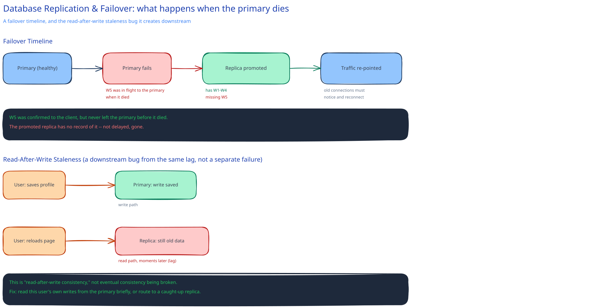

# Database Replication & Failover

This guide already covers sync-vs-async replication and why majority quorum prevents split-brain in [Replication & Consensus](../hld-building-blocks/replication-consensus.md) — that page is about the general mechanism. This one picks up where it leaves off: what failover actually looks like for a database specifically, and what breaks while it happens.

## What "failover" actually involves

**Detecting the primary is really down.** Not slow — down. A false positive here is the split-brain scenario from the consensus page, made concrete: something promotes a replica while the "dead" primary is actually still alive and still accepting writes from any client that hasn't noticed yet. Now two databases both believe they're the source of truth, and neither knows about the other's writes.

**Promoting a replica to primary.** It first applies whatever replication log it has. Any write that was in flight to the old primary but never made it to this replica is simply gone — not delayed, gone. This is the concrete cost of async replication landing at the worst possible moment: the write the client was told succeeded doesn't exist anywhere the new primary can see.

**Re-pointing application traffic.** A DNS change, a proxy layer, or a coordination service update tells the fleet where the new primary is. The gap most people miss: existing connections held open by app servers to the old primary don't redirect on their own — connection pools have to notice the old primary is gone and actually reconnect, and until they do, requests on those pools keep failing or, worse, keep trying to write to a primary that's no longer the primary.

## Replica lag as an application bug, not just a number

A user updates their profile — the write lands on the primary. They immediately reload the page, and that read gets routed to a replica that hasn't caught up yet. They see their *old* data, seconds after saving it. This has a name: a **read-after-write consistency** violation, and it's one of the most common bugs traced back to "replication lag" once someone finally reproduces it.

The practical fixes, in order of how often they're actually used: route a specific user's reads back to the primary for a short window right after they write (simplest, costs primary read capacity); track which replica has caught up to a given write and route that user's next read there specifically (more machinery, no primary load); or just accept the staleness for data where it doesn't matter (a view counter, not a profile edit).

## Replica vs. backup — not the same protection

A replica protects against a single node failing — fast failover, minutes of disruption at most. But a replica is a faithful copy: a bad write, a buggy migration, or an accidental `DELETE` without a `WHERE` clause replicates to every replica just as fast and just as faithfully as a good write does. A replica has never once saved anyone from their own mistake.

A **backup** — a point-in-time snapshot, kept in a separate store, usually with some delay before it's needed — is what actually saves you from that. It's the only one of the two that lets you go back to a moment *before* the bad write happened. Real systems need both, because they protect against genuinely different failures: a replica for "a machine died," a backup for "the data itself became wrong."

## Interviewer follow-ups

**How would you test that your failover actually works, before you need it in production?**
Run it deliberately, on a schedule, against real traffic — a "game day" that kills the current primary and confirms promotion, DNS/proxy re-pointing, and connection-pool reconnection all complete within your target window. A failover procedure nobody has exercised is a procedure you're testing for the first time during an actual outage.

**What's the concrete RPO (recovery point objective) implication of async replication?**
RPO is bounded below by your replication lag at the moment of failure — if replicas typically trail the primary by 200ms of writes, your RPO is "up to 200ms of committed-looking writes can be lost," not zero. Synchronous replication is the only way to push RPO to zero, at the ongoing per-write latency cost this guide's replication page already prices out.

**Should a read replica ever be promoted automatically, with no human in the loop?**
It depends on how expensive a false-positive failover is versus how expensive slow manual failover is: automatic promotion recovers in seconds but risks promoting during a network blip that resolves itself a moment later (a spurious split-brain risk); a human in the loop is slower but adds a sanity check a naive health check can't make. Most production systems automate detection and alerting, but gate the actual promotion behind either a very high-confidence automated check or a human — rarely a bare timeout.
