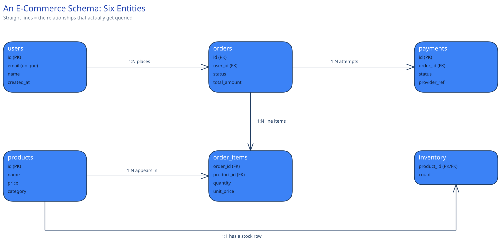

# Worked Example: An E-Commerce Schema



This page doesn't introduce new concepts — it applies [normalization](normalization-schema-design.md), [indexing](database-indexing.md), and [ACID vs. BASE](acid-vs-base.md) to one concrete schema, the way they'd actually show up together in a design.

## The entities, and why each gets its own table

- **`users`** — one row per account.
- **`products`** — the catalog: name, description, price, category.
- **`orders`** — one row per placed order: `user_id`, `status`, `total_amount`, timestamps.
- **`order_items`** — the junction table between orders and products. One order contains many products, and one product appears on many orders — a classic many-to-many, which is exactly what a junction table (`order_id`, `product_id`, `quantity`, `unit_price`) is for.
- **`inventory`** — kept separate from `products`, not folded into it. A product's name and description change rarely; its stock count changes on *every single purchase*. Different write frequency is a real reason to split a table, not just a stylistic preference — it keeps the hot, constantly-updated column away from the cold, rarely-updated ones.
- **`payments`** — kept separate from `orders`, not a status column on it. A payment can fail, get retried, or settle through a different processor attempt, all against the *same* order — the payment's lifecycle isn't the order's lifecycle, it's a related process with its own states.

## The transaction boundary that has to be ACID

Placing an order has to atomically: decrement inventory, create the `orders` row, and create the `order_items` rows. If inventory decrement and order creation aren't in the *same* transaction, two customers can both read "1 in stock," both pass that check, and both successfully create an order — you've oversold a single unit.

The concrete mechanism: wrap the inventory check-and-decrement and the order insert in one transaction, and make the decrement conditional in the same statement rather than a separate read-then-write:

```
UPDATE inventory SET count = count - 1 WHERE product_id = ? AND count > 0
-- if 0 rows affected, the item is out of stock: roll back the whole transaction
INSERT INTO orders (...) VALUES (...)
INSERT INTO order_items (...) VALUES (...)
```

The `WHERE count > 0` matters as much as the transaction boundary — without it, two concurrent decrements can each read `count = 1` before either writes, and both still succeed. Making the row's own current value part of the `WHERE` clause is what closes that race; the transaction is what makes "decrement, then insert" atomic as a unit.

Payment happens *after* this transaction commits, not inside it — a payment call is a network round trip to an external processor, and you don't want a slow or hung payment gateway holding a database transaction (and its locks) open.

## The indexes this schema actually needs

- **Unique index on `users.email`** — every login is a lookup by email, and uniqueness is also how you prevent two accounts registering the same address.
- **Index on `orders.user_id`** — the order-history page's whole query is "this user's orders," the same reasoning [`database-indexing.md`](database-indexing.md) already makes for `click_events(url_id, occurred_at)`.
- **Composite index on `order_items(order_id, product_id)`** — every read of an order's line items filters by `order_id` first; `product_id` narrows within that, matching the same leftmost-prefix rule.

Just as important: what does *not* get an index. `orders.shipping_address` is never queried by value — it's only ever read as part of an order row already found another way (by `order_id` or `user_id`). Indexing it would cost every write and speed up a query nobody runs. Indexing is a deliberate answer to a specific query, not something applied to every column by default.

## One denormalization, and a correctness reason for it

`orders.total_amount` is computed once at order-creation time and stored, not recomputed live by summing `order_items`. The usual framing for denormalization is "it's faster" — here it's sharper than that: **it's the only way to get the right answer.** If a product's price changes next month, an order placed today must still show the total the customer actually paid. Summing `order_items` live would silently produce today's total using yesterday's prices reattached to a historical order — not slower, *wrong*. Storing `total_amount` at creation time freezes the number the transaction actually charged.

## Interviewer follow-ups

**How would you handle a product's price changing while items are sitting in an active shopping cart?**
The cart should store the price at the time each item was added (or re-validate against the current price at checkout and surface the difference to the user) rather than silently charging whatever the product's price happens to be the moment checkout runs — the same "freeze the number" instinct as `orders.total_amount`, just one step earlier in the flow.

**What happens if the payment step fails after inventory was already decremented?**
The order transaction already committed the decrement, so this isn't a rollback — it's a compensating action: release the reserved inventory back and mark the order `payment_failed`, ideally driven by an [idempotency key](../scalability-resilience/idempotency-keys.md) on the payment call so a retried payment attempt can't double-charge, and a saga-style flow so the compensation itself is safe to retry too.

**Would you shard this schema, and by what key?**
`user_id` is the natural [shard key](../hld-building-blocks/data-partitioning-sharding.md) for `orders` and `payments` — a user's own order history stays on one shard, which is the query that actually happens constantly. `products` and `inventory` are a different problem (there's no "owning user"), and would more likely be replicated or sharded by `product_id` instead, accepting that an order's writes now touch two different shards' worth of tables — which is exactly the cross-shard-transaction cost this guide's sharding page names as the hard part of resharding a live system.
