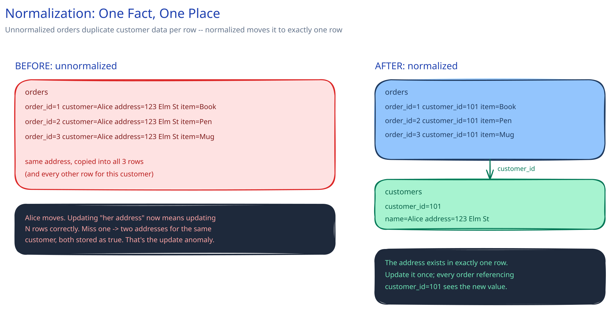

# Normalization & Schema Design

## What normalization actually prevents

Normalization means splitting data so each fact lives in exactly one place. The concrete failure it prevents is an **update anomaly**: imagine an `orders` table that stores the customer's name and address directly on every order row. A customer with 40 past orders has that same address copied into 40 rows. When they move, updating "their address" actually means updating 40 rows correctly — miss one, and your own database now contains two different addresses for the same customer, and nothing in the schema tells you which one is current. A normalized version stores the address once, in a `customers` table, referenced from orders by `customer_id`. There is exactly one row to update, and no way for it to disagree with itself.

## 1NF, 2NF, 3NF — the practical version, not the textbook one

- **1NF: no repeating groups crammed into one column.** Don't store `"tag1,tag2,tag3"` as a string in a single column — that's a hidden list pretending to be a scalar, and it can't be indexed, filtered, or joined against normally. Give tags their own table.
- **2NF: every non-key column depends on the *whole* primary key.** This only bites when a table has a composite key — a column that only depends on half of it belongs in a different table keyed by that half.
- **3NF: no non-key column depends on *another* non-key column.** The orders example above is exactly a 3NF violation: `address` depends on `customer`, not on the order itself. If a column's value is determined by some other non-key column rather than by the row's own identity, it's misplaced.

## Denormalization is a trade, not a mistake

This guide's own [URL Shortener database design](../case-studies/url-shortener/README.md) denormalizes on purpose: instead of always computing a link's click count as `COUNT(*) FROM click_events`, it keeps a running `click_count` column directly on `urls`. That's a real trade, not a shortcut taken by accident — it buys a cheap read (no aggregation at request time) at the cost of write complexity: now two things can theoretically disagree, so something has to keep the copy in sync (a trigger, an async worker off a queue, or accepting a few seconds of staleness). Whether that trade is worth it depends on the read:write ratio for that specific column, not on which version is "more correct" in the abstract — the normalized version is more correct, and denormalized anyway because the numbers justify it.

## How to actually decide

Start normalized. It's free correctness — no update anomalies, no risk of two copies of a fact disagreeing — and normalized schemas are also usually the easier ones to reason about while a system is still small. Then denormalize the *specific* hot read paths that measurably need it, once you can point at a real query and a real number, rather than denormalizing broadly up front on the assumption that it'll matter somewhere.

## Interviewer follow-ups

**What's the risk of denormalizing before you've actually measured a read is slow?**
You pay the write-complexity and sync-drift cost immediately, for a read speedup you haven't confirmed you need — and once two copies of a fact exist, ripping the denormalization back out later means finding and fixing every write path that could have left them disagreeing, not just adding an index.

**How would you keep a denormalized count column in sync with its source of truth?**
Off the request path: the write that creates the underlying event ([publishes to a queue](../hld-building-blocks/message-queues-pubsub.md)) rather than incrementing the counter synchronously in the same transaction — a worker consumes the event and applies the increment, so the count is eventually consistent within whatever lag the queue adds, and a slow worker never blocks the write that mattered.

**Does a document/NoSQL model even have a normalization problem the same way relational does?**
Yes, in substance if not in name — [embedding data inside a document](sql-vs-nosql.md) instead of referencing it is the same duplication trade as denormalizing a relational table, and it has the same failure mode: update one copy and forget the others, and now different documents disagree about the same fact.
