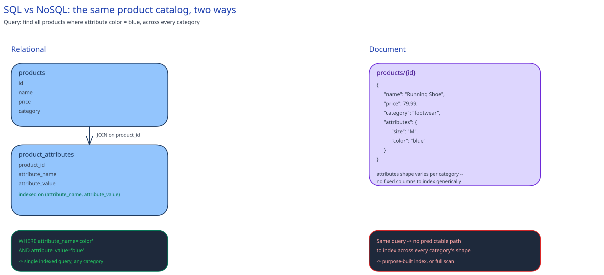

# SQL vs NoSQL

## It isn't really one choice

"SQL vs NoSQL" is usually asked as a single decision, but it's actually bundling several: fixed schema vs. flexible schema, joins vs. denormalized/embedded data, and — per [the CAP theorem](../foundations/latency-throughput-cap.md) — often a CP-leaning default vs. an AP-leaning one. The real decision driver is the query pattern the system actually needs to be fast, not a stylistic preference. This guide's own [URL Shortener](../case-studies/url-shortener/README.md) database design makes exactly this argument: its core lookup (`short_code -> long_url`) is a plain key-value pattern that a document or key-value store would serve fine, and it still picks relational — because the *other* queries it needs (a user's list of links, analytics joins) are what actually justify the choice, not the redirect path.

## What you give up moving to NoSQL

Using a document store as the running example:

- **Joins.** A relational `users JOIN orders` becomes one of two things in a document model: embed the orders inside the user document (denormalized — fast reads, no join, but the same order data now lives in more than one place and every update has to keep those copies consistent), or run two separate queries and join in application code (no duplication, but now it's your service doing what the database used to).
- **Multi-row ACID transactions across different entities.** Most document stores only guarantee atomicity at the single-document level. An operation that must atomically update two *unrelated* documents — decrement inventory on one, create an order on another — doesn't get that for free. The real answer is a saga (a sequence of local transactions with compensating undo steps) or accepting eventual consistency between the two writes, not "the database handles it."

## What you gain

- **Schema flexibility.** Adding a field to some documents doesn't require a migration that touches every existing row — old documents simply don't have the field yet, and the application reads a default.
- **Write scaling that's often the store's default posture.** Many document/key-value stores are built assuming [sharding](../hld-building-blocks/data-partitioning-sharding.md) from day one, rather than treating it as something bolted on later.
- **A data shape that matches how the app reads it.** One document *is* the API response — no assembling six joined tables into one JSON payload at request time.

## A worked comparison: the same product catalog, two ways

**Relational:** a `products` table (id, name, price, category) plus a separate `product_attributes` table (product_id, attribute_name, attribute_value) for the fact that a shirt has "size" and "color" but a laptop has "RAM" and "screen size" — variable attributes per category, joined at query time.

**Document:** one JSON document per product, attributes embedded directly as a nested object — `{ "name": "...", "price": ..., "attributes": { "size": "M", "color": "blue" } }`.

The query that separates them: *"find all products where attribute `color` = `blue`, across every category."* In the relational model this is a single indexed query against `product_attributes` (`WHERE attribute_name = 'color' AND attribute_value = 'blue'`). In the naive document model, attributes are buried inside an unpredictable nested shape per category, so the same query either needs a purpose-built index on that nested path (which most document stores do support, but it's a deliberate addition, not the default) or a full collection scan.

## Interviewer follow-ups

**Would you ever use both in the same system, and for what?**
Yes, routinely — a relational store for the data with real relationships and transactional needs (orders, payments, inventory), and a document or key-value store for data that's read-heavy, loosely structured, or naturally one-document-per-request (product catalog details, session data, a cache layer). Picking one store for an entire system is usually a sign the choice was made once up front rather than per data shape.

**How do you enforce a foreign-key-style constraint in a document store that has no native support for it?**
You mostly don't, at the database layer — the application code is responsible for checking the referenced document exists before writing, and for handling the case where it's since been deleted (a dangling reference). Some teams accept a background job that periodically finds and reports orphaned references instead of preventing them synchronously.

**What happens to the "flexible schema" advantage after 6 months of documents in 4 different historical shapes of the same field?**
It becomes a liability instead of a feature — every reader now has to branch on which shape a given document happens to be in, which is exactly the migration cost fixed schemas force you to pay up front, except now it's scattered through application code instead of one schema migration. Flexible schema defers the cost; it doesn't remove it.
