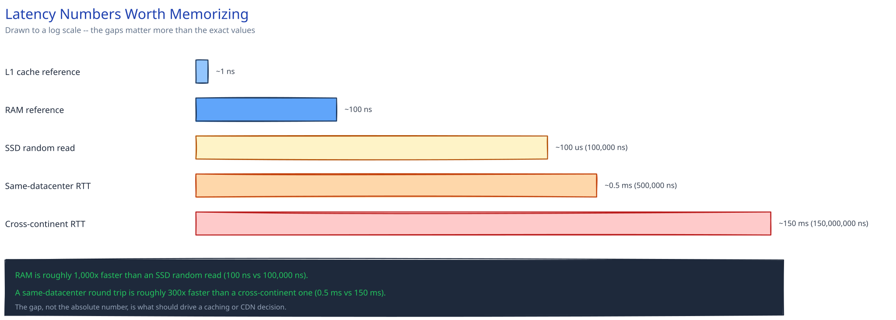

# Back-of-the-Envelope Estimation

## Why this happens first, and what it's actually for

This isn't a mental-math test. It's how you find out, before you draw a single box, whether the system in front of you needs a cache, needs to be sharded, or is small enough that neither matters yet. Skipping straight to boxes is exactly the mistake this guide's own [Practice Problems module](../../04-practice-problems.md) warns about: "if you draw boxes before requirements, you'll design for guesses instead of constraints." The numbers ARE the requirements — they're just requirements you compute instead of being handed.

## The numbers worth memorizing

**Time conversions, rounded on purpose:** 1 million seconds is close enough to 12 days that you can go either direction in your head. The one that matters most: a day has 86,400 seconds — round it to **~100,000 (10^5)** and divide by that instead of 86,400. You're an interview, not a calculator; an order-of-magnitude answer produced in 10 seconds beats an exact one that takes two minutes.

**Latency numbers worth having memorized** (see the diagram — drawn to a log scale on purpose, because the point isn't the exact values, it's the *gaps* between them):

- L1 cache reference: **~1 ns**
- RAM reference: **~100 ns**
- SSD random read: **~100 µs** (100,000 ns)
- Same-datacenter network round trip: **~0.5 ms** (500,000 ns)
- Cross-continent network round trip: **~150 ms** (150,000,000 ns)

The relative gaps are what you actually use: RAM is roughly **1,000x faster** than an SSD random read, and a same-datacenter round trip is roughly **300x faster** than a cross-continent one. Those two ratios alone explain why this guide's [caching](../hld-building-blocks/caching-strategies.md) and [CDN](../hld-building-blocks/cdn.md) pages exist — every layer between a user and a cross-continent database round trip is there to avoid paying the biggest number on the list.

## A worked estimation, start to finish

Take a concrete system: **100 million daily active users, each posts 2 photos/day, each photo averages 2 MB, and the average photo gets viewed 50 times.**

**Writes/sec.** 100M users x 2 photos/day = 200M photo-writes/day. Divide by ~100,000 (our rounded seconds-per-day): 200,000,000 / 100,000 = **~2,000 writes/sec average**. Average is the wrong number to design for (see [Latency, Throughput & the CAP Theorem](latency-throughput-cap.md) on why p99, not the mean, is what breaks systems) — multiply by a peak factor, say 3x for a system with a daily usage curve, for **~6,000 writes/sec peak**. That peak number, not the average, is what your load balancer and app tier actually have to survive.

**Storage/day.** 200M photos x 2 MB = **400 TB/day**. Annualized, that's ~146 PB/year before any replication factor. That number is the one that tells you whether "just use a bigger disk" is still a legitimate answer (it isn't, past a few TB/day) — this is the exact fork in the road this guide's [Object / Blob Storage](../scalability-resilience/object-blob-storage.md) page picks up from.

**Reads/sec.** Every photo is viewed 50 times on average, so reads run at 50x the write rate: 2,000 writes/sec x 50 = **~100,000 reads/sec average**, ~300,000/sec peak at the same 3x factor. A 50:1 read:write ratio this lopsided is, by itself, the entire justification for a cache in front of the database — you don't need a deeper reason than the ratio.

**Bandwidth.** 100,000 reads/sec x 2 MB/photo = **200 GB/sec** of read bandwidth if every read went straight to origin storage — which is precisely the number a CDN exists to absorb, since almost none of that should ever reach your own servers.

Every one of those numbers came from three inputs (users, posts/day, avg size) and a read:write ratio. That's the whole method: convert "per day" to "per second" with the 10^5 shortcut, multiply straight through, and apply a peak factor before you trust any of it.

## When to stop estimating

The estimate's only job is to answer one question: does this need a cache, does this need to be sharded, or is this small enough that a single server is genuinely fine? Once you know your rough read:write ratio and whether you're operating in the thousands, millions, or billions of requests/rows, you have the answer — more decimal places don't change which of those three buckets you're in. Stop refining and start designing the moment the bucket is clear.

## Interviewer follow-ups

**Your napkin math says 400 TB/day of storage — does that change your database choice, and how?**
Yes, directly: 400 TB/day rules out storing the actual photo bytes in a relational database entirely (see [Object / Blob Storage](../scalability-resilience/object-blob-storage.md)) — the database now only needs to hold a small pointer row per photo, which is a completely different, much smaller storage number than the 400 TB.

**Why estimate peak traffic as a multiple of average instead of just asking for the real peak number?**
In an interview there usually isn't a real number to ask for — the peak factor (2-3x is a reasonable default absent other information) is a stand-in for "this system has a daily usage curve, not constant load," which is true of almost every consumer system and is the point being tested, not the exact multiplier.

**What's actually wrong with an estimate that's off by 2x, in the context of what it's being used to decide?**
Usually nothing — the three questions this section answers (cache or not, shard or not, which order of magnitude) rarely flip on a factor of 2. An estimate is wrong in a way that matters only if it's off by an order of magnitude, which is exactly why rounding 86,400 to 100,000 is safe but forgetting to apply a peak factor at all isn't.

**Would you estimate storage the same way for a system that deletes old data (like this guide's [Ephemeral Content](../../ephemeral-content-stories/00-overview.md) case study) vs. one that keeps everything forever?**
No — a system with a retention window has a storage ceiling (roughly daily volume x retention period, not an ever-growing total), while a keep-forever system's storage estimate needs to be annualized indefinitely. Naming which one you're in changes whether "just buy more disk eventually" is even a valid long-term answer.
