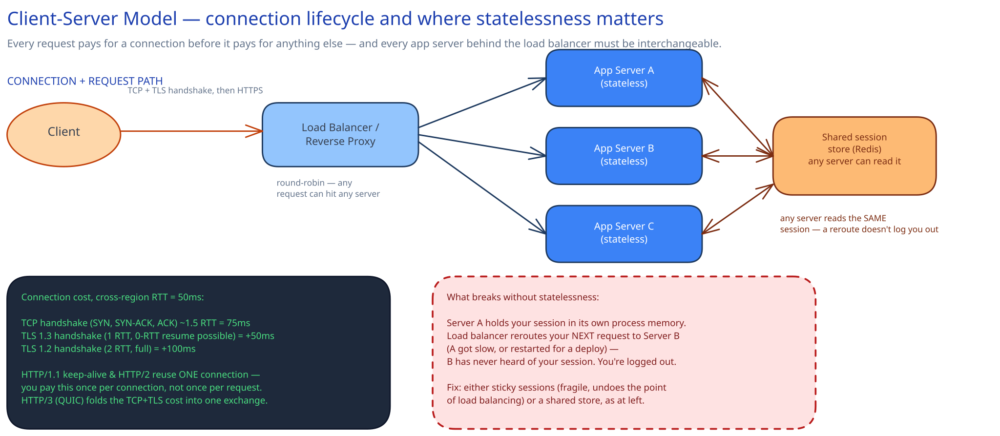

# The Client-Server Model

## What problem this actually solves

Before client-server won, the obvious alternative was peer-to-peer: every machine both serves and consumes, and there's no single place that owns "the data" or "the logic." That's genuinely fine for some workloads (BitTorrent still uses it, for exactly the reason it doesn't need one) but it's a bad fit for the web, because nobody agrees to keep their laptop online 24/7 to serve your profile page to strangers. Client-server fixes that by concentrating availability, consistency and access control in one place — the server — and letting clients come and go freely. The cost: the server becomes the thing that has to scale, and everything in the rest of this guide (load balancers, caches, replicas, sharding) exists to answer "now what, when one server isn't enough."

## The mechanics: you pay for the connection before you pay for anything else

A request doesn't start at your API handler — it starts with the network agreeing to talk at all, and that has a real, billable cost in round trips:

- **TCP handshake** (SYN → SYN-ACK → ACK): ~1.5 round trips. At a 50ms cross-region RTT, that's **75ms** before a single byte of your request has moved.
- **TLS handshake**, on top of that: TLS 1.3 adds **1 more RTT** (+50ms, and 0-RTT resumption can skip even that for a returning client); TLS 1.2 needs a full **2 RTTs** (+100ms). This is why "just enable TLS 1.3" is a real, measurable latency win, not a checkbox.
- **HTTP/1.1 keep-alive and HTTP/2** exist specifically to make you pay this once per *connection*, not once per *request* — reusing one TCP+TLS session for many requests. **HTTP/3 (QUIC)** goes further and folds the transport and TLS handshake into a single exchange, because on lossy mobile networks a dropped packet mid-handshake under TCP+TLS means redoing both from scratch.

The number worth remembering for back-of-envelope math: a cold HTTPS connection over a 50ms-RTT link costs on the order of **125-175ms** before your server even sees the request. A warm, reused connection costs **0ms** of that. This is exactly why connection pooling on both ends (client keep-alive, and a server-side connection pool to its own database) is a default, not an optimization.

## Statelessness is what makes horizontal scaling possible

"Stateless" means: any app server can handle any request, because no server holds anything in memory that another server would need to know about. That single property is what lets you add a tenth app server under load instead of buying a bigger one — the load balancer can send the next request anywhere, because everywhere is equivalent.

The diagram's right-hand contrast is the failure mode this prevents: if Server A keeps your login session in its own process memory, and the load balancer's next pick is Server B (because A got slow, or was just rolled during a deploy), B has never heard of your session and you're logged out — not because anything crashed, but because the architecture assumed a server would remember something only it knew. The two fixes are **sticky sessions** (route a client's requests back to the same server it started on — works, but re-couples client and server and defeats a chunk of what load balancing buys you) or a **shared session store** (Redis, or a signed client-side token like a JWT) that every server can read identically. This project's own [URL Shortener](../../01-hld-fundamentals.md) case study makes exactly this call: its app servers are stateless by design, which is precisely what lets module 01 add more of them under load without touching the redirect logic at all.

## Why X not Y, explicitly

- **Client-server vs. peer-to-peer**: peer-to-peer avoids a single point of scaling pressure, but gives up a central place to enforce consistency, auth, and availability guarantees — the wrong trade for a service where "is this the real balance" has one correct answer.
- **Sticky sessions vs. shared store**: sticky sessions are the zero-infrastructure option and fine for low-stakes, short-lived state; a shared store costs an extra network hop per request but is what survives a server dying mid-session, which sticky sessions cannot.
- **Reusing a connection vs. opening a new one per request**: a new connection is simpler to reason about (no shared mutable connection state) but re-pays the full handshake cost every time — only defensible at very low request volume.

## Interviewer follow-ups

**"What happens if a client's connection drops mid-request?"** The client sees a failed request (timeout or reset) and, if the operation is safe to retry, opens a new connection and retries — which is exactly why idempotency matters for anything that mutates state (see the Idempotency Keys topic). The server, if it hadn't finished, may have partially applied the write; whether that's safe depends entirely on whether the operation was made idempotent ahead of time.

**"Why not just keep one persistent connection open forever, to skip the handshake entirely?"** You can, and HTTP/2's multiplexing leans on exactly this — but a connection that lives forever also means the load balancer can't rebalance that client onto a different server without an explicit disconnect, and a server holding millions of idle-but-open connections spends real memory on socket state per connection (this is precisely the scaling problem the Long Polling/WebSockets/SSE topic and the Read Receipts & Presence deep dive both have to design around).

**"When would you actually want a stateful server?"** When the state itself is the expensive resource you're avoiding shipping over the network on every request — an in-memory game simulation tick, a WebSocket holding live presence, or a database connection pool. In all of these you still isolate *just that state* behind a deliberate boundary (a single owning process, or a sticky routing rule) rather than letting it leak into "any request handler might have some in memory."

**"Does REST vs. RPC change any of this?"** No — the connection and statelessness concerns are a transport-layer property, orthogonal to which API style rides on top. See [REST vs RPC vs GraphQL](rest-vs-rpc-vs-graphql.md) for that axis.
