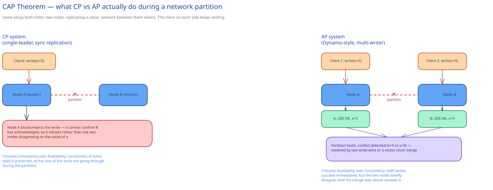

# Latency, Throughput & the CAP Theorem



## Latency and throughput are different axes, and optimizing one can cost the other

**Latency** is how long one request takes. **Throughput** is how many requests the system finishes per second. They sound like the same goal — "make it fast" — but a change that helps one routinely hurts the other:

- **Batching** (buffer 100 writes, flush them in one call) raises throughput — one round trip amortized over 100 items instead of 100 round trips — but every individual item now waits for the batch to fill, which is strictly *worse* latency for that item than writing it immediately.
- **Adding parallel workers** raises throughput (more requests finish per second, in aggregate) without making any *single* request faster — it just means more of them are in flight at once.

Neither change is free, and "optimize performance" is meaningless until you say which of the two you're actually trading against the other.

### Why the average is the wrong number, and p50/p95/p99 aren't optional

**p50** (median), **p95**, and **p99** answer "what latency does the slowest N% of requests see" — p99 is the latency below which 99% of requests complete, i.e. the worst case for 1-in-100 requests. The average hides exactly the thing you need to design for: one dependency that's usually fast but occasionally slow barely moves the average, but it dominates the tail.

Here's the number worth remembering: **say a request fans out to 20 backend calls, each with its own p99 of 100ms** (each call is individually "slow" — over 100ms — only 1% of the time). The *aggregate* request is only fast if **all 20** calls are fast simultaneously. Assuming independence:

```
P(all 20 fast) = 0.99^20 ≈ 0.818
P(at least one slow) = 1 − 0.818 ≈ 0.182
```

So a dependency that's slow 1% of the time on its own becomes a request that's slow **18% of the time** once you fan out to 20 of it. This is why a service with a healthy-looking p99 on every individual dependency can still have a terrible p99 in aggregate — it's not a bug in any one service, it's what fan-out does to tail latency. The fix isn't "make every service faster" (diminishing returns); it's **reducing the number of sequential/fan-out calls on the hot path**, adding timeouts + hedged requests so one slow straggler doesn't hold up the whole response, or making slow dependencies non-blocking (fire-and-forget, or read from a cache that doesn't wait on them).

## The CAP theorem, precisely

**C**onsistency, **A**vailability, **P**artition tolerance — and the common misreading is "pick any 2 of 3," as if it's a free architectural choice you make once. It isn't. **Partition tolerance isn't optional** in any real distributed system (networks *will* drop packets and split), so the actual, narrower claim is: **when a network partition happens, you must choose between consistency and availability for the duration of that partition.** With no partition, a well-built system can be both consistent and available — CAP only bites during the partition itself.

- **CP (Consistency over Availability)**: when the network splits, the system refuses to serve (or write) on the side that can't confirm it has the latest state, rather than risk returning or accepting something wrong. A single-leader relational database with synchronous replication behaves this way: if the leader can't reach a quorum of replicas, it stops accepting writes rather than let the two sides silently diverge.
- **AP (Availability over Consistency)**: when the network splits, *both* sides keep accepting reads and writes, and reconcile the disagreement after the partition heals — via last-write-wins, vector clocks, or an application-level merge. A Dynamo-style key-value store (and most systems that describe themselves as "eventually consistent") behaves this way.

Neither is "correct" in the abstract — it depends on which failure mode is worse for that specific data: an unavailable bank ledger is safer than a wrong one (CP); a shopping cart that's briefly inconsistent across two replicas is far better than one that refuses to accept "add to cart" during a network blip (AP).

## Why this isn't just theory

This project's own [URL Shortener](../../01-hld-fundamentals.md) case study already makes both calls, in the same system: its **cache-in-front-of-the-database read path** is AP-leaning — during a hiccup, it will happily serve a short URL that's a few seconds stale rather than block the redirect — while its **unique-index write path** on `short_code` is CP-leaning: a write that can't confirm uniqueness is rejected outright rather than risk two different long URLs silently sharing one short code. Same system, two different CAP choices, because the two paths have different failure costs — exactly the reasoning above, not a philosophical stance the team took once.

## Interviewer follow-ups

**Is a single-node database CP or AP?**
Neither label really applies — CAP is a statement about behavior *during a network partition between nodes*, and a single node has no internal network to partition. A single-node database is consistent and available until the node itself fails, which is an availability problem CAP doesn't model.

**How does adding a cache change your system's CAP profile?**
It usually pulls the read path toward AP even if the source-of-truth database is CP: the cache keeps serving reads (possibly stale) during a database blip that would otherwise make the system unavailable. That's a deliberate, per-path trade — not a change to what the database itself guarantees.

**Why do most real systems claim to be "eventually consistent" rather than picking a hard CP/AP label?**
Because almost no real system is uniformly one or the other — as the URL Shortener example shows, different data paths in the *same* system make different CAP trade-offs based on what each path can tolerate. "Eventually consistent" is usually shorthand for "the AP-leaning paths converge once the partition heals," not a claim about the whole system.

**Does a higher p99 always mean a worse system?**
Not by itself — it means more of the tail is slow, but whether that matters depends on what's calling it. A p99 spike on a background batch job is invisible to users; the same spike on a synchronous request in a 20-way fan-out (see the math above) shows up as nearly 1-in-5 requests feeling slow, which is very much a user-facing problem.
