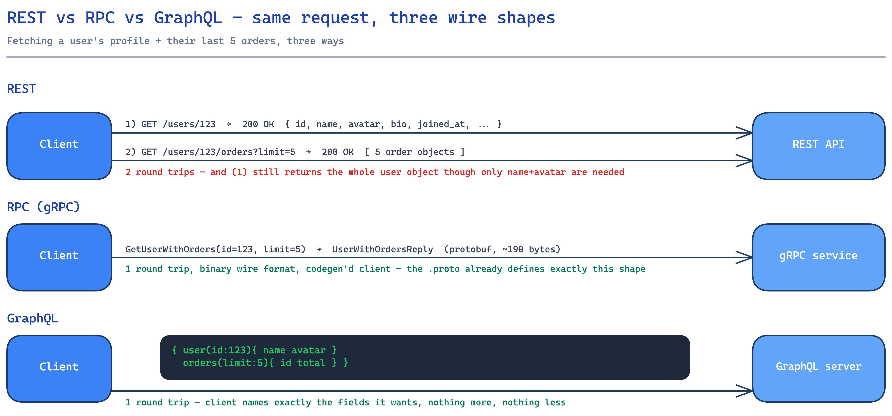

# REST vs RPC vs GraphQL

## The same request, three wire shapes

Take one concrete request: fetch a user's profile plus their last 5 orders. The diagram above shows what actually goes over the wire for that exact request under each style — the differences aren't philosophical, they're visible in the number of round trips and the bytes exchanged.

## What each one actually is

- **REST** — the server exposes *resources* (`/users/123`, `/users/123/orders`) and the client operates on them with HTTP verbs (`GET`, `POST`, `PATCH`, `DELETE`) and gets back HTTP status codes (`200`, `404`, `429`). There's no single request that spans two resources unless the server deliberately builds an aggregation endpoint for it.
- **RPC (gRPC specifically)** — the client calls a *typed method* (`GetUserWithOrders(id, limit)`) defined in a `.proto` file, shared between client and server via codegen. The wire format is Protocol Buffers over HTTP/2: binary, not text, so there's no field name repeated per record the way JSON repeats keys.
- **GraphQL** — one endpoint, one POST, and the *client* writes a query naming exactly the fields it wants across whatever resources the query touches. The server has *resolvers* that know how to satisfy each field, however many underlying calls that takes.

## The trade-offs, concretely

| Dimension | REST | gRPC | GraphQL |
|---|---|---|---|
| Over/under-fetching | Both: extra fields you didn't need, extra round trips for related resources | Neither — the `.proto` defines exactly the fields for that one call | Neither — client asks for exactly the fields it wants |
| Payload | JSON, human-readable, larger (repeats key names per object) | Protobuf, binary, typically 3-10x smaller and faster to (de)serialize than JSON for the same data | JSON by default — same size cost as REST per byte, but usually one response instead of several |
| Caching | Free: HTTP caching (`ETag`, `Cache-Control`, CDNs, browser cache) works because a GET to a stable URL is cacheable by definition | None built in — you cache at the application layer if at all | None at the HTTP layer either (every request is a POST to the same URL) — needs app-level or normalized client-side caching (e.g. Apollo/Relay's cache) |
| Client/server coupling | Loose — any HTTP client can call it, no shared schema required | Tight — client needs the generated stub from the same `.proto`, versioned in lockstep | Loose on transport, tight on schema — client is validated against the server's GraphQL schema at build time |
| Best fit | Public/partner APIs, webhooks, anything that benefits from HTTP caching and ubiquity | Internal service-to-service calls: low latency, streaming, strongly-typed contracts between services you control on both ends | Client-driven apps with genuinely different data needs per surface (mobile vs. web dashboard) hitting the same backend |

## Why not just pick one for everything

A realistic backend for something like a social app typically runs **all three at once, deliberately**:

- **gRPC between internal services** — the notification service calling the user service to resolve a user ID to a display name and avatar URL is a fixed, well-known shape, called extremely often, latency-sensitive, and both ends are owned by the same org. Codegen and binary framing pay for themselves immediately here.
- **GraphQL as the public/BFF (backend-for-frontend) layer** — the mobile app needs `{ name, avatar }` for a feed row; the web dashboard needs the full profile plus analytics. Same underlying services (reached over gRPC), one GraphQL layer in front that lets each client shape its own response instead of the backend team building a bespoke REST endpoint per screen.
- **REST for third-party-facing surfaces** — webhooks (Stripe, GitHub, etc. all POST to a REST-shaped URL), and any public API meant for external developers, because REST needs no shared codegen, works from `curl`, and benefits from HTTP caching and well-understood semantics.

The split isn't indecision — each protocol is answering a different question: *is the caller inside or outside my organization, does the caller need to shape its own response, and does this specific call sit on the hot path where microseconds and bytes matter.*

## Interviewer follow-ups

**How does GraphQL handle the N+1 query problem?**
A naive resolver for "posts, each with their author" issues one query for posts and then one more *per post* to fetch its author — N+1 queries. The standard fix is a **DataLoader**: within a single request, resolver calls are batched and deduplicated, so all the author lookups for that request collapse into one `WHERE id IN (...)` query.

**Why is gRPC not typically exposed directly to browsers?**
Browsers can't easily open a raw HTTP/2 stream with the trailer-based framing gRPC needs, and there's no native browser API for it the way `fetch` exists for REST/GraphQL. The workaround is gRPC-Web, which proxies through a translation layer — at which point you've usually decided a browser-facing GraphQL or REST layer in front of internal gRPC is simpler than shipping gRPC-Web everywhere.

**How would you version a REST API vs. a GraphQL schema?**
REST commonly versions the URL itself (`/v1/users`, `/v2/users`) or a header, so an old client keeps hitting the old, frozen contract. GraphQL instead favors an **evolving single schema**: add new fields, mark old ones `@deprecated`, and let clients migrate off deprecated fields on their own schedule — because a GraphQL client only requests the fields it uses, adding a field is non-breaking, unlike adding a field to a fixed REST response shape a client might over-parse.

**If GraphQL solves over/under-fetching, why isn't it used for internal service-to-service calls instead of gRPC?**
Because internal calls don't need per-caller field flexibility — the notification service always wants the same three fields from the user service, every time. What internal calls *do* need is raw speed and a strict contract, which is exactly what protobuf's binary framing and generated stubs optimize for; GraphQL's flexibility is solving a problem (many different clients, many different needs) that a single internal caller doesn't have.
