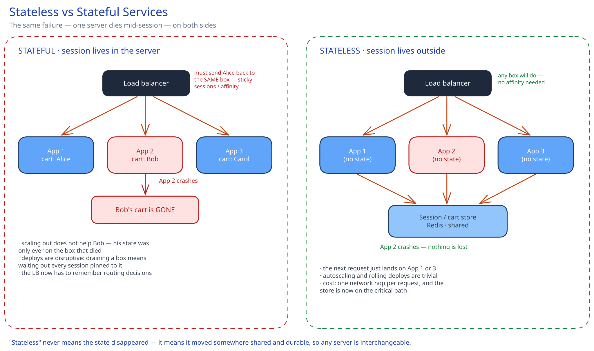

# Stateless vs Stateful Services

## What problem this solves

Whether you can add and remove servers freely. That is the whole question. A **stateless** service keeps no client-specific data between requests, so every instance is interchangeable and the [load balancer](load-balancing.md) can send request 2 anywhere regardless of where request 1 went. A **stateful** service keeps something in local memory or on local disk that the next request needs, which quietly makes that one box irreplaceable.

The name misleads people: stateless does not mean the system forgot anything. The state still exists — it moved to somewhere shared and durable (Redis, the database, or the client's own cookie). "Stateless" describes the *server*, not the system.

## What actually breaks when a server holds session state

Say a shopping cart lives in the app server's process memory. Four separate things now go wrong, and they compound:

- **A crash is data loss, not just a retry.** Bob's cart existed in exactly one place. The [load balancer](load-balancing.md) health-checks the box out of rotation in seconds, which is fast — but Bob's cart is already gone, and no amount of horizontal scaling helps, because his state was never anywhere else.
- **The load balancer has to remember things.** You need **sticky sessions** (session affinity), typically a cookie or a hash of the client IP pinning Bob to App 2. That is a routing constraint, and it fights load balancing: the LB can no longer send traffic to the least-loaded box, only to the *correct* box. A single hot user's traffic cannot be spread at all.
- **Deploys stop being free.** Rolling a new version means draining each box and waiting out every session pinned to it, rather than just terminating it (see [Deploying Without Dropping a Single Request](../real-world-deep-dives/zero-downtime-deploys/README.md)). Autoscaling down has the same problem in reverse — you cannot pick an arbitrary instance to kill.
- **Scaling out gets uneven.** New instances start empty and only accumulate sessions as new users arrive, so a freshly-added box stays underused for as long as sessions live while the old boxes stay hot.

## Where the state actually goes

Moving state out is a choice between three places, and they are not equivalent:

- **A shared in-memory store** (Redis, Memcached) — the common default for sessions. Fast, and every app box sees the same data. The cost is real: one network round trip is now on the critical path of every request, and that store's availability becomes yours. See [Caching Strategies](caching-strategies.md).
- **The client** — a signed cookie or JWT carrying the session itself. The server keeps nothing, which is maximally scalable, but the payload rides on every request and **you cannot revoke it before it expires** — the server has no record to delete. That trade (revocation vs. statelessness) is the entire reason short JWT lifetimes plus refresh tokens exist.
- **The database** — durable and already there, but a per-request write to a relational store for something as churny as session data is usually the wrong tier for the job.

## The services that genuinely cannot be stateless

Pushing state out is the default, not a law. Some systems are stateful because the state *is* the product, and pretending otherwise just relocates the problem:

- **Databases and caches themselves.** A Redis node or a database shard owns its data by definition. Scaling these is the [sharding](data-partitioning-sharding.md) and [replication](replication-consensus.md) problem, not the stateless-app problem.
- **WebSocket and connection-oriented servers.** A live socket is inherently pinned to one box — the connection *is* state. The standard resolution is a thin stateful edge and a stateless core: gateways hold sockets and own nothing else, while a shared registry maps user to gateway so any box can find where to deliver. See [Long Polling, WebSockets & SSE](../scalability-resilience/long-polling-websockets-sse.md).
- **Consumers with local aggregation state.** A stream processor keeping a running window in memory is stateful on purpose, because re-reading history per event would be absurd. It earns that with checkpointing — periodically flushing offsets and state so a restart resumes rather than restarts.

The useful framing in an interview: make the **tier that scales with traffic** stateless, and confine state to a tier you scale deliberately.

## Interviewer follow-ups

**If you move sessions to Redis, haven't you just moved the single point of failure?**
Partly, and it is worth saying so rather than pretending the problem vanished — but the failure characteristics change in your favour. One app server dying took a slice of users' state with it permanently and unrecoverably; Redis dying is a shared outage you can plan against directly with replication and failover, and the app tier stays interchangeable throughout. You have traded many small, unrecoverable, unpredictable losses for one well-understood dependency you can make highly available. That is usually a good trade, and it is a trade, not a free win.

**When are sticky sessions actually acceptable?**
When the state is a cheap optimisation rather than correctness — a warmed local cache, an in-progress upload buffer, an open connection. If losing it degrades performance but not correctness, affinity is fine and often sensible. The failure mode to avoid is affinity for *correctness*: if the request is wrong when it lands on another box, you have a single point of failure per user, and you will discover it during a deploy rather than in testing.

**A JWT lets you drop the session store entirely — why doesn't everyone do that?**
Revocation. A stateless token is valid until it expires because there is nothing to delete; logging out, banning a user, or changing permissions cannot take effect immediately. Teams then add a revocation list — at which point there is a lookup on every request again, and the statelessness was traded away for the thing they were trying to avoid. Short expiries with refresh tokens narrow the window instead of closing it, which is why the honest answer is a bounded exposure, not zero.

**How does this interact with the CAP theorem?**
It mostly sidesteps it. A stateless app tier holds no data, so there is nothing to be inconsistent *about* — replicas cannot diverge. You have concentrated the CAP problem into the state store, which is exactly where you want it: one place to reason about consistency, replication and partitions instead of every app instance. See [Latency, Throughput & the CAP Theorem](latency-throughput-cap.md).

**Is a stateless service the same as an idempotent one?**
No, and conflating them is a common slip. Stateless is about where session data lives between requests; **idempotent** is about whether processing the same request twice has the same effect as once. A stateless service can still double-charge a card on a retry, and a stateful one can be perfectly idempotent. You usually want both, for different reasons — see [Idempotency Keys](../scalability-resilience/idempotency-keys.md).
