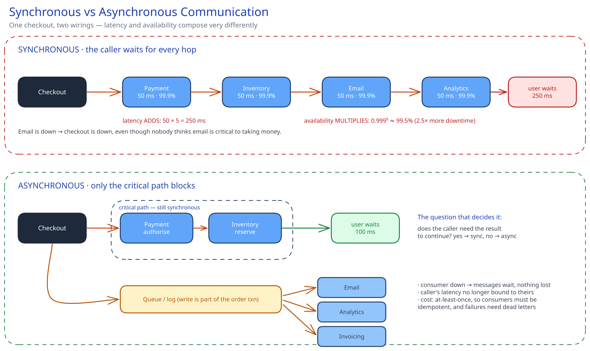

# Synchronous vs Asynchronous Communication

## What problem this solves

Whether the caller waits. That is the whole distinction, and almost every "should this be a queue?" argument is really this question in disguise. In a **synchronous** call the caller blocks until the callee answers, so the caller's latency and availability are bound to the callee's. In an **asynchronous** one the caller hands the work off and returns immediately, so they are not.

The consequences are arithmetic, not opinion, which is why this decision is worth making explicitly rather than by habit.

## Latency and availability compose differently, and both get worse

Put five services in a synchronous chain, each 99.9% available and 50 ms:

- **Latency adds.** `5 × 50 ms = 250 ms` before any of your own work. Worse, tail latency dominates — if each service has a p99 of 400 ms, the chance that *at least one* of five calls hits its tail is roughly `1 − 0.99⁵ ≈ 5%`, so your p95 is now shaped by their p99s. This is the "tail at scale" problem, and it is why deep synchronous chains feel slow even when every individual service looks healthy on its own dashboard.
- **Availability multiplies.** `0.999⁵ ≈ 0.995` — five nines-and-a-nine dependencies produce a service that is down roughly **2.5× more often** than any one of them. Every synchronous dependency is a shared fate: if the email service is down, checkout is down, even though nobody would say email is critical to taking money.

Asynchronous handoff breaks both chains. The producer writes to a [queue or log](../hld-building-blocks/message-queues-pubsub.md) and returns; the consumer's latency and uptime stop being the caller's problem. The [URL shortener](../case-studies/url-shortener/README.md) queues click analytics for exactly this reason — a redirect must never wait on an analytics worker.

## What "async" actually costs you

Async is not free, and claiming it is scalable without naming the price is the answer that gets pushed on:

- **You lose the immediate answer.** The caller learns the work was *accepted*, not that it *succeeded*. Anything that must tell the user "your payment went through" cannot be fire-and-forget.
- **Errors move somewhere else.** A synchronous failure returns a `500` to someone who can retry. An async failure happens in a worker, minutes later, with nobody waiting — so you need dead-letter queues, alerting on consumer lag, and a story for poison messages, or failures become silent.
- **You inherit at-least-once delivery.** Retries mean duplicates, so consumers must be idempotent — see [Idempotency Keys](../scalability-resilience/idempotency-keys.md). Skip this and async turns "slow" into "charged twice", which is a much worse bug.
- **Eventual consistency leaks to the user.** The order exists but the confirmation email has not sent and the dashboard has not updated. That is usually fine, but only if the UI is honest about it — "processing" rather than a stale-looking zero.
- **Debugging spans time.** A synchronous trace is one call stack; an async one is a producer, a broker and a consumer minutes apart, which is why [distributed tracing](../scalability-resilience/logs-metrics-tracing.md) stops being optional.

## The decision rule

Ask one question: **does the caller need the result to continue?**

- **Yes → synchronous.** Reading a user's profile to render a page. Checking inventory before confirming an order. Authenticating. Anything where the next line of code needs the answer.
- **No → asynchronous.** Sending email, generating a thumbnail, updating analytics, warming a cache, reindexing search, notifying downstream systems. The user's request is complete without any of it.

The productive middle ground is to make the *critical path* synchronous and everything else async, which is what a well-designed checkout does: reserve stock and authorise payment synchronously because correctness depends on them; email, invoicing, recommendations and the data warehouse all go on the queue. See [Design an E-commerce Platform](../case-studies/ecommerce-platform/README.md).

## Async without a queue: the other two shapes

A queue is the common implementation, not the only one:

- **Async request/reply with a callback or webhook** — the caller registers a URL and the callee calls back on completion. Useful for genuinely long jobs (video transcoding), and it needs its own retry and signature-verification story.
- **Polling a status endpoint** — return `202 Accepted` with a job ID and let the client poll `GET /jobs/{id}`. Crude, but it needs no infrastructure and works through any firewall, which is why so many public APIs use it.

Both keep the *server* non-blocking. That is separate from **non-blocking I/O** inside one process (an event loop handling thousands of sockets on a few threads) — same word, different layer. Async I/O stops one service from burning a thread per waiting request; async messaging stops one service from depending on another's uptime.

## Interviewer follow-ups

**Everything downstream of checkout is async. How does the user learn their order actually succeeded?**
By splitting the guarantee: the synchronous part must include everything the confirmation depends on. Reserve inventory and authorise payment inline, then write the order row and return `201` with a status of `confirmed` — at which point the promise you made the user is durable and true. Email, invoicing and analytics go on the queue afterwards, because none of them change whether the order exists. The failure to avoid is returning "success" before anything durable has happened; then a consumer failure silently loses an order the user was told they had. What makes this safe is that the queue write is part of the same transaction as the order row (an outbox), so an order can never exist without its follow-up work being queued.

**If async decouples availability, why not make everything async?**
Because you would be trading an outage you can see for a correctness problem you cannot. Read paths mostly cannot be async at all — rendering a page needs the data now — and anything with a user-visible decision (was my password right, is this seat free) needs the answer inline. Making those async means inventing a way to deliver the result later, which is a worse version of the synchronous call you removed. Async also has a real floor cost: a broker to operate, consumer lag to monitor, idempotency to implement, dead letters to triage. For a call that is fast and rarely fails, that complexity buys very little.

**Your queue consumer has been down for an hour. What is the user-visible impact and what do you do?**
It depends entirely on what was queued, and naming that split is the answer. For genuinely deferrable work — emails, analytics — the impact is delay, not loss: the messages accumulate in the log, and when the consumer restarts it drains the backlog from its last committed offset. The real risks are the ones people forget: retention (if the backlog outlives the topic's retention window the oldest messages are gone for good) and the thundering restart (a consumer coming back to an hour of backlog can overwhelm whatever it writes to, so rate-limit the catch-up). What you should *not* do is let the producer block on queue depth — that converts a background outage into a front-door outage, which is the exact coupling the queue was there to prevent.

**How do you keep p99 latency sane in a synchronous chain you cannot remove?**
Stop the chain from waiting for things it does not need, then bound what remains. Parallelise independent calls so latency is the max rather than the sum. Set aggressive per-call timeouts — a call with no timeout is an unbounded dependency, and one slow service will exhaust your thread pool and take you down with it. Add [circuit breakers](../scalability-resilience/circuit-breakers-retries.md) so a failing dependency fails fast instead of making every request wait for a timeout. And where a stale answer is acceptable, cache it so the call disappears entirely on the hot path.
