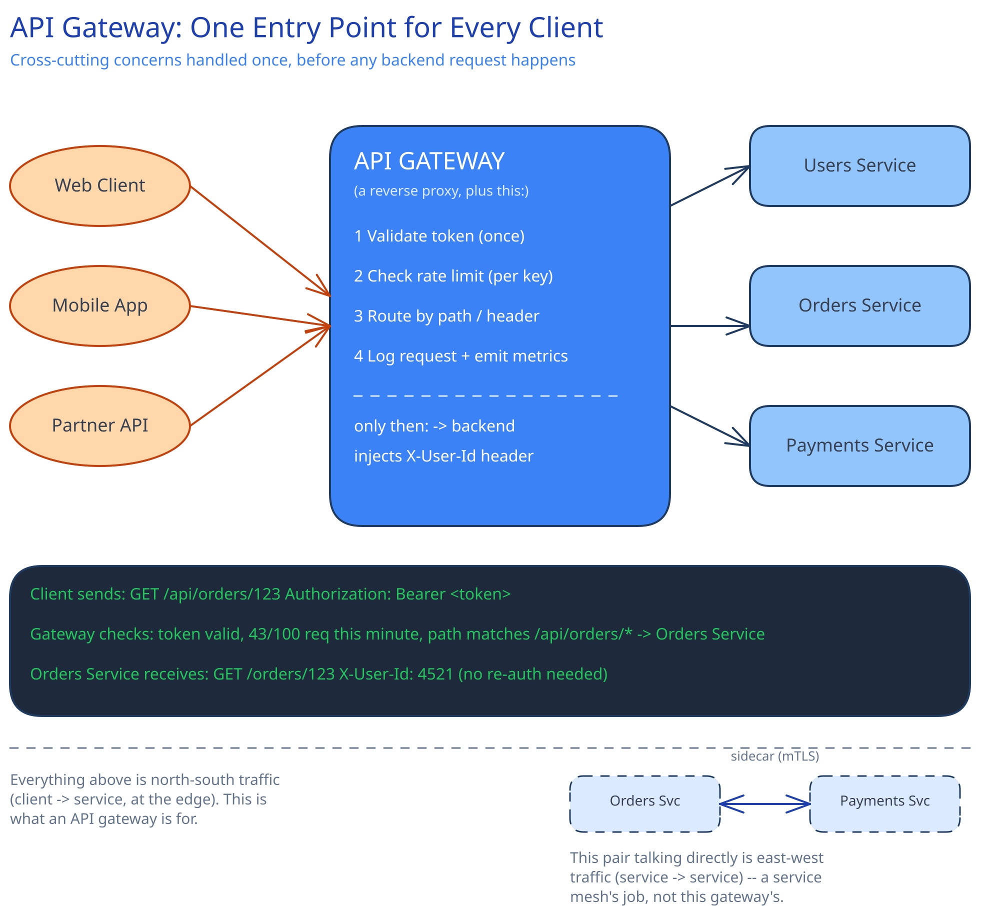

# API Gateway

## What problem it actually solves

Without a gateway, every client — the web app, the mobile app, a partner integration — has to know every backend service's address, and every service has to implement its own auth checking, its own rate limiting, its own request logging. That's the same cross-cutting logic duplicated N times across every service, and every client has to be updated whenever a service moves or splits.

An API gateway is a [reverse proxy](forward-reverse-proxies.md) with those cross-cutting concerns layered on top — not a fundamentally different kind of device, just a reverse proxy whose job description grew. One entry point, one place to change auth logic, one place every request's cost is paid.

## What actually lives at the gateway layer

- **Authentication / token validation** — checked once, at the edge, instead of re-implemented in every service.
- **Rate limiting** — per API key or per client, enforced before a request ever reaches a backend that would've done real work for it.
- **Routing** — by path (`/api/orders/*` → Orders Service) or by header, so clients address the gateway, not individual services.
- **Request/response transformation** — a backend-for-frontend (BFF) pattern: the gateway can aggregate two backend calls into one client-facing response, so a mobile client doesn't pay for three round trips to assemble one screen.
- **Centralized logging and metrics** — every request that crosses the boundary is observed in one place, instead of stitched together after the fact from N services' separate logs.

The diagram's evidence box shows the concrete mechanism that makes "auth once" real: the gateway validates the token and **injects a trusted `X-User-Id` header** downstream. The backend service trusts that header instead of re-validating the token itself — which only works because the network between gateway and backend is one you control (the backend must never accept that header from outside the gateway).

## The real trade-off: a gateway is a single entry point

That's exactly the shape this guide's other pages warn about — a single point of failure, and a hop that adds latency to every request. Two mitigations, not one:

- The gateway itself must be horizontally scaled and stateless, the same as any other tier in [The Client-Server Model](../foundations/client-server-model.md) — it's not exempt from that rule just because it's "infrastructure."
- The latency it adds is usually small relative to the backend call it fronts, but it's not zero — a gateway needs its own timeout and circuit-breaker behavior, so a slow or wedged gateway instance doesn't become the slowest link in every request that passes through it.

## API gateway vs. service mesh

Different problems, not competing solutions to the same one:

- **API gateway** — north-south traffic: client to service, at the edge. This diagram.
- **Service mesh** (sidecar proxies) — east-west traffic: service to service, internal. Handles mTLS, retries, and load balancing *between* your own services.

Real systems commonly run both — a gateway at the edge, a mesh internally — because a gateway sitting in the middle of every internal service-to-service call would make it a bottleneck for traffic it has no reason to see.

## Interviewer follow-ups

**How would you handle a backend service adding a new endpoint version without breaking existing gateway routes?**
Route by an explicit version in the path or header (`/v2/orders`) and keep the old route mapped to the old backend version until every client has migrated — the gateway is exactly the place version routing belongs, since it's the one place that sees every client's traffic.

**What happens to an in-flight request if the gateway instance handling it crashes?**
The client's connection drops and it retries (ideally with an idempotency key, since the request may or may not have reached the backend) — this is why the gateway tier needs the same statelessness and load-balanced redundancy as any other tier, so a crash loses one in-flight request, not the whole entry point.

**Would you put response caching at the gateway or push it further out to a CDN?**
Push it to the [CDN](cdn.md) when the response is cacheable by URL alone (static or near-static) — the CDN is physically closer to the user and the request never reaches your infrastructure at all. Keep caching at the gateway only for responses that need per-client logic (e.g. a cache key that depends on the validated identity) that a CDN can't easily see.

**Does the gateway need to know anything about a backend service's internal API shape?**
Only enough to route and, optionally, transform — it shouldn't share a backend's internal data model. A gateway that has to be redeployed every time a backend's internal schema changes has taken on too much coupling; the BFF aggregation logic should depend on each backend's *public* response contract only.
