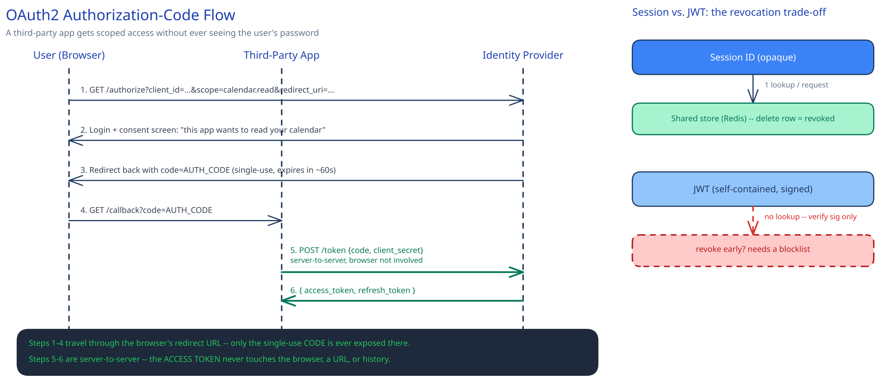

# AuthN & AuthZ at the HLD Layer

## Two different questions, constantly confused

Authentication (AuthN) answers **"who are you"** — verifying an identity claim. Authorization (AuthZ) answers **"what are you allowed to do"** — a completely separate decision made *after* identity is already established.

A system can authenticate someone perfectly and still be broken if authorization is missing or wrong. A logged-in user editing another user's document by guessing an ID in the URL isn't an authentication bug — the login worked exactly as designed. It's an authorization bug: nobody checked whether *this* identity is allowed to touch *that* resource.

## Session-based vs. token-based (JWT) authentication

**Session-based**: the server issues an opaque session ID, storing the actual identity/state server-side (Redis, typically). Every request needs a lookup against that store. The [client-server model](../foundations/client-server-model.md)'s statelessness argument applies directly here: that lookup store has to be shared across every app instance, or a request can only be served by the instance that remembers it — the same problem [service discovery](../scalability-resilience/service-discovery.md) exists to avoid for routing decisions. The upside: revocation is instant. Delete the session row and the token is dead everywhere, immediately.

**Token-based (JWT)**: a signed, self-contained token — the server verifies the signature and reads the claims directly, no lookup required. Faster to verify, and it scales without a shared store. The cost: a JWT can't be revoked before it expires without adding the exact lookup you were trying to avoid (a blocklist, checked on every request — at which point you've rebuilt the session store you left behind, just for revocation instead of the whole identity). This is a real trade: speed and statelessness vs. instant revocability. Most systems answer it by keeping JWTs short-lived (minutes) and pairing them with a longer-lived, revocable refresh token.

## OAuth2/OIDC: delegation, not just login

The problem OAuth2 actually solves: letting a **third-party app** act on a user's behalf without that app ever seeing the user's real password. "Sign in with Google" on some other site is the visible case, but the same mechanism is how a partner integration gets scoped access to one user's data without your system handing out raw credentials.

The authorization-code flow, at the level that matters:

1. The user is redirected to the identity provider (Google, your own auth service, whatever issues tokens).
2. The user approves a specific scope ("this app wants to read your calendar").
3. The provider redirects back to the third-party app with a short-lived **code** — not a token.
4. The third-party app exchanges that code for an access token in a **server-to-server** call, using its own client secret.

The code-then-exchange indirection exists for one reason: the code travels through the user's browser (the redirect URL), where it can leak — browser history, a referrer header, a shared screen. The actual access token never does. If step 3 handed back a token directly, that token would be exposed everywhere the code is now, and tokens are worth far more than a single-use code.

## AuthZ models: coarse to fine, each with its cost

- **RBAC (role-based)** — a role ("editor", "admin") either can or can't do X. Cheap to reason about, cheap to audit, but coarse: it can't express "editor, but only for documents in their own department."
- **ABAC (attribute-based)** — a rule references attributes of the resource and the request itself: `can_edit if user.department == document.department`. More expressive, harder to audit, because the actual permission set for a given user is now the *output* of evaluating rules, not something you can just list.
- **ReBAC (relationship-based, Zanzibar-style)** — permission follows a graph of relationships: "can view if the user is a member of a group that has access to this specific document." This is what a genuinely nested sharing model needs — [Google Docs](../case-studies/google-docs-collab-editing.md)'s "shared with me, inherited from a parent folder" behavior isn't expressible as a fixed role; it's a traversal.

Start with RBAC. Reach for ABAC or ReBAC only once the real permission model stops being a fixed set of roles — adding relationship-graph authorization to a system that only ever needed "admin vs. member" is solving a problem you don't have yet.

## Where the enforcement point actually lives

Authentication terminates at the edge — the [API gateway](api-gateway.md) validates the token once and injects a trusted identity downstream (that guide's own evidence example: an `X-User-Id` header the gateway injects and every backend trusts, precisely because the network between gateway and backend is one you control).

Authorization can't fully live there. Coarse authz — "is this token valid, does this role exist" — fits at the gateway. Fine-grained authz — "does *this* user own *this specific* document" — needs data only the owning service has. The gateway doesn't have (and shouldn't have) every service's resource ownership data. The practical split: coarse authz at the edge, fine-grained authz at the resource-owning service, using the identity the gateway already validated.

## Interviewer follow-ups

**How would you revoke a compromised JWT before it expires?**
You can't, purely — that's the trade-off named above. In practice: keep access-token lifetimes short (minutes), maintain a small revocation/blocklist for the rare compromised-token case (small because most tokens expire naturally before it matters), and revoke the longer-lived refresh token so no new access token can be minted.

**How would you design permission checks for a Google-Docs-style nested folder sharing model?**
ReBAC, not RBAC — model access as a graph (user → group → document, or document → parent folder, inherited) and answer "can this user view this document" as a graph traversal/reachability query, not a role lookup. This is exactly the kind of check a Zanzibar-style system is built to answer quickly at scale.

**What's the security risk of trusting a header the gateway injects, if an internal service can be reached directly?**
If any path bypasses the gateway — a misconfigured internal route, a service reachable from outside its intended network — an attacker can set that header directly and impersonate any user, since the backend never re-validates it. The header is only trustworthy because the network path is trusted; that assumption has to be enforced (network policy, mTLS between internal services), not just assumed.

**Is authentication ever needed between two of your own internal services, or only at the edge?**
Often yes, but it's a different problem — internal service identity (this call really is from the orders service, not something else on the network) rather than end-user identity. That's typically handled by mTLS or a service mesh, not the same token that authenticated the original end user.
