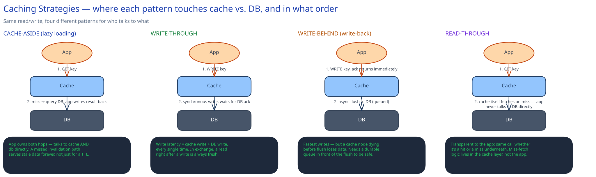

# Caching Strategies

## Four patterns, four different failure modes

Every caching pattern is really a decision about who talks to the database, and when. That decision is what to compare, not the label:

- **Cache-aside (lazy loading)** — the app checks the cache first, and on a miss queries the DB itself and writes the result back into the cache. Simple, and the most common default. The cost: the app now owns two code paths (cache and DB) instead of one, and if an update path forgets to invalidate the cache, that bug serves stale data forever, not just for a TTL window.
- **Write-through** — every write goes to the cache and the DB together, synchronously, before the write is acknowledged. Reads are always fresh. The cost: every write now pays cache-write latency on top of DB-write latency, permanently.
- **Write-behind (write-back)** — a write lands in the cache and is acknowledged immediately; the DB write happens asynchronously afterward. Writes are fast. The cost is real: if the cache node dies before the flush completes, that write is gone. Making this safe means putting a durable queue in front of the flush (so the pending write survives a cache-node crash), not just trusting the cache to eventually get around to it.
- **Read-through** — the app only ever talks to the cache; the cache itself owns the on-miss DB fetch. Functionally close to cache-aside, but the app never has a direct DB code path at all — the miss-handling logic lives once, in the cache layer, instead of being duplicated in every caller.

## Eviction: matching the policy to the actual access pattern

- **LRU (least recently used)** — the default for most workloads, because most access patterns have temporal locality: what was just read is likely to be read again soon.
- **LFU (least frequently used)** — wins specifically when a small number of items get disproportionate traffic and you want them to survive a burst of one-off reads that LRU would otherwise let evict them (a "top 100 posts" cache is the classic case).
- **TTL-based** — used when data has a natural staleness budget regardless of how often it's accessed. The [URL Shortener](../../01-hld-fundamentals.md)'s redirect cache in this guide is exactly this: entries get a 1-hour TTL not because of access frequency, but because that's the acceptable staleness window for a redirect target.

## Invalidation is the actually hard part

The mechanics of reading and writing a cache are simple; keeping it *correct* is not, for one specific reason: the same value can be cached in more than one place at once — an app server's local in-process memory, a shared Redis layer, a CDN edge — and invalidating one of those doesn't invalidate the others. There are two practical strategies, and they trade off against each other directly:

- **Short TTL as a safety net** — bounds staleness to a known window no matter what, at the cost of wasted refetch work even when the underlying value hasn't changed.
- **Explicit invalidation on write** — instant correctness, but only as complete as your invalidation code's coverage. Miss one code path that writes to the underlying data, and that path serves stale data indefinitely, not for a bounded window — this is strictly worse than a short TTL's worst case, which is why most real systems keep a TTL even when they also do explicit invalidation.

## Thundering herd: what happens when a hot key expires

When a single hot key (a viral post, a popular product page) expires, every concurrent request that was reading it misses at the same instant and all of them hit the database simultaneously — a spike the DB wasn't sized for, caused entirely by the cache's own eviction rather than by real new demand. Three practical mitigations, usually combined: **request coalescing / single-flight** (the first miss triggers the DB query; concurrent misses for the same key wait on that one in-flight query instead of each issuing their own); **jittered TTLs** (randomize expiry slightly per key so a batch of keys set at the same time don't all expire in the same millisecond); **stale-while-revalidate** (keep serving the expired value to other readers while one request refreshes it in the background).

## Interviewer follow-ups

**How would you cache a value that's expensive to compute but rarely read?**
Cache it with a long TTL and no eager refresh — the cost you're avoiding is recomputation, not staleness, so there's no reason to warm it proactively. Consider read-through so the expensive-computation code lives in one place (the cache's miss handler) instead of being duplicated at every call site.

**What's the risk of caching at the CDN edge vs. an in-app cache?**
A CDN edge cache is invisible to your application's invalidation logic by default — purging your Redis layer does nothing to the copies sitting at edge nodes around the world unless you explicitly call the CDN's purge API too. That's an easy blind spot: "I invalidated the cache" can be true for one layer and false for another simultaneously.

**How do you keep a distributed cache's replicas from disagreeing?**
Most distributed caches (Redis included) replicate asynchronously, so a replica can briefly serve a stale value right after a write lands on the primary — the same eventual-consistency trade-off covered in [Latency, Throughput & the CAP Theorem](../foundations/latency-throughput-cap.md). If every reader must see a write immediately, reads have to go to the primary, which defeats part of the point of having replicas.

**Why not just make the TTL very short to minimize staleness risk?**
A very short TTL doesn't eliminate the invalidation problem, it just shrinks the staleness window at the cost of a much lower hit rate — you end up paying DB-query cost on nearly every request while still having a (smaller) window where stale data can be served. It's a tuning knob, not a substitute for correct invalidation on the paths that actually change the data.
