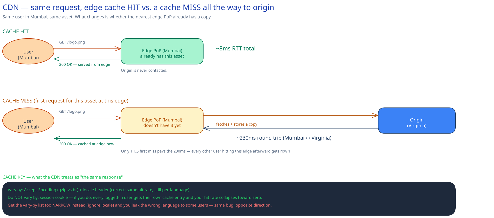

# Content Delivery Networks (CDN)

## What a CDN actually buys you: round-trip time, not bandwidth

A CDN is a network of edge servers (points of presence, or PoPs) spread across many geographic regions, each holding a cached copy of content close to the people requesting it. DNS (or anycast routing) sends a user to whichever PoP is nearest them, not to your origin.

The win is latency, not throughput. A user in Mumbai hitting an origin server in Virginia pays the physical cost of the round trip — roughly 230ms — before a single byte of the response starts arriving, no matter how much bandwidth either end has. The same request served from a Mumbai edge PoP pays single-digit milliseconds, because the data never had to cross an ocean. Bandwidth was never the bottleneck; distance was.

## What's actually cacheable, and what breaks if you get the cache key wrong

Static assets — images, JS/CSS bundles, video segments — cache trivially, because the same bytes are the correct response for every user. A logged-in user's personalized dashboard doesn't cache this simply, because "the same request" now means something different per user. Modern CDNs still cache personalized-feeling pages, either by varying the cache key on the specific header/cookie that actually changes the response, or by shipping a cacheable static shell that hydrates personalized data client-side.

The cache key is the whole game here. A reasonable key varies by `Accept-Encoding` (so a gzip client and a brotli client don't get each other's compressed bytes) and by a locale header (so a French and an English visitor don't get each other's translated page) — but explicitly **not** by session cookie. Get that wrong in either direction and you get a real bug, not just a performance regression:

- **Too narrow** (e.g. ignoring the locale header): the CDN thinks two different-language requests are "the same" response, and starts serving the wrong language to some users.
- **Too broad** (e.g. varying by session cookie): the CDN thinks every logged-in user's request is a unique response, cache hit rate collapses toward zero, and — worse — if you vary by cookie without meaning to, you can end up serving *one user's* cached personalized page to someone else entirely.

## Invalidation: don't purge, version

Purging one path from thousands of globally distributed edge nodes is a real operational problem — the purge call itself takes real time to propagate everywhere, and until it does, some edges still serve the stale copy. The dominant fix in practice is to avoid needing to purge at all: fingerprint the filename with a content hash (`app.3f2a1c.js`) so a changed file is a *new* URL, cached forever (`Cache-Control: max-age=31536000, immutable`) since it can never go stale — the old URL just stops being referenced. Purge APIs still exist for the cases that can't be versioned this way (an HTML page at a fixed URL, a mis-published asset that must be pulled everywhere immediately), but they're the exception path, not the default one.

## Where this sits in the request path

A CDN sits in front of everything else in this guide's HLD building blocks — a request that hits a CDN cache never reaches your [load balancer](load-balancing.md) at all, and never reaches your origin's app servers, database, or cache layer either. That's the entire point: the cheapest request is the one your own infrastructure never sees.

## Interviewer follow-ups

**How would you serve a live video stream through a CDN, versus a static video file?**
A static file is one cacheable object like any other. A live stream is chunked into short segments (a few seconds each, via HLS/DASH) as the stream is produced, and each segment becomes its own small cacheable object with a short TTL — the CDN caches segments moments after they're created, not the whole stream as one object, since the whole stream doesn't exist yet.

**What happens on a CDN cache miss — does the user wait for the full origin round trip?**
Yes, for that one request: the edge PoP has to fetch from origin (or from a mid-tier regional cache, if the CDN has one) before it can respond, so that user pays the full latency this diagram shows in row two. That's the trade being made deliberately — one user absorbs the miss so everyone else at that edge doesn't have to.

**How would you roll back a bad deploy of a cached static asset?**
If assets are content-hashed, you don't roll back the CDN at all — you just re-deploy the previous hashed filename (or revert the pointer in your HTML/manifest that references it), and the old, correct file is likely still cached and valid. This is a second concrete reason content-hashed filenames beat purge-based invalidation: rollback becomes "point at a different already-cached URL" instead of "purge and hope propagation is fast."

**Does a cache hit at the edge ever return stale data?**
Yes, by design, for any TTL-based (not content-hashed) cache entry — that's the trade-off a CDN makes for not needing to check origin on every request. This is the same availability-over-strict-freshness trade-off covered in [Latency, Throughput & the CAP Theorem](../foundations/latency-throughput-cap.md): a CDN is an AP-leaning layer sitting in front of whatever consistency model your origin actually has.
