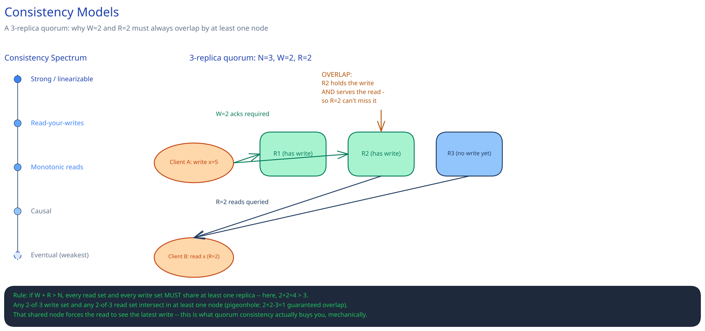

# Consistency Models

## Why this isn't just CAP again

[Latency, Throughput & the CAP Theorem](../foundations/latency-throughput-cap.md) names the choice a system makes *during a partition* — CP or AP. But "consistency" isn't one thing with an on/off switch. Two systems can both call themselves "eventually consistent" and still make very different promises to a caller. This page enumerates the actual spectrum, because "eventually consistent" alone doesn't tell you what you're allowed to assume.

## Strong / linearizable consistency

Every read sees the most recent write, as if there were only one copy of the data anywhere. It's the strongest guarantee and the most expensive one — it requires real coordination on every read, every write, or both, because "most recent" only means something if everyone agrees on an order. Reach for it where being wrong is a correctness bug, not a UX wrinkle: checking a balance immediately before approving an overdraft. Reaching for it everywhere by default is how a system pays coordination cost on paths that never needed it — a "like" count doesn't need to know about a write that happened 40ms ago.

## The weaker guarantees, and what each one actually promises

Weaker-than-strong doesn't mean "no guarantee" — each level below rules out a specific, nameable bug:

- **Read-your-writes** — you always see your own writes immediately, even if someone else might see them late. Concretely: you post a comment and it's there when *you* reload the page, even though a stranger loading the same page a moment later might not see it yet. Without this, a user can edit their own profile and then immediately see the old version — a genuinely confusing bug to explain to a support ticket.
- **Monotonic reads** — once you've seen a value, a later read never shows you something *older*, even from a different replica. Without this, a user could refresh and watch their own comment vanish and reappear, because the second request happened to land on a replica that's further behind than the one the first request hit.
- **Causal consistency** — writes that are causally related are seen by everyone in that order, even if unrelated writes can appear in any order. A question and its answer are causally related; two strangers' unrelated comments aren't. Causal consistency guarantees nobody ever sees the answer before the question, without paying for a total global order on everything.
- **Eventual consistency** — the floor. No ordering guarantee at all, only a promise that replicas converge if writes stop. This is the one that gets named most often and promises the least.

## Quorums: the mechanism, not just the vocabulary

Quorum systems make the strong-vs-eventual choice tunable per operation instead of fixed for the whole database. With `N` replicas: a write succeeds once `W` of them acknowledge it; a read is trusted once it's queried `R` of them and (usually) taken the most recent value seen.

The rule that makes this work: **if `W + R > N`, every possible read set is guaranteed to overlap every possible write set in at least one replica.** With `N=3, W=2, R=2` (`2+2=4 > 3`), pick any 2 replicas for the write and any 2 for the read — by the pigeonhole principle, `2+2-3=1`, so at least one replica is in both sets. That shared replica has the latest write, and the read is guaranteed to see it. Drop to `W=1, R=1` (`1+1=2`, not `> 3`) and a write set and a read set can miss each other entirely — faster, but now eventual instead of strong.

Two mechanisms keep a quorum system honest between writes:

- **Read repair** — a read that notices one queried replica disagrees with the others patches the stale one on the spot, using the read path itself to heal drift instead of waiting for a separate process.
- **Hinted handoff** — a write meant for a replica that's temporarily down is held by another node and delivered once the original comes back, so a brief outage doesn't turn into a permanently missing write.

## Interviewer follow-ups

**Which consistency model would you pick for a shopping cart vs. a bank balance, and why?**
A shopping cart tolerates eventual or session-level consistency (read-your-writes) fine — the worst case is a user briefly not seeing an item they just added on a different device, which is confusing but not costly. A bank balance checked right before approving an overdraft needs strong consistency, because the cost of being wrong (approving a withdrawal against stale data) is the exact failure the check exists to prevent.

**How does `W+R>N` change your read/write latency compared to `W=1, R=1`?**
Every write now waits on 2 acknowledgments instead of 1, and every read waits on 2 responses instead of 1 — both get slower, and both become as slow as the *slower* of the required replicas rather than the fastest one. You're trading latency for the overlap guarantee; `W=1, R=1` is faster precisely because it gives that guarantee up.

**Can a system offer different consistency guarantees for different operations, or is it an all-or-nothing choice for the whole database?**
Per-operation is normal, not an exception — many quorum-based stores let you choose `W` and `R` per request. A payment write might use a high `W`; a read of a "last seen" timestamp on the same database might use `R=1` because staleness there is invisible. The database supports the range; the caller picks the point on it that matches what a wrong answer would actually cost.
