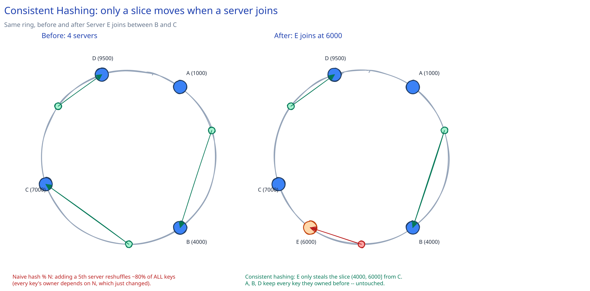

# Consistent Hashing

## The problem naive hashing has

The obvious way to shard `N` servers is `server = hash(key) % N`. It works — right up until `N` changes. Every key's owner is a function of `N` itself, so the moment a server joins or leaves, almost every key's assignment changes too. Going from 4 servers to 5 with mod-N remaps roughly **80% of all keys**, not the ~20% you might hope for (`hash(key) % 4` and `hash(key) % 5` agree for almost no key). Every one of those remapped keys is a cache miss or a misdirected request, arriving at exactly the moment — right after a scaling event or a node failure — when the system can least afford it.

## How the hash ring actually works

Consistent hashing puts both servers and keys on the same circular space (a ring, conventionally 0 to 2³²−1, simplified below to 0–10000). A key belongs to the **first server clockwise** from its position.

Take 4 servers at ring positions `A=1000, B=4000, C=7000, D=9500`, and 3 keys:

- `k1` at position `2000` → the first server at or after 2000, going clockwise, is **B (4000)**.
- `k2` at position `5000` → the first server at or after 5000 is **C (7000)**.
- `k3` at position `8500` → the first server at or after 8500 is **D (9500)**.

That's the entire rule. No modulo, no dependency on `N` anywhere in the lookup.

## What happens when a node joins — concretely

Add a 5th server, `E`, at position `6000` — between `B (4000)` and `C (7000)`. Walk the same 3 keys again:

- `k1` at `2000` → still **B**. Unaffected — E is nowhere near it.
- `k2` at `5000` → now **E**, not C. `5000` is the first position at or after itself that has a server, and that server is now E instead of C.
- `k3` at `8500` → still **D**. Unaffected.

Only keys in the range `(4000, 6000]` — the slice between B and the new server E — change owners, and they all move to E specifically. Every key outside that slice, on every other server, is untouched. Compare that to mod-N's ~80% global reshuffle: this is a local, bounded change.

## Virtual nodes, and why they're needed

With only 4-5 real servers, ring positions land wherever their hash happens to fall — by luck, one server can end up owning a much bigger arc than the others (a hot spot), and there's no way to fix that without moving a real server. The fix is **virtual nodes**: each physical server is hashed onto the ring many times (100-200 virtual replicas is typical, each at an independent position), and a physical server's real load is the sum of all its virtual slices. With enough virtual nodes, the law of large numbers smooths ownership to near-uniform, and — just as important — when a server leaves, its load doesn't dump onto one unlucky neighbor; it's spread across many other servers, because its virtual nodes were scattered all over the ring, not clustered in one place.

## Where this actually shows up

This guide's [Load Balancing](load-balancing.md) page mentions consistent-hash-based routing for session affinity and cache locality — this page is the mechanism behind that. It's also how real distributed stores shard data across nodes (DynamoDB and Cassandra both use it, as do most CDN and cache-cluster designs) — see [Database Replication & Failover](../database-design/db-replication-failover.md) for how sharding and replication interact.

## Interviewer follow-ups

**How many virtual nodes is "enough," and what's the trade-off of using more?**
More virtual nodes means a smoother, more even load distribution and finer-grained movement when a server joins or leaves — but each one is an entry in every node's routing table (usually a sorted map), so more virtual nodes means more memory and a slightly more expensive lookup. A few hundred per physical node is a common practical range.

**How would you handle a key whose owning server is temporarily down?**
Don't stop at the first server clockwise — walk further and replicate to the next `N` distinct servers clockwise (a "preference list"). If the first is down, the second serves the read; this is also how consistent-hashing systems get replication almost for free, since the preference list *is* the replica set.

**Does consistent hashing help with a hot key — one specific key getting disproportionate traffic?**
No. Consistent hashing only solves *which server owns a key*, uniformly distributing the *number* of keys per server. If one key is disproportionately popular, every request for it still lands on the same single owning server no matter how the ring is arranged — that's a caching or key-splitting problem, not a hashing-scheme problem.
