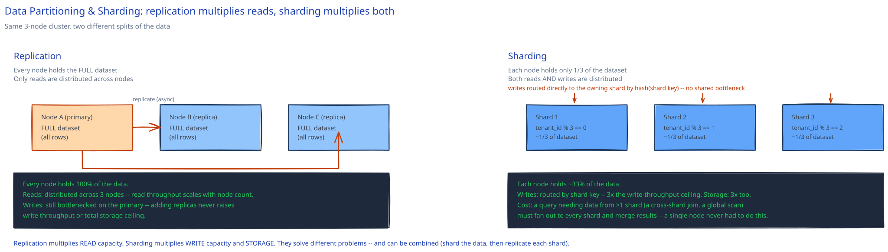

# Data Partitioning & Sharding

## Is this a read problem, or a write/size problem?

That's the first question, and it's worth asking before drawing anything, because reaching for sharding when a replica would have solved it is a common wrong turn. A single database node has a ceiling on both write throughput and total storage. [Replication](../database-design/db-replication-failover.md) doesn't touch either ceiling — every replica still holds the *full* dataset and could, in principle, absorb the same write load as the primary; replicas just aren't used for writes by convention. What replication actually multiplies is read capacity, because reads can be spread across nodes that each hold a complete copy.

Sharding solves a different problem: split the data itself across N nodes so each one holds only 1/N of it. Now write throughput and storage both scale with node count, because each node is only ever responsible for its own slice. This guide's [URL Shortener](../../03-db-design-fundamentals.md) database design makes exactly this call — it reaches for read replicas, not sharding, because its bottleneck is redirect *reads*, not writes.

## Partitioning strategies, and what breaks each one

- **Range-based** — rows are split by key range (e.g. user IDs 1-1M on shard 1, 1M-2M on shard 2). Simple, and range queries ("all orders this week") stay on one shard if the range key is chosen well. The failure mode: a monotonically increasing key — an auto-incrementing ID, a timestamp — concentrates every new write on whichever shard currently owns the newest range. One "hot" shard eats all the write traffic while the others sit idle.
- **Hash-based** — a hash of the key decides the shard, spreading writes evenly regardless of key ordering. The trade: range queries no longer stay on one shard. "All orders from last week" now has to fan out to every shard and merge, because hashing destroys the locality that made range queries cheap.
- **Directory-based** — an explicit lookup service maps key → shard. Flexible (rebalancing is just updating the directory), but the directory itself is now a dependency every request pays a lookup against, and it needs its own replication or it becomes the single point of failure the sharding was supposed to route around.

[Consistent hashing](consistent-hashing.md) is the usual answer to hash-based sharding's worst operational problem: with naive `hash(key) % N`, adding or removing one node reshuffles nearly every key's shard assignment. Consistent hashing bounds that disruption to roughly 1/N of the keys.

## Choosing a shard key is the real decision

Two worked examples show why this isn't mechanical:

- **A multi-tenant SaaS, sharded by `tenant_id`** — every query for one tenant stays on one shard, so there's no fan-out for the common case. This only works as long as no single tenant's data outgrows one shard's capacity; a shard key that ties one logical entity to unbounded growth is a design bug waiting to happen.
- **A social app's posts, sharded by `user_id`** — one user's posts stay together, which is great for "show me my posts" but means a global "trending posts across all users" query has no single shard to ask — it must fan out to all of them and merge.

There's no shard key that's free of trade-offs; there's only the one that matches the query pattern you actually need to be fast.

## What gets harder once you shard

- **Cross-shard transactions and joins** — a transaction that used to be a single-node ACID operation now spans multiple nodes with no shared transaction log. The practical fix is usually to design queries and schemas so they don't need this (denormalize so the common queries stay single-shard); when it's unavoidable, a saga pattern or two-phase commit exists but both add real latency and failure-handling complexity a single node never had.
- **Resharding** — when one shard outgrows its capacity, splitting it means moving a live subset of its data to a new node without downtime or lost writes. This is usually the single hardest operational task in a sharded system, which is exactly why picking a shard key that won't need resharding soon matters more than almost any other decision on this page.

## Interviewer follow-ups

**How would you detect a shard has become a hot spot before it falls over?**
Per-shard metrics — write QPS, CPU, queue depth — compared across shards, not just against a global average. A single hot shard can hide inside a healthy fleet-wide average; the signal is one shard's metrics diverging from its siblings', not the aggregate crossing a threshold.

**Would you shard a table with 10,000 rows? Why not?**
No — sharding trades single-node simplicity (joins, transactions, easy backups) for throughput and storage headroom you don't need at that scale. A 10,000-row table fits comfortably in memory on one node; sharding it only adds cross-shard-query complexity for no corresponding benefit.

**How do auto-incrementing primary keys break across shards, and what replaces them?**
An auto-incrementing counter is inherently single-node — two shards generating IDs independently will mint duplicates. The usual replacement is a globally unique ID scheme that doesn't need central coordination (a Snowflake-style ID embedding a shard/worker ID and timestamp, or UUIDs) — see a dedicated unique ID generator design if this guide has one yet.

**Does sharding replace replication, or do real systems use both?**
Both, almost always. Each shard is typically *also* replicated internally for read scaling and failover — the two techniques answer different questions (replication: read throughput and durability per shard; sharding: total write throughput and storage across shards) and compose rather than substitute for each other.
