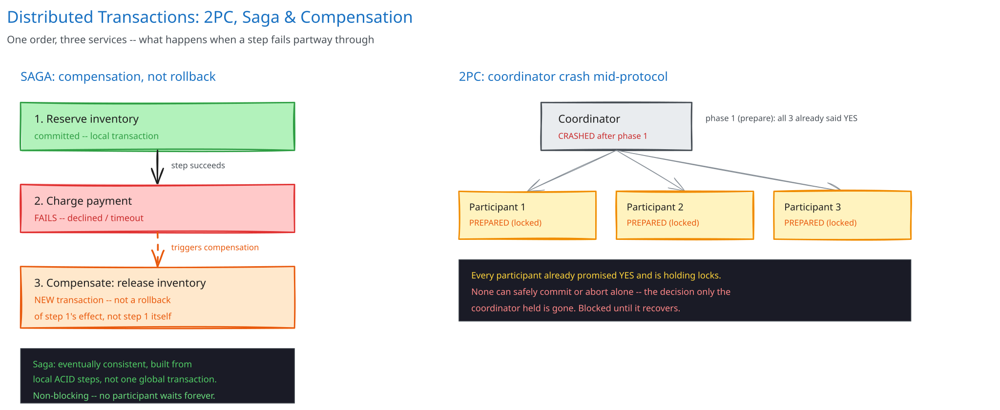

# Distributed Transactions: 2PC, Saga & Compensation

## The problem: one order, three databases

This guide's [e-commerce schema](../database-design/ecommerce-schema-worked-example.md) places an order atomically — decrement inventory, insert the order, insert the order items — because all three tables live in *one* database, wrapped in *one* transaction. That guarantee stops the instant those steps move into separate services, each owning its own database: an inventory service, a payment service, a shipping service. No single `BEGIN ... COMMIT` can span all three anymore.

Without a coordination pattern, the concrete failure is exactly the one the schema page's transaction was written to prevent, just relocated: the inventory service commits its decrement, the payment service call then fails (a declined card, a timeout, the service is down) — and now stock is reserved for an order nobody paid for.

## Two-Phase Commit (2PC), and why it's mostly avoided anyway

2PC is the direct extension of a single-database transaction across multiple participants:

- **Phase 1 (prepare):** a coordinator asks every participant "can you commit this?" Each one locks the resources it would need and replies yes or no, without committing yet.
- **Phase 2 (commit):** only if every participant said yes, the coordinator tells all of them to actually commit. If any said no, it tells all of them to abort.

The failure mode that makes this unpopular in practice: if the coordinator crashes *after* phase 1 but *before* sending the phase-2 decision, every participant is stuck. Each one has already promised it *can* commit and is holding locks on real resources — but none of them knows whether the final answer was commit or abort, and none can safely decide alone. They wait, blocked, until the coordinator recovers. This is a blocking protocol, and it's the exact cost this guide's [CAP theorem page](../foundations/latency-throughput-cap.md) would predict for a design that leans this hard toward strong consistency: availability is what gets sacrificed, for every participant, for as long as the coordinator is gone.

## Saga: local transactions, plus a way to undo them

A saga breaks the operation into a sequence of local transactions, each committed independently in its own service and database. If a later step fails, the saga doesn't roll back the earlier ones — it can't, they already committed — it runs **compensating actions**: separately-written operations whose job is to undo the effect, not the transaction.

Traced through the order example:

1. **Reserve inventory** — local commit in the inventory service. Stock is now held for this order.
2. **Charge payment** — fails (declined, timeout, whatever).
3. **Compensate** — release the inventory reservation. This is a *new*, separate transaction that reverses step 1's effect; it is not step 1 undone, it's step 1 answered.

Every step after the first needs its compensation defined up front, before you need it — "what un-reserves the stock" is a real piece of the design, not an afterthought bolted on when something breaks.

## Choreography vs. orchestration

- **Choreography** — each service listens for events and reacts on its own (built on the [message queue/pub-sub](message-queues-pubsub.md) pattern already in this guide): the inventory service publishes `stock-reserved`, the payment service listens and reacts, and so on. No central coordinator, and no single service that could become a bottleneck — but the overall flow is now implicit, scattered across every service's event handlers, genuinely hard to see as one picture when you're debugging a stuck order.
- **Orchestration** — one central saga coordinator explicitly calls each step in order and decides which compensating action to run on failure. The whole flow is visible in one place — at the cost of that coordinator becoming a new component every participating service now depends on.

Neither is "correct" in the abstract; a small, fixed number of steps with simple failure handling tends to favor choreography's lack of a new component, while a longer or frequently-changing flow tends to favor an orchestrator's visibility.

## Interviewer follow-ups

**What happens if a compensating action itself fails?**
It has to be retried until it succeeds — which means compensating actions need the same idempotency guarantee as any other retried operation (cross-ref this guide's [idempotency keys](../scalability-resilience/idempotency-keys.md) page). A compensation that can silently fail-and-move-on leaves the system in exactly the inconsistent state the saga existed to prevent.

**How does a choreographed saga guarantee steps run in the right order over an unordered pub/sub topic?**
It generally can't rely on topic-level ordering alone — either partition events so all events for one saga instance land on the same ordered partition (this guide's [message queues page](message-queues-pubsub.md) covers exactly this trade-off), or have each service check the saga is in the expected prior state before acting, rejecting or queuing events that arrive out of order.

**Is a saga eventually consistent or strongly consistent — what does that mean for a customer checking order status mid-saga?**
Eventually consistent, by construction: for the seconds or longer the saga is mid-flight, the order genuinely is in an intermediate state, and the UI needs an honest status for it ("processing payment") rather than presenting a not-yet-true "confirmed." This is the same trade this guide's [ACID vs BASE page](../database-design/acid-vs-base.md) names explicitly — a saga is a BASE-style operation built out of several ACID-local steps.

**Why not just make every service call the payment service synchronously and roll back on failure, like a normal function call?**
Because "roll back" only exists inside a transaction boundary, and each service's commit already closed that boundary the instant it completed — there is nothing left to roll back, only a separate, later operation that can undo the effect. That's the entire reason compensations exist as their own named concept instead of just "call rollback."
