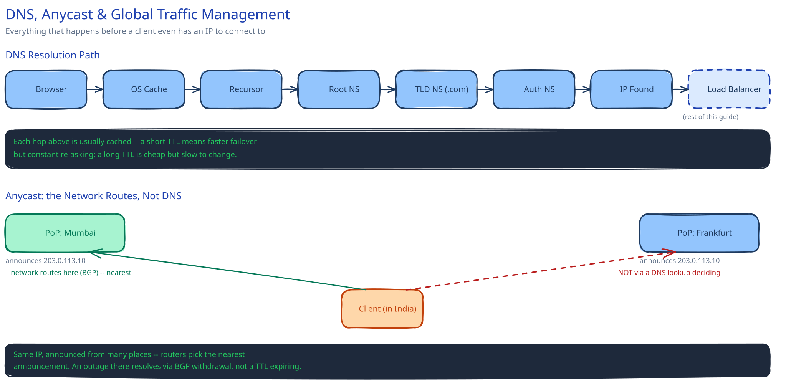

# DNS, Anycast & Global Traffic Management

## The resolution path: everything that happens before this guide's request even starts

Every request this guide describes — hitting a [load balancer](load-balancing.md), a [CDN edge](cdn.md), an [API gateway](api-gateway.md) — assumes the client already has an IP address to connect to. Getting that IP address is its own chain of lookups: browser cache (checked first, usually empty) → OS resolver cache → a recursive resolver (your ISP's, or a public one like `8.8.8.8`) → a root nameserver (which doesn't know the answer, but knows who does) → the TLD nameserver for `.com` → the authoritative nameserver for the actual domain, which finally returns the IP. Only then does the client open the TCP connection this guide's other pages start from.

This guide starts at the load balancer, not here, because the resolution path above is usually invisible — cached at three or four layers deep, it adds nothing measurable to most requests. It's worth knowing it's there anyway, because the two places it stops being invisible (TTLs and anycast) are exactly the two things this page covers.

## TTLs: the actual lever, and why DNS failover is "slow"

A DNS record's TTL controls how long every layer of that resolution chain is allowed to cache the answer before asking again. A short TTL (seconds) lets you redirect traffic fast — point the record somewhere else and most resolvers will notice within seconds — but it costs you: every resolver on earth re-asks that often, load on your authoritative nameservers scales with 1/TTL, and every client pays a fresh resolution round trip more frequently. A long TTL (hours) is nearly free — resolvers barely ever re-ask — but it means a DNS-based failover can take that long to actually reach every client, because some resolver somewhere cached the old answer right before you changed it and won't check again until its TTL expires.

This is the concrete reason DNS-based failover is considered slow compared to a load balancer swapping a backend: the [load balancer](load-balancing.md) makes the decision once, centrally, and the very next packet goes to the new backend. A DNS change has to *propagate* — through however many caches, at however long a TTL each one was holding — before every client has even heard about it.

## Anycast: the same IP, routed by the network, not by DNS

Anycast announces the *same* IP address from multiple physical locations simultaneously, via BGP — and the network's own routing infrastructure sends each client's packets to whichever announcing location is topologically nearest, with no DNS lookup deciding between locations at all. This is why anycast reacts to an outage faster than any TTL can: when a location goes down, that location's BGP announcement is withdrawn, and routers worldwide route around it as part of ordinary route convergence — no resolver cache anywhere has to expire first, because no resolver made the location decision in the first place.

This guide's [CDN](cdn.md) page already depends on this without naming it: CDN edge PoPs are commonly reached via anycast, which is part of why a cache hit is fast even before content caching enters the picture — the client was routed to the nearest PoP by the network itself, not by a DNS answer that might be stale.

## DNS-based traffic-steering policies answer different questions

These are easy to conflate because they all look like "a DNS record with some extra logic," but each is optimizing for something different:

- **Latency-based routing** — send each resolver to whichever registered endpoint answers fastest from roughly that resolver's network location. Optimizing for speed.
- **Geo-DNS routing** — send by the client's actual country or region, regardless of which endpoint is fastest. Optimizing for data residency or content-licensing rules, which is a legal/business constraint, not a performance one — the two can disagree, and geo-DNS wins when they do.
- **Weighted routing** — send a fixed percentage of traffic to each endpoint. The DNS-layer equivalent of a canary rollout (cross-ref [Feature Flags: Shipping to 1% Before 100%](../../feature-flags-rollout/00-overview.md)) — useful for shifting traffic gradually to a new region or a new stack, independent of latency or geography.

## Interviewer follow-ups

**Why can't you just always set TTL to 0 seconds for instant failover?**
A TTL of 0 (or near it) means every single request pays a full DNS resolution round trip instead of using a cache — you've traded failover speed for adding real, constant latency and load to every request, and hammering your own authoritative nameservers at your full request rate. Most systems pick a short-but-nonzero TTL (tens of seconds) as the actual trade-off, and reach for a load balancer or anycast when they need faster-than-that reaction.

**What's the difference between a CDN's anycast IP and a regular load-balanced VIP, from the client's point of view?**
From the client's point of view, both look like "one IP, many servers behind it" — the difference is *where* the routing decision happens. A load-balanced VIP is one IP that's actually reachable at one place (or a small failover set); the load balancer behind it picks the backend. An anycast IP is announced from many *separate physical locations*, and the network itself picks which location a given client even reaches, before any load balancer at that location gets involved.

**How would you actually test that DNS failover works before you need it in production?**
Point a test client at your authoritative nameservers directly (bypassing cached resolvers), trigger the failover, and measure how long the new answer actually takes to appear — then separately verify against a resolver you don't control that respects your real TTL, since that's the number that determines what actual users experience. This is the same instinct as [testing database failover before you need it](../database-design/db-replication-failover.md): a failover mechanism nobody has ever triggered outside a diagram is not a tested mechanism.

**Does a shorter TTL always mean faster failover for every client?**
No — it only bounds the WORST case for resolvers that respect TTLs correctly. Some resolvers (and some client-side caches) cache longer than the TTL says regardless, so a short TTL is a strong lever on average behavior, not a guarantee for every single client on earth.
