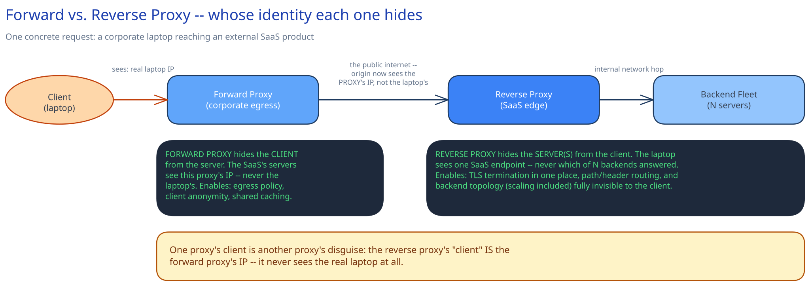

# Forward & Reverse Proxies

## The one distinction that actually matters: who's being hidden

A **forward proxy** sits in front of *clients* and hides the client from the server — the destination sees the proxy's IP, never the real caller's. A corporate egress gateway, a VPN, and a scraper rotating IPs through a proxy pool are all forward proxies: same shape, same job, different motive.

A **reverse proxy** sits in front of *servers* and hides the server from the client — the client thinks it's talking to one endpoint, when there might be 50 machines behind it, or the machine handling this request might not exist five minutes from now. This isn't a different technology from the rest of this guide's [Load Balancing](load-balancing.md) page — a load balancer *is* a reverse proxy that happens to also distribute load across backends. A reverse proxy that only does TLS termination and header rewriting, with no distribution logic at all, is still a reverse proxy.

## What a forward proxy buys you

- **Client anonymity** — the destination never learns the real caller's IP.
- **Centralized egress policy** — a company blocks a destination for every employee from one gateway, instead of configuring every laptop individually.
- **Shared caching** — many internal clients requesting the same external resource can be served from one cached copy at the proxy, instead of each one hitting the destination.

## What a reverse proxy buys you, beyond load balancing

- **TLS termination in one place** — certificates and handshake cost live at the edge, not duplicated on every backend.
- **Request/response rewriting** — path rewriting, header injection, response compression, all without backend code changes.
- **Backend topology fully hidden** — a backend can be renamed, moved, or scaled up/down with zero client-visible change, because the client's only contract is with the proxy's stable endpoint.

## One request, traced through both

Take a concrete case: a corporate laptop hits an external SaaS product. The full path is `laptop → forward proxy (corporate egress) → the public internet → reverse proxy (the SaaS's edge) → one of N backend servers`.

The detail worth sitting with: from the SaaS's reverse proxy's point of view, "the client" making this request *is the corporate forward proxy* — its IP is the only one the reverse proxy ever sees. The laptop's real address never crosses the public internet at all. One proxy's client is another proxy's disguise, and neither one is aware the other exists.

## Interviewer follow-ups

**Does a reverse proxy need to be a separate hop from the load balancer, or can one process do both?**
One process can do both — nginx or Envoy terminating TLS *and* distributing across backends is extremely common. "Reverse proxy" and "load balancer" are overlapping roles, not competing pieces of infrastructure; you only split them into separate hops when you want the outer layer to stay dumb and fast (see the two-layer LB pattern on the [Load Balancing](load-balancing.md) page).

**How does a reverse proxy affect a client's ability to see the real backend's IP for debugging?**
It doesn't let them — that's the point. Debugging has to happen server-side (logs, tracing headers like `X-Forwarded-For` or a request ID injected by the proxy) rather than by asking the client to inspect the connection, because the client's OS-level connection was only ever to the proxy.

**What breaks if a forward proxy caches a response that should have been personalized?**
Every client behind that proxy gets served the first client's personalized data — a real information leak, not just a staleness bug. This is why forward-proxy caching is only safe for genuinely shared, non-personalized responses, and why caching layers need an explicit signal (a `Vary` header, a cache-control directive) rather than caching-by-default.

**Can a forward proxy and a reverse proxy be the same physical box from two different perspectives?**
Yes — a corporate gateway that's a forward proxy for outbound employee traffic might simultaneously act as a reverse proxy for inbound traffic to the company's own internal tools. The role is defined by which side's identity is being hidden for a given request, not by the box itself.
