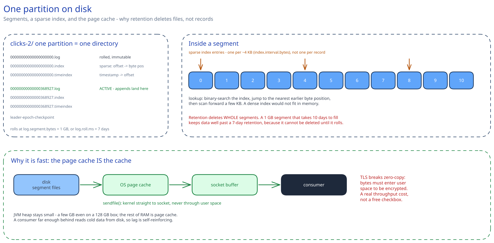

# Kafka & the Distributed Log


## What problem this solves

[Message Queues & Pub/Sub](message-queues-pubsub.md) covers *whether* to decouple producers from consumers. This page is about the specific data structure Kafka uses to do it, because that structure is the reason Kafka behaves differently from every queue you have used before.

A traditional queue **deletes a message once it is consumed** — the queue is a buffer, and reading is destructive. Kafka does not delete on read. A topic partition is an **append-only, immutable, ordered log on disk**, and a consumer is just a cursor holding an integer offset into it. Nothing is removed when read; the consumer moves its pointer. That single design choice produces almost everything else worth knowing about Kafka.

Three consequences fall straight out of it:

- **Replay is free.** Reset the offset to 0 and reprocess last month's events. In a delete-on-read queue that data is gone the instant it was consumed. This is what makes Kafka the backbone of event sourcing, of the batch-recompute path in an [ad click aggregation pipeline](../case-studies/ad-click-aggregation/README.md), and of rebuilding a derived store from scratch after a bug.
- **Many independent readers are free.** Two consumer groups reading the same topic do not compete or duplicate work — each keeps its own offset. Analytics can be 4 hours behind while the fraud checker is 50 ms behind, over the same data, with neither aware of the other.
- **Throughput comes from sequential disk I/O.** Appending to the end of a file and reading forward is the access pattern spinning disks and SSDs are fastest at, and it is why "but it writes to disk" is not the weakness people assume.

## What a broker actually stores on disk



"The log" is not one giant file. Each partition is a **directory** named `<topic>-<partition>` (for example `clicks-2/`), and inside it the log is split into **segments**. Every segment is three files sharing a base name — the offset of its first record, zero-padded to 20 digits:

```
clicks-2/
  00000000000000000000.log        the records themselves
  00000000000000000000.index      offset  -> byte position   (sparse)
  00000000000000000000.timeindex  timestamp -> offset        (sparse)
  00000000000000368927.log        ... the active segment
  00000000000000368927.index
  00000000000000368927.timeindex
  leader-epoch-checkpoint
```

Why this shape matters, and what interviewers pull on:

- **Only the last segment is open for writing** (the *active segment*). It rolls to a new one when it hits `log.segment.bytes` (1 GB by default) or `log.roll.ms` (7 days). Everything before it is immutable, which is what makes replication, retention and zero-copy reads simple.
- **The index is sparse, not per-record.** Kafka writes an index entry roughly every `index.interval.bytes` (4 KB by default), so a lookup is a binary search in the index to find the nearest earlier position, then a short linear scan through the log. A dense index would be enormous; a sparse one costs a few microseconds of scan and fits in memory.
- **The `.timeindex` is why offset-by-timestamp works.** `offsetsForTimes()` — the thing behind "replay everything since 09:00" — is a binary search of the time index. It's approximate to the index granularity, which is fine, and it exists only because someone stored it.
- **Retention deletes whole segments, never individual records.** This is the detail people get wrong: with a 7-day retention and a 1 GB segment that takes 10 days to fill, data can survive well past 7 days, because the segment can only be deleted once it has rolled *and* its newest record is past the horizon. Retention is a floor on deletion, not a promise of it — which matters both for capacity planning and for GDPR-style deletion arguments.

**The page cache is Kafka's cache.** Kafka keeps no application-level record cache. It writes into the OS page cache and lets the kernel flush; consumers reading recent data are served from RAM without touching a disk. Two consequences: the JVM heap stays small (a few GB is normal even on a machine with 128 GB of RAM — the rest is page cache), and a consumer that falls far behind starts reading cold data from disk, which is exactly when a lagging group also gets slower. Lag is self-reinforcing.

**Zero-copy.** For a plaintext fetch, Kafka uses the `sendfile` syscall to move bytes from the page cache straight into the socket buffer without copying them into user space. That is a large part of the throughput story. The nuance worth knowing: **TLS breaks zero-copy**, because the data must be pulled into user space to be encrypted. Turning on in-transit encryption is a real, measurable throughput cost, not a free checkbox.

## Partitions: the unit of parallelism, ordering, and pain

A topic is split into **partitions**, and this is the single most consequential decision you make:

- **Ordering is per-partition only.** Kafka guarantees strict order *within* a partition and nothing at all across partitions. If order matters for a user, produce with `key = user_id` — the default partitioner hashes the key (murmur2), so all of that user's events land in one partition and stay ordered relative to each other. Ordering across different users was never promised and you are not giving anything up.
- **Partition count caps consumer parallelism.** Within one consumer group, a partition is assigned to **exactly one** consumer. Ten partitions means at most ten useful consumers; the eleventh sits idle. This is the number people get wrong: you cannot scale consumption past the partition count without repartitioning the topic.
- **Increasing partitions later breaks key locality.** Adding partitions changes `hash(key) % n`, so a user's events start landing in a different partition from their historical ones — and ordering across that boundary is lost. Over-provision partitions modestly up front rather than planning to grow them.
- **A hot key is a hot partition.** All of one celebrity's events go to one partition, which one consumer must handle alone. The fix is a composite key (`user_id:bucket`) that spreads the load and gives up strict per-user ordering — the same trade-off the [leaderboard](../case-studies/real-time-leaderboard/README.md) and [ad click](../case-studies/ad-click-aggregation/README.md) designs make.
- **Partitions are not free at the cluster level.** Each one costs open file handles, memory for index buffers, and controller work. More importantly, a broker failure means electing new leaders for every partition that broker led, so partition count directly sets your failover time. Tens of thousands of partitions per broker is where clusters start to hurt.

## Producer internals: batching, and the setting that silently reorders

The producer is not a thin wrapper around a socket. `send()` appends to an in-memory accumulator and returns a future immediately; a background I/O thread drains it.

- **`batch.size` (16 KB) and `linger.ms` (0)** control batching. `linger.ms=0` means "send as soon as the sender thread is free", which is *not* the same as no batching — under load, batches form naturally while the previous request is in flight. Raising `linger.ms` to 5–20 ms trades a little latency for a large throughput and compression win, and it's the first knob to reach for on a write-heavy topic.
- **Compression happens per batch, not per record** (`compression.type`: `lz4` and `zstd` are the usual picks). Bigger batches compress better, so `linger.ms` and compression ratio are linked. The compressed batch is stored compressed on the broker and served compressed to consumers — the broker doesn't decompress unless it has to re-validate offsets.
- **`buffer.memory` (32 MB) is your producer-side backpressure.** When the accumulator is full, `send()` blocks for up to `max.block.ms` and then throws. That's the moment your application discovers Kafka is slow, and it's why an unhandled `send()` in a request path can stall your HTTP threads.
- **`max.in.flight.requests.per.connection` (5) is the reordering trap.** With retries enabled and idempotence *off*, request 1 can fail, be retried, and land *after* request 2 — silently reordering a partition you believed was ordered. With `enable.idempotence=true` (the default in modern clients) the broker uses the producer's PID and per-partition sequence numbers to reject out-of-order and duplicate batches, which preserves ordering *and* deduplicates retries with up to 5 requests in flight. If you ever see advice to set this to 1, it's from the pre-idempotence era.
- **Null keys use the sticky partitioner.** Rather than round-robining every record, the producer sticks to one partition until the batch is sent, then picks another. Same eventual distribution, far better batching.

## Consumer internals: the fetch loop, assignment, and rebalancing

A **consumer group** is a set of consumers sharing a `group.id`; Kafka distributes the topic's partitions among them and tracks one committed offset per partition per group (stored in an internal `__consumer_offsets` topic — the offsets are themselves a log, compacted by key).

**The fetch loop.** `poll()` is doing four jobs at once: fetching records, sending heartbeats, committing offsets if auto-commit is on, and participating in rebalances. The tuning knobs pair up:

- `fetch.min.bytes` / `fetch.max.wait.ms` — wait for at least this much data, or this long. Raising `fetch.min.bytes` batches harder at the cost of latency.
- `max.partition.fetch.bytes` (1 MB) — per partition, so a consumer assigned 50 partitions can pull 50 MB in one response. Size your memory for the assignment, not for one partition.
- `max.poll.records` (500) and `max.poll.interval.ms` (5 min) — the pair that causes most rebalance pain. If processing 500 records takes longer than 5 minutes, the consumer is presumed dead and evicted mid-work.

**When you commit the offset decides your delivery semantics**, and this is the real lever:

- Commit *before* processing → at-most-once. A crash after the commit loses the message.
- Commit *after* processing → at-least-once. A crash after processing but before the commit reprocesses it. **This is what nearly everyone runs**, and it is why the consumer must be idempotent — see [Idempotency Keys](../scalability-resilience/idempotency-keys.md).
- `enable.auto.commit=true` (the default) commits on a timer *during `poll()`*, which means it can commit offsets for records you have fetched but not finished processing. It is at-most-once wearing an at-least-once costume, and turning it off is the right default for anything that matters.

**Assignment strategies** decide who gets which partition, and the choice is not cosmetic:

- `RangeAssignor` — per topic, hands out contiguous ranges. Skews badly when partition count doesn't divide evenly across consumers, and skews the *same way* for every topic, so consumer 0 gets the extra partition of all of them.
- `RoundRobinAssignor` — spreads across all topics evenly, but reassigns everything on every rebalance.
- `StickyAssignor` — balanced, and preserves as much of the previous assignment as possible so local state and caches survive.
- `CooperativeStickyAssignor` — **incremental** rebalancing: instead of every consumer stopping and rejoining ("stop-the-world"), only the partitions that actually need to move are revoked. On a large group this is the difference between a multi-second freeze and a barely-visible blip, and it's the modern default choice.

**Rebalancing** is the operational sharp edge. A consumer that joins, leaves, or misses a heartbeat triggers reassignment. Two symptoms worth naming: a consumer doing slow work per message trips `max.poll.interval.ms` and causes repeated rebalances that look like a throughput problem but are a config bug; and a rolling deploy of ten consumers triggers ten rebalances unless you use **static membership** (`group.instance.id`), which lets a restarting consumer reclaim its old partitions without triggering a reassignment at all as long as it returns within `session.timeout.ms`.

## Durability: replication, ISR, and the acks setting

Each partition has one **leader** and N-1 **followers**; all reads and writes go to the leader, and followers pull to stay caught up. The set of replicas currently caught up is the **in-sync replica set (ISR)** — a follower drops out if it hasn't fetched within `replica.lag.time.max.ms` (30 s).

`acks` is the durability dial, and it is a genuine latency-versus-safety trade:

- `acks=0` — fire and forget. Fastest, and messages can vanish silently.
- `acks=1` — the leader has written it. If the leader dies before a follower replicates, that message is lost.
- `acks=all` — every in-sync replica has it. Combined with `min.insync.replicas=2`, this is the configuration that actually survives a broker failure without data loss, and the one to state as your default for anything financial.

The subtle failure: `acks=all` with `min.insync.replicas=1` looks safe and is not — if the ISR has shrunk to just the leader, "all replicas" means one replica, and you are back to `acks=1` durability while believing you are protected. The correct triple is `replication.factor=3`, `min.insync.replicas=2`, `acks=all`: it tolerates one broker down while still accepting writes, and refuses writes rather than losing them when two are down.

**Consumers only see replicated data.** The **high watermark** is the highest offset replicated to all in-sync replicas, and consumers cannot read past it. That's why a message can be acknowledged to the producer and still not be visible to consumers for a few milliseconds — and why "the producer got a success but my consumer hasn't seen it" is normal rather than a bug.

**Unclean leader election** is the availability-versus-correctness lever. If every in-sync replica for a partition is down, `unclean.leader.election.enable=true` promotes an out-of-sync replica — the partition comes back, and every record that replica was missing is **permanently gone**, silently. The default is `false`, meaning the partition stays offline until a valid replica returns. Knowing which way you'd set it, and why, is a good answer: `false` for anything ledger-like, and a conscious `true` only where availability genuinely beats a gap in the data.

## Inside the cluster: the controller, KRaft, and leader election

One broker in the cluster is the **controller**. It maintains cluster metadata — which brokers are alive, which replica leads each partition, the current ISR — and it is what actually performs leader election when a broker dies. Exactly one controller must be active at a time; two is split brain.

Historically that metadata lived in **ZooKeeper**, which meant operating a second distributed system, and metadata propagation became the bottleneck on large clusters (a controller failover on a cluster with hundreds of thousands of partitions could take minutes). **KRaft** (KIP-500) replaces it: a dedicated quorum of controller nodes runs Raft over an internal `__cluster_metadata` topic, so metadata is itself a replicated log that brokers tail. ZooKeeper support was removed entirely in Kafka 4.0. The practical wins to cite: no second system to operate, far faster failover, and a much higher supported partition count.

**Preferred leaders and skew.** Each partition has a preferred leader (the first replica in its assignment list). After a broker restarts, its partitions have been failed over elsewhere, so leadership is now lopsided — one broker serving all the traffic while the recovered one idles. `auto.leader.rebalance.enable` (on by default) periodically moves leadership back. If you've ever seen one broker at 90% CPU after a rolling restart, this is why.

**Rack awareness.** Setting `broker.rack` makes replica assignment spread a partition's replicas across racks or availability zones, so losing an AZ doesn't lose a whole partition. Combined with **follower fetching** (KIP-392), consumers can read from the closest replica instead of always the leader, which cuts cross-AZ data transfer — often a bigger line on the cloud bill than the compute.

## Transactions and what "exactly-once" really covers

Two separate features, commonly conflated:

**The idempotent producer** (`enable.idempotence=true`) assigns each producer a PID and a monotonic sequence number per partition. The broker remembers the last sequence per PID and discards a duplicate from a retry. Scope: duplicates caused by producer retries, within one producer session, per partition.

**Transactions** (`transactional.id`, `beginTransaction` / `sendOffsetsToTransaction` / `commitTransaction`) let you atomically write to multiple partitions *and* commit the consumer offsets in the same transaction. A **transaction coordinator** on a broker tracks state in the internal `__transaction_state` topic and writes commit or abort markers into each partition. Consumers set `isolation.level=read_committed`, which makes them read only up to the **last stable offset** — the point before any open transaction — so aborted records are never delivered. That gives genuinely exactly-once **consume-transform-produce** pipelines, which is what Kafka Streams uses under the hood.

The boundary is the part that matters in an interview: **the guarantee ends at Kafka's edge.** If your consumer charges a credit card and then crashes before committing, Kafka replays the message and the card is charged twice — no transaction covers a side effect in another system. The `transactional.id` also has a cost: it's how zombie fencing works (an older producer instance with the same id is fenced off), so it must be stable across restarts and unique per logical writer. Most systems that claim exactly-once are running at-least-once plus idempotency, and saying so is the correct answer.

## Retention, compaction, and tiered storage

- **Time or size retention** (`cleanup.policy=delete`) — keep 7 days, or 100 GB per partition, then delete the oldest *segments*. The log is a *buffer with a horizon*, and that horizon is your replay window: you can only recompute as far back as retention allows.
- **Log compaction** (`cleanup.policy=compact`) — instead of deleting by age, keep the **most recent value per key** forever and garbage-collect superseded ones. A record with a null value is a **tombstone**: it marks the key deleted and is itself removed after `delete.retention.ms`, which is the window consumers have to observe the deletion. Compaction runs in the background when the ratio of uncompacted to total exceeds `min.cleanable.dirty.ratio`, so it is eventual, not immediate — a compacted topic will still hand you several versions of a key if you read soon after the writes. This is how Kafka backs stateful stream processors, `__consumer_offsets`, and change-data-capture snapshots.
- The two policies can be combined (`compact,delete`) for a changelog you also want bounded in time.
- **Tiered storage** (KIP-405) moves closed segments to object storage and leaves recent data on local disk, so retention and cluster size stop being the same decision. Before it, keeping a year of history meant buying a year of local SSD on every replica; with it, the broker fetches old segments from S3 on demand. It changes the "how long can I replay" answer from a cost question to a latency question.

## The ecosystem you will be asked about

Kafka rarely appears alone on a whiteboard, and knowing what the surrounding boxes are called is cheap credibility:

- **Kafka Connect** — a worker cluster that runs source connectors (external system → Kafka) and sink connectors (Kafka → external system) without you writing code. It handles offsets, restarts and scaling. **Debezium** is a source connector that tails a database's replication log, which is how change data capture and the [transactional outbox](message-queues-pubsub.md) reach Kafka.
- **Kafka Streams** — a library, not a cluster: a stream-processing app is just your JVM process with a `group.id`. It keeps local state in **RocksDB**, and makes that state fault-tolerant by writing every update to a compacted **changelog topic**, so a restarted or relocated instance rebuilds by replaying it (with **standby replicas** if you can't afford the rebuild time). Any operation that changes the key forces a **repartition topic** — an invisible extra round trip through the cluster that surprises people looking at their throughput.
- **Schema Registry** — a service holding Avro/Protobuf/JSON schemas; the serializer writes a magic byte plus a 4-byte schema id in front of each payload, so consumers fetch the writer's schema by id instead of guessing. The value is enforced **compatibility**: `BACKWARD` (default) lets new consumers read old data, `FORWARD` lets old consumers read new data, `FULL` both. Without it, a producer adding a required field breaks every consumer at 3 a.m. and nothing catches it in review.

## Multi-region and disaster recovery

Kafka does not stretch across regions by itself, and the honest answer names the three options and their costs:

- **Stretch cluster across AZs** (one region, rack-aware) — this is the normal deployment and it is genuinely highly available. Cross-AZ replication traffic costs money; follower fetching reduces the consumer half of it.
- **Stretch across regions** — replication is synchronous, so every `acks=all` write pays the inter-region round trip. Viable only for nearby regions with a tight latency budget, and it makes producer p99 hostage to a link you don't control.
- **Asynchronous mirroring with MirrorMaker 2** (built on Connect) — the standard DR pattern. Topics are replicated to a second cluster, by default renamed with a source-cluster prefix so bidirectional replication doesn't loop. MM2 also emits **checkpoints** that translate consumer offsets between clusters, because offset 5,000 in the source is not offset 5,000 in the target. It is asynchronous, so a failover has a non-zero **RPO** — you lose whatever hadn't mirrored — and consumers restart from a translated, approximate offset, which means a burst of reprocessing. Idempotent consumers make that survivable.

## Sizing a cluster: the numbers to say out loud

Work it as arithmetic rather than a guess:

```
ingest        200,000 msg/s x 1 KB          = 200 MB/s
replication   x 3 (RF=3)                    = 600 MB/s cluster-wide write
consumers     3 groups reading everything   = 600 MB/s read
retention     200 MB/s x 86,400 x 7 days    = 121 TB
with RF=3                                   = 363 TB across the cluster
partitions    200 MB/s / ~10 MB/s per partition-consumer = ~20 minimum,
              round up for headroom and growth           -> 60
consumers     capped at 60 per group; at 25 msg/s each you need
              200,000 / 25 = 8,000 -> the handler must be batched, not scaled
```

That last line is the useful part: capacity math tells you when the answer is "add consumers" and when it's "the per-message work is wrong." Also note the three multipliers people forget — replication factor multiplies both disk and inter-broker network, every extra consumer group multiplies read bandwidth, and compression divides all of it (a 4:1 ratio on JSON is common, which is why `linger.ms` pays for itself).

## What to monitor

Four metrics carry most of the signal, and naming them shows operational experience:

- **`UnderReplicatedPartitions`** — should be 0. Anything else means a follower has fallen out of the ISR and your effective durability is lower than you think.
- **`ActiveControllerCount`** — must sum to exactly 1 across the cluster. 0 means no controller and no leader elections; 2 means split brain.
- **`OfflinePartitionsCount`** — partitions with no leader. Non-zero means writes are failing for those partitions right now.
- **Consumer lag, expressed in time, not messages** — "the oldest unprocessed record is 4 minutes old" is an SLO statement; "there are 2 million messages of lag" is not, because it means nothing without the throughput.

Then `IsrShrinksPerSec` (flapping replicas, usually a network or GC problem) and `RequestHandlerAvgIdlePercent` (below ~20% means the broker's request threads are saturated).

## When Kafka is the wrong answer

Saying this unprompted lands well, because Kafka is over-applied:

- **Per-message TTLs, priority queues, or delayed delivery.** A log has no notion of reordering or expiring individual messages. SQS or RabbitMQ do this natively; in Kafka you would build it awkwardly on the side.
- **Low-volume task queues.** A few thousand jobs a day with a handful of workers does not need brokers, KRaft controllers, partition planning and rebalancing semantics. The operational floor is real.
- **Request/response.** Kafka is one-directional by design. Correlating a reply through a second topic reinvents RPC badly — use [REST or RPC](../foundations/rest-vs-rpc-vs-graphql.md).
- **Fine-grained per-record deletion.** Compaction deletes by key, eventually, and only if you keyed the topic that way. "Delete this user's data everywhere within 30 days" is awkward against a 7-day-retention event log and genuinely hard against a compacted one.

## Interviewer follow-ups

**Does Kafka give you exactly-once?**
Within Kafka's own boundary, yes, and it is worth being precise about where that boundary ends. The **idempotent producer** removes duplicates from producer retries using a PID and per-partition sequence numbers. **Transactions** then let you atomically write to multiple partitions and commit consumer offsets together, which makes a consume-transform-produce pipeline exactly-once end to end *within Kafka*, with `read_committed` consumers reading only up to the last stable offset. What it cannot do is make an external side effect exactly-once: if your consumer charges a credit card and then crashes before committing, Kafka replays the message and the card gets charged twice. For anything outside Kafka you still need an idempotent consumer. Most systems claiming exactly-once are running at-least-once plus idempotency.

**How do you pick the number of partitions?**
Work from three constraints and say which binds. Target throughput divided by per-consumer throughput gives the parallelism floor. The partition count also caps how many consumers in a group can ever be useful, so leave headroom for growth — you cannot raise it later without breaking key locality. Against that, each partition costs open file handles, memory and controller work, and more partitions means longer failover when a broker dies, because every partition that broker led needs a new leader elected. A common shape is to size for a few times current peak and accept modest waste, precisely because increasing it later is the expensive direction.

**A consumer group is falling hours behind. What do you do?**
First check whether lag is spread evenly or concentrated on one partition, because the fixes are opposite. Even lag across all partitions means the group is genuinely under-provisioned — add consumers up to the partition count, and past that you must repartition. Lag on one partition means a **hot key**, and adding consumers does nothing at all, since one partition is served by exactly one consumer; you need a better key. Also check for repeated rebalances: if processing per message exceeds `max.poll.interval.ms`, consumers keep getting evicted and the group spends its time rebalancing instead of consuming, which looks like slowness but is a configuration bug. And note the second-order effect — a group far enough behind is reading data that has aged out of the page cache, so it is now disk-bound and getting slower on its own.

**Why is Kafka fast if it writes everything to disk?**
Because it never seeks. Appending to the end of a segment file and reading forward is sequential I/O, which on SSDs and even spinning disks is orders of magnitude faster than the random access people picture when they hear "disk". On top of that, Kafka writes into the OS **page cache** rather than managing its own, so a consumer reading recent data is usually served from RAM without a disk read at all, and it uses the `sendfile` syscall to copy bytes from page cache straight to the socket without passing through user space (**zero-copy**). Producers and consumers also batch and compress whole record sets, so per-message overhead amortises away. The caveat worth adding: enabling TLS defeats zero-copy, because the bytes must come into user space to be encrypted.

**A broker dies. Walk me through what happens.**
The controller notices the broker's session has expired and, for every partition that broker led, elects a new leader from the ISR — which is why partition count drives failover time. Producers and consumers get `NotLeaderForPartition`, refresh metadata, and retry against the new leader; with retries configured this is a latency blip, not an error, though in-flight `acks=all` writes may be retried and would duplicate without idempotence. Partitions where the dead broker was a follower simply shrink their ISR, and if that drops the ISR below `min.insync.replicas` those partitions start **rejecting writes** — correctly, because accepting them would risk loss. When the broker returns it refetches from the new leaders, rejoins the ISR once caught up, and `auto.leader.rebalance` eventually moves preferred leadership back to it, which is the step that fixes the lopsided load you'll see in the meantime.

**How does this compare to just using a database table as a queue?**
A table works surprisingly well at low volume, and saying so shows judgement rather than cargo-culting. It breaks in a specific way: consumers polling `SELECT ... WHERE processed = false ORDER BY id LIMIT n FOR UPDATE SKIP LOCKED` put constant write and lock pressure on the same rows, the table needs vacuuming as it churns, and the polling interval sets your latency floor. Kafka replaces polling with a long-lived fetch, replaces row locks with per-partition ownership, and replaces deletion with an offset. Below a few thousand messages a day the table is genuinely simpler; the crossover is when either lock contention or polling latency starts showing up in your metrics.

**You need to reprocess the last 3 days of a topic without disturbing the live consumers. How?**
Start a **new consumer group** with a different `group.id` and seek it to the right starting point — `offsetsForTimes()` against the `.timeindex` gives you the offset for a wall-clock timestamp, which is why that file exists. The existing group's offsets are stored per group, so it is completely unaffected: this is the property a delete-on-read queue cannot give you at all. Two things to plan for: the backfill group will read cold data from disk rather than page cache, so it competes for broker I/O with live traffic and should be rate-limited (Kafka quotas can cap its byte rate); and if it writes to the same downstream store as the live pipeline, the writes must be idempotent or keyed by event id, or the replay will double-count. Also confirm the data is actually still there — the answer is bounded by retention, or by tiered storage if you have it.

**Your team wants to add a required field to an event schema. What breaks and how do you avoid it?**
Adding a required field is a **backward-incompatible** change: existing consumers deserializing new records will fail on a field they don't know is mandatory, and replayed old records lack it entirely. With a schema registry set to `BACKWARD` compatibility the registry rejects the producer's schema at registration time, which is the outcome you want — the failure moves from 3 a.m. production to the deploy pipeline. The safe path is to add the field as **optional with a default**, deploy consumers first so they can read both shapes, backfill or accept the default for historical records, and only then make it required in a later version if you truly must. This matters more in Kafka than in an RPC system because the log holds *old* messages indefinitely: you are not just versioning a request format, you are versioning data that will be replayed.
