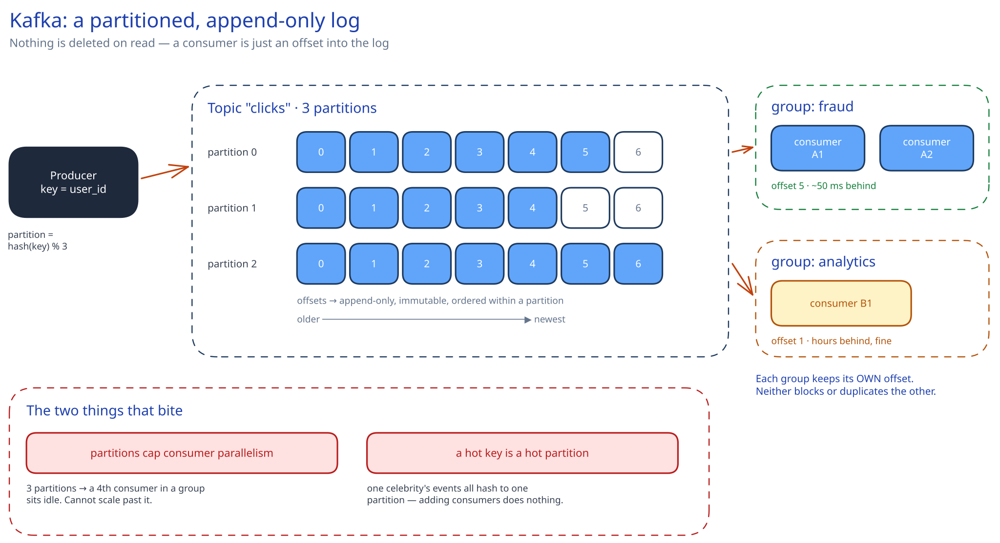

# Kafka & the Distributed Log

## What problem this solves

[Message Queues & Pub/Sub](message-queues-pubsub.md) covers *whether* to decouple producers from consumers. This page is about the specific data structure Kafka uses to do it, because that structure is the reason Kafka behaves differently from every queue you have used before.

A traditional queue **deletes a message once it is consumed** — the queue is a buffer, and reading is destructive. Kafka does not delete on read. A topic partition is an **append-only, immutable, ordered log on disk**, and a consumer is just a cursor holding an integer offset into it. Nothing is removed when read; the consumer moves its pointer. That single design choice produces almost everything else worth knowing about Kafka.

Three consequences fall straight out of it:

- **Replay is free.** Reset the offset to 0 and reprocess last month's events. In a delete-on-read queue that data is gone the instant it was consumed. This is what makes Kafka the backbone of event sourcing, of the batch-recompute path in an [ad click aggregation pipeline](../case-studies/ad-click-aggregation/README.md), and of rebuilding a derived store from scratch after a bug.
- **Many independent readers are free.** Two consumer groups reading the same topic do not compete or duplicate work — each keeps its own offset. Analytics can be 4 hours behind while the fraud checker is 50 ms behind, over the same data, with neither aware of the other.
- **Throughput comes from sequential disk I/O.** Appending to the end of a file and reading forward is the access pattern spinning disks and SSDs are fastest at, and it is why "but it writes to disk" is not the weakness people assume.

## Partitions: the unit of parallelism, ordering, and pain

A topic is split into **partitions**, and this is the single most consequential decision you make:

- **Ordering is per-partition only.** Kafka guarantees strict order *within* a partition and nothing at all across partitions. If order matters for a user, produce with `key = user_id` — the default partitioner hashes the key, so all of that user's events land in one partition and stay ordered relative to each other. Ordering across different users was never promised and you are not giving anything up.
- **Partition count caps consumer parallelism.** Within one consumer group, a partition is assigned to **exactly one** consumer. Ten partitions means at most ten useful consumers; the eleventh sits idle. This is the number people get wrong: you cannot scale consumption past the partition count without repartitioning the topic.
- **Increasing partitions later breaks key locality.** Adding partitions changes `hash(key) % n`, so a user's events start landing in a different partition from their historical ones — and ordering across that boundary is lost. Over-provision partitions modestly up front rather than planning to grow them.
- **A hot key is a hot partition.** All of one celebrity's events go to one partition, which one consumer must handle alone. The fix is a composite key (`user_id:bucket`) that spreads the load and gives up strict per-user ordering — the same trade-off the [leaderboard](../case-studies/real-time-leaderboard/README.md) and [ad click](../case-studies/ad-click-aggregation/README.md) designs make.

## Consumer groups, offsets and rebalancing

A **consumer group** is a set of consumers sharing a `group.id`; Kafka distributes the topic's partitions among them and tracks one committed offset per partition per group (stored in an internal `__consumer_offsets` topic — the offsets are themselves a log).

**When you commit the offset decides your delivery semantics**, and this is the real lever:

- Commit *before* processing → at-most-once. A crash after the commit loses the message.
- Commit *after* processing → at-least-once. A crash after processing but before the commit reprocesses it. **This is what nearly everyone runs**, and it is why the consumer must be idempotent — see [Idempotency Keys](../scalability-resilience/idempotency-keys.md).

**Rebalancing** is the operational sharp edge. When a consumer joins, leaves, or misses its heartbeat, the group reassigns partitions — and in the classic protocol, *every* consumer stops consuming while that happens ("stop-the-world"). A consumer that takes too long between `poll()` calls is presumed dead and gets kicked out, which triggers a rebalance, which slows everyone, which can cascade. Two symptoms worth naming in an interview: a consumer doing slow work per message trips `max.poll.interval.ms` and causes repeated rebalances, and a deploy that restarts ten consumers one by one can trigger ten rebalances unless you use static membership or incremental cooperative rebalancing.

## Durability: replication, ISR, and the acks setting

Each partition has one **leader** and N-1 **followers**; all reads and writes go to the leader, and followers pull to stay caught up. The set of replicas currently caught up is the **in-sync replica set (ISR)**.

`acks` is the durability dial, and it is a genuine latency-versus-safety trade:

- `acks=0` — fire and forget. Fastest, and messages can vanish silently.
- `acks=1` — the leader has written it. If the leader dies before a follower replicates, that message is lost.
- `acks=all` — every in-sync replica has it. Combined with `min.insync.replicas=2`, this is the configuration that actually survives a broker failure without data loss, and the one to state as your default for anything financial.

The subtle failure: `acks=all` with `min.insync.replicas=1` looks safe and is not — if the ISR has shrunk to just the leader, "all replicas" means one replica, and you are back to `acks=1` durability while believing you are protected.

## Retention and compaction: two different jobs

- **Time or size retention** — keep 7 days, or 100 GB per partition, then delete the oldest segments. The log is a *buffer with a horizon*, and that horizon is your replay window: you can only recompute as far back as retention allows.
- **Log compaction** — instead of deleting by age, keep the **most recent value per key** forever and garbage-collect superseded ones. This turns a topic into a durable changelog of current state: replay it from the beginning and you have every key's latest value. This is how Kafka backs stateful stream processors and change-data-capture, and it is a genuinely different tool from time retention, not a tuning knob on it.

## When Kafka is the wrong answer

Saying this unprompted lands well, because Kafka is over-applied:

- **Per-message TTLs, priority queues, or delayed delivery.** A log has no notion of reordering or expiring individual messages. SQS or RabbitMQ do this natively; in Kafka you would build it awkwardly on the side.
- **Low-volume task queues.** A few thousand jobs a day with a handful of workers does not need brokers, ZooKeeper/KRaft, partition planning and rebalancing semantics. The operational floor is real.
- **Request/response.** Kafka is one-directional by design. Correlating a reply through a second topic reinvents RPC badly — use [REST or RPC](../foundations/rest-vs-rpc-vs-graphql.md).

## Interviewer follow-ups

**Does Kafka give you exactly-once?**
Within Kafka's own boundary, yes, and it is worth being precise about where that boundary ends. The **idempotent producer** (`enable.idempotence=true`) assigns each producer a PID and a per-partition sequence number so a broker discards a retried duplicate — that removes duplicates from producer retries. **Transactions** then let you atomically write to multiple partitions and commit consumer offsets in the same transaction, which makes a consume-transform-produce pipeline exactly-once *end to end within Kafka*. What it cannot do is make an external side effect exactly-once: if your consumer charges a credit card and then crashes before committing, Kafka replays the message and the card gets charged twice. For anything outside Kafka you still need an idempotent consumer. Most systems claiming exactly-once are running at-least-once plus idempotency.

**How do you pick the number of partitions?**
Work from three constraints and say which binds. Target throughput divided by per-consumer throughput gives the parallelism floor. The partition count also caps how many consumers in a group can ever be useful, so leave headroom for growth — you cannot raise it later without breaking key locality. Against that, each partition costs open file handles, memory and leader-election work on every broker, and more partitions means longer failover when a broker dies. A common shape is to size for a few times current peak and accept modest waste, precisely because increasing it later is the expensive direction.

**A consumer group is falling hours behind. What do you do?**
First check whether lag is spread evenly or concentrated on one partition, because the fixes are opposite. Even lag across all partitions means the group is genuinely under-provisioned — add consumers up to the partition count, and past that you must repartition. Lag on one partition means a **hot key**, and adding consumers does nothing at all, since one partition is served by exactly one consumer; you need a better key. Also check for repeated rebalances: if processing per message exceeds `max.poll.interval.ms`, consumers keep getting evicted and the group spends its time rebalancing instead of consuming, which looks like slowness but is a configuration bug.

**Why is Kafka fast if it writes everything to disk?**
Because it never seeks. Appending to the end of a segment file and reading forward is sequential I/O, which on SSDs and even spinning disks is orders of magnitude faster than the random access people picture when they hear "disk". On top of that, Kafka writes into the OS **page cache** rather than managing its own, so a consumer reading recent data is usually served from RAM without a disk read at all, and it uses the `sendfile` syscall to copy bytes from page cache straight to the socket without passing through user space (**zero-copy**). Producers and consumers also batch and compress whole record sets, so per-message overhead amortises away.

**How does this compare to just using a database table as a queue?**
A table works surprisingly well at low volume, and saying so shows judgement rather than cargo-culting. It breaks in a specific way: consumers polling `SELECT ... WHERE processed = false ORDER BY id LIMIT n FOR UPDATE SKIP LOCKED` put constant write and lock pressure on the same rows, the table needs vacuuming as it churns, and the polling interval sets your latency floor. Kafka replaces polling with a long-lived fetch, replaces row locks with per-partition ownership, and replaces deletion with an offset. Below a few thousand messages a day the table is genuinely simpler; the crossover is when either lock contention or polling latency starts showing up in your metrics.
