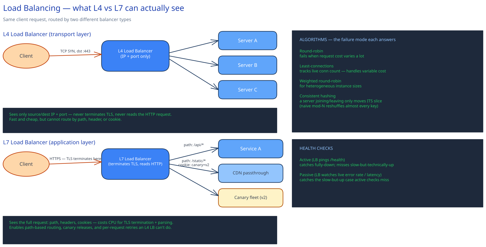

# Load Balancing

## L4 vs L7 — not a preference, a visibility difference

An **L4 (transport-layer) load balancer** looks at the IP packet: source/dest IP and port. It never terminates TLS and never parses HTTP, so it physically cannot route on a path, a header, or a cookie — it doesn't have that information. That's exactly why it's fast and cheap: no CPU spent on a TLS handshake or request parsing, just packet forwarding.

An **L7 (application-layer) load balancer** terminates TLS itself and reads the full HTTP request. That buys real capabilities an L4 LB cannot offer at any price — route `/api/*` to one service and `/static/*` straight to a CDN, send requests carrying a `canary=v2` cookie to a canary fleet, retry an individual request against a different backend on a 5xx — but every one of those capabilities is paid for in CPU, on every request, for TLS termination and parsing.

The choice isn't "which is better" — it's "does anything downstream need to see inside the request." A pure TCP proxy in front of a database replica set has no use for L7; a public API gateway that does canary releases and path-based routing needs it.

## Algorithms, and the failure mode each one is actually answering

Picking an algorithm is answering a specific question about your traffic, not picking a default:

- **Round-robin** — assumes every request costs about the same. Fails visibly the moment it doesn't: one backend doing a slow report-generation request looks identical to the balancer as one serving a cached redirect, so it keeps sending both kinds evenly and the slow-request server backs up.
- **Least-connections** — fixes exactly that, by routing to whichever backend currently has the fewest open connections, which naturally accounts for requests of different cost. The price: the balancer now has to track live connection counts per backend instead of just a pointer.
- **Weighted round-robin** — for a fleet that isn't uniform (some instances are 2x the size), assign weights so the bigger boxes get proportionally more traffic instead of an equal share they can't use.
- **Consistent hashing** — used when you want the *same* client (or key) to keep landing on the *same* backend, for session affinity or cache locality. The reason it beats naive `hash(key) % N`: when a server joins or leaves, naive mod-N reshuffles almost every key to a new server (cache misses everywhere), while consistent hashing only remaps the joining/leaving server's own slice of the ring — everyone else's mapping is untouched.

## Health checks: two different failures, two different detectors

- **Active health checks** — the LB itself polls a `/health` endpoint on a timer. Catches a server that's fully down (process crashed, port closed) quickly and cheaply.
- **Passive health checks** — the LB watches the error rate and latency of *real* traffic it's already sending. Catches the failure mode active checks miss entirely: a server that's still up and answers `/health` in 2ms, but is timing out on 30% of actual requests because a downstream dependency is slow. "Technically alive" and "actually serving traffic correctly" are different questions, and only one of these checks answers the second one.

## Where this sits in a real request path

This project's own [URL Shortener](../../01-hld-fundamentals.md) HLD puts an L7 load balancer directly in front of a fleet of stateless app servers, for the reason covered in [The Client-Server Model](../foundations/client-server-model.md): any server can answer any request, so the balancer is free to spread load however the algorithm decides. At a scale beyond one region, a single load balancer isn't the top of the stack either — **DNS-level / global server load balancing (GSLB)** sits a layer above, routing a client to the nearest *region's* load balancer in the first place, before that region's own L7 LB picks a specific server.

## Interviewer follow-ups

**What happens to in-flight requests when you deploy a new LB config?**
A correctly configured LB does a hot reload or blue-green swap of its routing table without dropping established connections — in-flight requests finish against the old config, new requests get the new one. A naive restart instead drops every open connection mid-request, which is why "reload" and "restart" are different operations on any real load balancer.

**How would you load-balance a stateful WebSocket connection?**
You balance the *initial* HTTP upgrade request like any other request, but once the WebSocket is established, that TCP connection has to stay pinned to the same backend for its entire lifetime — there's no "next request" to reroute, it's one long-lived connection. This is the same sticky-routing problem covered in Long Polling/WebSockets/SSE.

**Why might you run two layers of load balancers instead of one?**
Commonly: an L4 LB (or a cloud provider's network load balancer) at the edge for raw throughput and DDoS absorption, handing off to an L7 LB per-service that does the actual path/header-based routing. Splitting the layers lets the outer one stay dumb and fast while the inner one does the expensive parsing only once traffic is already inside the network.

**Can a load balancer become the bottleneck itself?**
Yes — it's a single logical point all traffic passes through, so it needs its own redundancy (usually an active-passive or active-active pair behind a floating IP) and enough headroom that its own CPU (spent on TLS termination at L7 specifically) doesn't cap throughput below what the backend fleet could otherwise handle.
