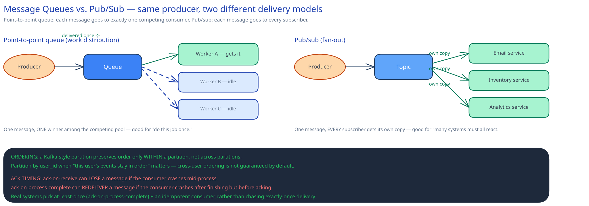
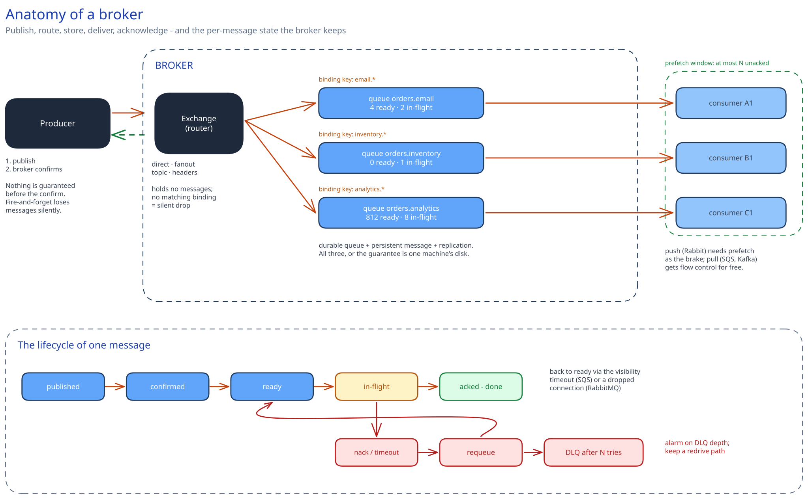

# Message Queues & Pub/Sub

## What problem this actually solves

A queue decouples a producer from a consumer **in time and in failure** — the producer doesn't need the consumer to be up, fast, or even to exist yet. That's the entire reason queues exist, not a vague "it's more scalable." The [URL Shortener](../../01-hld-fundamentals.md) case study is the concrete version: click analytics is queued specifically so a slow or down analytics worker can never block the redirect. Remove the queue and the redirect's latency becomes hostage to the analytics worker's latency — the opposite of what the system is trying to guarantee.

That single sentence hides a lot of machinery. Everything below is that machinery, because "just put a queue in front of it" is where a mid-level answer stops and a senior answer starts.

## Anatomy of a broker

A **broker** is a server process that accepts messages, decides where they belong, stores them durably, hands them to consumers, and tracks which ones are still outstanding. Four moving parts, and every broker has all four even when it names them differently.

**1. The ingress and the confirm.** The producer opens a long-lived TCP connection (usually multiplexed into logical **channels**, so one socket carries many concurrent publishers) and sends a message. The broker replies with an **acknowledgement to the producer** — RabbitMQ calls this a *publisher confirm*, Kafka calls it the produce response, SQS returns a `MessageId`. Until that reply arrives, the producer must assume nothing. Fire-and-forget publishing — not waiting for the confirm — is the single most common way people lose messages while believing the broker guarantees delivery. The broker's guarantee starts at the confirm, not at the `send()` call.

**2. The router.** This is the part most people skip, and it's the part interviewers use to tell whether you've actually operated a broker.

- **RabbitMQ** never lets a producer write to a queue. It publishes to an **exchange** with a **routing key**, and **bindings** decide which queues receive a copy. Four exchange types: `direct` (routing key must match the binding key exactly), `fanout` (ignores the key, copies to every bound queue), `topic` (dotted patterns with `*` for one word and `#` for zero or more — `order.*.created` or `payments.#`), and `headers` (match on a header map instead of a string key). The exchange is a *routing function*, and it holds no messages: an exchange with no matching binding silently drops the message unless you publish `mandatory` or configure an alternate exchange. That silent drop is a genuine production trap.
- **SNS** does the same job with **subscription filter policies** — a JSON predicate over message attributes, evaluated broker-side, so a subscriber only pays for what it wants.
- **Kafka** has no server-side router at all. The *producer client* computes `partition = hash(key) % numPartitions` and writes straight to that partition's leader. Routing is a client concern, which is why Kafka has no equivalent of a topic exchange and why consumers filter in application code.

**3. The queue itself and its storage.** A queue is an ordered structure with a head and a tail, backed by memory with spill-to-disk, or by a log on disk. Two flags matter and they are independent: the **queue** must be declared durable (it survives a broker restart as a definition) *and* the **message** must be marked persistent (its body is written to disk). Durable queue + transient message = the queue comes back empty. Persistent message + non-durable queue = the queue itself is gone, so the message is too. You need both, and even then "written to disk" usually means "handed to the OS", not `fsync`'d — brokers batch fsyncs on an interval for throughput, so a hard power loss inside that window loses confirmed messages unless you've turned the knob down or you're relying on replication instead.

**4. Per-message delivery state.** This is what distinguishes a broker from a log. For every message the broker tracks whether it is *ready*, *in flight* (delivered but unacknowledged), or *done*. RabbitMQ keeps an unacked set per channel; SQS makes the message invisible for the **visibility timeout**; Redis Streams keeps a **Pending Entries List** per consumer group. That state is what makes redelivery-on-crash possible, and it is also why a classic broker's memory grows with the number of *in-flight* messages, not just the backlog.

**Push or pull** is the last structural choice. RabbitMQ **pushes**: the broker sends messages to a registered consumer as fast as the consumer's **prefetch** window allows (`basic.qos(prefetch_count=N)` = at most N unacked messages outstanding). SQS and Kafka **pull**: the consumer asks for a batch (`ReceiveMessage`, up to 10 messages; Kafka `poll()` up to `max.poll.records`). Pull gives the consumer natural flow control — it never receives more than it asked for. Push is lower-latency but needs prefetch as an explicit brake, and `prefetch=0` (unlimited) with a slow consumer is a reliable way to run a worker out of memory while the other nine workers sit idle.

## Point-to-point vs. pub/sub, precisely

These solve different problems, and picking the wrong one breaks things in a specific way, not just "suboptimally":

- **Point-to-point queue** (SQS, a RabbitMQ queue with several consumers) — each message goes to **exactly one** consumer among a competing pool. This is the **competing consumers** pattern, and it's for work distribution: "do this job once." Use pub/sub here by mistake and every worker redundantly processes every job.
- **Pub/sub** (SNS, a fanout exchange, a Kafka topic with several consumer groups) — each message goes to **every** subscriber independently. This is for fan-out: an `order.placed` event triggering email, inventory and analytics as three unrelated systems. Use a plain shared queue here by mistake and only one of those three ever sees any given event — the other two silently never fire, and nothing errors.

The two compose, and production systems almost always use the composition rather than either one alone: **one topic, fanned out to one queue per consuming system, with competing consumers inside each queue.** SNS→SQS is literally this. Kafka expresses the same shape with one topic, one consumer group per system, and multiple consumers inside each group. Say this composition out loud in an interview — it's the difference between knowing two definitions and knowing the pattern.

## Scaling consumption: competing consumers vs. partitioning

This is the fork in the road that decides your ordering guarantees, your maximum parallelism, and your failure behaviour. It's worth being precise because the two look identical on a whiteboard.

**Competing consumers on one queue.** N consumers all pull from the same queue; whoever asks next gets the next message. Load balances perfectly — a slow consumer simply pulls less — and N is unbounded. The cost is that **ordering is gone entirely**: two messages for the same entity can be processed concurrently by different workers, and a redelivered message can land *after* a message that was published later. If your handler is `SET balance = 100` you are fine; if it's `balance = balance - 10` applied out of order against a stale read, you are not.

**Partitioned consumption.** The key space is split into P partitions; each partition is assigned to exactly one consumer in the group. Order is preserved **within a partition**, which by construction means within a key. The costs are real and are what interviewers probe:

- **Parallelism is capped at P.** The (P+1)th consumer sits idle. You cannot scale past the partition count without repartitioning.
- **A hot key is a hot partition.** One celebrity, one merchant, one tenant sends 40% of traffic and it all lands on one consumer. Adding consumers does nothing at all. The fix is a composite key (`user_id:bucket`) which spreads load and gives up strict per-key ordering — see [Kafka & the Distributed Log](kafka-distributed-log.md) and the [real-time leaderboard](../case-studies/real-time-leaderboard/00-overview.md).
- **Rebalancing is a stop-the-world event** in most implementations. A consumer joining, leaving, or missing a heartbeat triggers reassignment, and a deploy that restarts ten consumers one at a time can trigger ten rebalances.

Every broker gives you some version of this. Kafka calls them partitions. **SQS FIFO** calls it `MessageGroupId` — messages with the same group id are strictly ordered and delivered one at a time, and different group ids proceed in parallel, so the group id *is* your partition key. RabbitMQ has no native concept, so you either run a **consistent-hash exchange** that routes by key across N queues, or you shard by declaring `orders.0 … orders.N` yourself.

The senior framing: **you buy ordering with parallelism, and the exchange rate is the partition count.** If nothing in your workload needs ordering, don't pay — use competing consumers and idempotent handlers.

## The lifecycle of one message

Interviewers love this because it exposes exactly which failure modes you've thought about. A message moves through:

`published → confirmed → routed → ready → in-flight → (acked | nacked | timed out) → done | requeued | dead-lettered`

The interesting transitions:

**Ready → in-flight.** The broker hands the message out and starts a clock. In SQS that clock is the **visibility timeout** (default 30s, max 12h): the message is hidden from other consumers, and if the consumer hasn't deleted it by then, it becomes visible again and someone else picks it up. In RabbitMQ there is no timer at all — the message stays unacked until the consumer acks, nacks, or **the connection drops**, at which point it's requeued. The practical consequence: an SQS consumer whose job takes longer than the visibility timeout will have its work silently duplicated while it's still running, so long jobs must call `ChangeMessageVisibility` to extend the lease (a **heartbeat**), or set the timeout above the p99 job duration with headroom.

**In-flight → nacked.** Rejecting is not one thing. `nack(requeue=true)` puts the message back — and if it fails deterministically, it will be redelivered immediately, forever, at full CPU. `nack(requeue=false)` sends it to the dead-letter destination. Choosing `requeue=true` for a poison message is how a single malformed payload turns into a broker-saturating hot loop.

**Redelivery counting → DLQ.** A **poison message** is one that fails every time — a schema it can't parse, a foreign key that will never exist. Without a cap, it is redelivered forever and, on an ordered partition, it blocks every message behind it (**head-of-line blocking**), which turns one bad record into a total outage for that key range. So: count deliveries (SQS `maxReceiveCount` in the redrive policy, RabbitMQ's `x-death` header or a delivery-count on quorum queues) and after N attempts route to a **dead-letter queue**. A DLQ is not a graveyard — it needs an alarm on depth, a way to inspect payloads, and a **redrive** path to replay messages back to the main queue after you've shipped the fix.

**Retry timing.** Immediate retry is right for a transient blip and wrong for a dependency that's down — N consumers retrying in a tight loop is a self-inflicted DDoS on a service that is already struggling. Retry with **exponential backoff and jitter**, and pair it with a [circuit breaker](../scalability-resilience/circuit-breakers-retries.md). Brokers without native delayed delivery implement backoff with a **retry queue**: publish to a queue with a per-message TTL and no consumer, whose dead-letter exchange points back at the main queue — the message "expires" into the work queue after the delay. SQS has `DelaySeconds` (up to 15 minutes) natively.

## Durability: what "the broker won't lose it" actually requires

Three separate things must hold, and a system usually has exactly one of them wrong:

1. **The producer waited for the confirm** and retried on failure. A retry after a lost confirm creates a duplicate — which is fine, because you're idempotent, but you must not treat a timeout as "it didn't happen."
2. **The message is on more than one machine before the confirm returns.** A single-node broker with a persistent message is one disk failure from data loss. RabbitMQ **quorum queues** replicate via Raft and only confirm once a majority has it. Kafka does this with `acks=all` plus `min.insync.replicas=2`. SQS replicates across three availability zones before returning a `MessageId`. If the confirm returns before replication, your durability is one machine's disk.
3. **The write to the database and the publish to the broker are not two independent writes.** This is the **dual-write problem**: commit the order, then publish `order.placed`, and a crash in between leaves an order that no downstream system knows about. No broker feature fixes this, because the failure is outside the broker. The fix is the **transactional outbox** — write the event into an `outbox` table in the *same database transaction* as the business row, then a relay process (or change-data-capture on the DB log) reads that table and publishes. The database transaction is the atomic unit; the publish becomes a retryable side effect. See [Synchronous vs Asynchronous Communication](../foundations/sync-vs-async-communication.md).

## Delivery guarantees, and where duplicates actually come from

- **At-most-once** — the message might be dropped, never duplicated. Ack before processing. Fine for a metrics heartbeat, wrong for anything you'd notice missing.
- **At-least-once** — never silently dropped, might arrive twice. Ack after processing. **This is what essentially every real system runs.**
- **Exactly-once** — extremely hard end-to-end, because it requires the consumer's *side effect* (charging a card, writing a row, calling a third party) and the ack to commit atomically, and those live in different systems.

There are three independent duplicate sources, and naming them is a strong signal: the **producer** retried after a lost confirm; the **broker** redelivered because an ack was lost or a visibility timeout expired; the **consumer** was redelivered mid-processing after a rebalance or crash. Notice that only the second is under the broker's control — which is why brokers can't sell you exactly-once for the whole path.

So the practical answer is always the same: **at-least-once delivery plus an idempotent consumer**, which makes duplicates harmless rather than trying to prevent them. Implement it with a natural idempotency key from the message (`payment_id`, `event_id`) and a uniqueness constraint or a dedupe table on the consumer side — see [Idempotency Keys](../scalability-resilience/idempotency-keys.md). SQS FIFO offers a bounded version of this for free: a `MessageDeduplicationId` suppresses duplicate *publishes* within a 5-minute window, which handles producer retries but not consumer redelivery.

## Backpressure, queue depth, and the numbers to quote

Consumers falling behind is the normal steady state of a queue-based system, not an anomaly, and the fix is arithmetic.

**Little's Law** — `L = λ × W` — is the whole model. With arrival rate λ = 500 msg/s and per-message processing time W = 40 ms, one consumer sustains 25 msg/s, so you need `500 / 25 = 20` consumers just to break even, and more for headroom and for the p99 rather than the mean. Being able to do this out loud, and then say "and if the handler makes two 20 ms network calls, parallelising them halves W and I need 10 consumers instead of 20," is what a capacity answer looks like.

**Alert on the age of the oldest message, not on depth.** Depth is scale-dependent and meaningless on its own — 100,000 messages is a catastrophe at 10 msg/s and a rounding error at 50,000 msg/s. Age (SQS's `ApproximateAgeOfOldestMessage`, Kafka's consumer lag converted to time) directly answers "how stale is the worst thing in here", which is what the SLO is actually about. Watch the *derivative* too: a queue growing steadily means λ exceeds throughput and no amount of waiting will fix it.

**Do not push backpressure onto the producer by default.** Blocking the producer converts a background-processing problem into a front-door outage — the exact coupling the queue existed to prevent. Brokers will do it to you at the limit, though, and you should know it: RabbitMQ raises a **memory or disk alarm** and blocks publishing connections outright; it also uses **credit-based flow control** to slow fast publishers. That's a last-resort safety valve, not a design. The intended responses, in order, are: add consumers, make the handler cheaper, shed low-priority work, and only then slow the producer.

## Choosing a broker

| | RabbitMQ | SQS + SNS | Kafka | Redis Streams |
|---|---|---|---|---|
| **Model** | routed queues (exchanges, bindings) | managed queue + fanout topic | partitioned durable log | in-memory log with groups |
| **Routing** | rich: direct/fanout/topic/headers | SNS filter policies | none — client-side partitioner | none |
| **Ordering** | per queue, lost with competing consumers | none (standard) / per `MessageGroupId` (FIFO) | per partition | per stream |
| **Replay** | no — consumed is gone | no | yes, offsets within retention | yes, within `MAXLEN` |
| **Per-message TTL / priority / delay** | yes, all three | delay yes, priority no | no | no |
| **Throughput** | tens of thousands/s | very high, elastic | millions/s | very high, RAM-bound |
| **Max message** | large but impractical | 256 KB (S3 claim-check beyond) | 1 MB default | RAM-bound |
| **Ops cost** | you run it, and clustering is subtle | near zero | highest: brokers, partitions, rebalances | you already run Redis |

The one-line decision rules: **need routing rules, per-message TTLs, priorities or delays → RabbitMQ.** **Need a replayable history and many independent readers → Kafka.** **Want none of the operational surface and your workload is work distribution → SQS+SNS.** **Already run Redis, volumes are modest, and losing the tail on a failover is survivable → Redis Streams.** Naming what each one *can't* do is more convincing than naming what it can.

## Anti-patterns worth naming unprompted

- **The queue as a database.** Querying, filtering, or "just leaving it in the queue until we need it" — brokers have no index. If you need to look things up, that's a database with a queue beside it.
- **RPC over a queue without a timeout.** Request/reply via a correlation id and a reply queue is legitimate, but without a client-side timeout and a bounded reply queue you've built a synchronous call with none of the failure handling and none of the observability.
- **Fat payloads.** Putting a 5 MB PDF in the message destroys broker throughput and hits hard size limits. Use the **claim-check** pattern: write the blob to [object storage](../scalability-resilience/object-blob-storage.md), put the key in the message.
- **A queue to hide a slow query.** Making a slow operation asynchronous doesn't make it faster; it makes the slowness invisible until the backlog is hours deep. Fix the operation, then decide whether it should also be async.
- **Unbounded retries with no DLQ.** Covered above, and it is the single most common cause of "the queue is at 4 million and climbing."

## Interviewer follow-ups

**Walk me through exactly what happens when a consumer crashes halfway through processing a message.**
The message was in flight — delivered but unacknowledged — so the broker still owns it. In SQS its visibility timeout expires and it becomes visible again for another consumer; in RabbitMQ the TCP connection drop is detected and the unacked message is requeued immediately; in Kafka the group rebalances and the partition's messages are re-read from the last committed offset. In all three the message is redelivered, which is the correct behaviour and also means **the side effects of the half-finished work already happened**. If the handler had written two rows and sent an email before dying, the retry will send a second email unless the handler is idempotent. So the real answer has two halves: the broker guarantees you won't lose the message, and *you* guarantee that reprocessing it is safe — usually with a dedupe key on the message id, checked and inserted in the same transaction as the work.

**What happens to a message that keeps failing?**
Without a cap it becomes a poison message and is redelivered forever, and on an ordered partition it blocks everything behind it — one malformed record becomes an outage for that whole key range. Cap the delivery count and route past the cap to a dead-letter queue, with backoff between attempts so a genuinely transient failure gets a chance to recover without hammering the dependency. Then treat the DLQ as an operational surface, not a bin: alarm on its depth, keep enough context on the message to diagnose it, and have a redrive path to replay it once the bug is fixed. The failure I'd call out explicitly is `nack(requeue=true)` on a deterministic failure — it's a tight infinite loop that will saturate the broker.

**Your consumers are falling behind a fast producer. What do you do, in order?**
First find out whether it's a throughput problem or a distribution problem, because the fixes are opposite. If lag is even across all partitions, the group is genuinely under-provisioned: apply Little's Law, add consumers up to the partition count, and past that repartition. If lag is concentrated on one partition it's a hot key, and adding consumers does literally nothing — one partition is served by one consumer, so you need a better key. Then check whether it's actually a rebalance loop: if per-message processing exceeds the poll interval, consumers get evicted and the group spends its time rebalancing rather than consuming, which looks like slowness but is a config bug. Only after that would I make the handler cheaper (batch the DB writes, parallelise independent calls) or shed low-priority message types. Blocking the producer is last, because it converts a background outage into a customer-facing one.

**Why might you choose Kafka over SQS for one system and the reverse for another?**
Kafka keeps a durable, replayable log and supports many independent consumer groups reading the same stream at their own pace, so it's right when several systems need their own view of the same event history — analytics replaying last week while the fraud checker stays 50 ms behind. That capability costs you: partition planning, rebalancing semantics, brokers to operate, and no per-message TTL, priority or delay. SQS is a work-distribution queue with essentially no operational surface, unbounded consumer parallelism and native delayed delivery, and it's the right answer when nothing needs replay or fan-out to independent readers. The tell that someone has only read about Kafka is proposing it for a few thousand jobs a day with four workers.

**How do you guarantee an event is published if and only if the database write commits?**
You can't, with two independent writes — that's the dual-write problem, and it fails in both directions: commit-then-crash loses the event, publish-then-rollback invents one. The fix is to make the event part of the transaction. Write it into an `outbox` table in the same transaction as the business row, then have a relay poll that table (or tail the database's replication log with change data capture) and publish, marking rows sent afterwards. If the relay crashes after publishing but before marking, you publish twice — at-least-once again, handled by the consumer's idempotency. The property you've bought is that the event exists if and only if the row does, which is the guarantee people incorrectly assume the broker provides.

**Does the producer need to know how many consumers exist?**
No, and that's the actual point. The producer publishes to a queue or topic and is done; consumer count, consumer health and consumer scaling are entirely decoupled from it. The one place this leaks is pub/sub with a slow subscriber: if one subscriber's queue backs up unboundedly it can exhaust broker memory or disk and take down publishing for everyone, so per-queue limits and DLQs are what keep the decoupling honest. It's the same argument as stateless servers behind a load balancer in [The Client-Server Model](../foundations/client-server-model.md), applied across time instead of across machines.

**When would you deliberately not use a queue?**
When the caller needs the answer to continue — a queue can't return a result, and bolting a reply channel onto it reinvents RPC with worse tooling. When the work is trivially fast and the failure is best surfaced immediately to a user who can retry: a 5 ms local write does not need a broker, and making it async trades a visible error for a silent one. And when the operational floor outweighs the benefit — a few hundred jobs a day is a database table with `SELECT … FOR UPDATE SKIP LOCKED`, which is simpler, transactional with your data, and easier to debug. The crossover comes when polling latency or lock contention starts showing up in your metrics.
