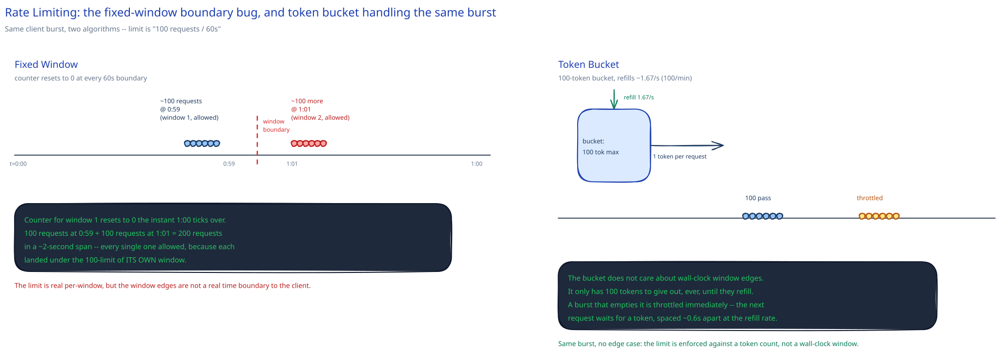

# Rate Limiting

## What problem this solves

Protecting a system from a client — malicious or just buggy — sending more requests than it can handle, and giving many clients sharing one resource a fair slice of it instead of first-come-first-served. This page covers the algorithm and placement decisions. The [LLD Worked Example: Rate Limiter](../low-level-design/lld-rate-limiter.md) covers the class-level implementation of the same problem.

## The algorithms, each answering a specific failure mode

- **Fixed window** — a counter per time window (e.g. per 60s), reset to 0 at each boundary. Simple, but has a real edge-case bug, not just a theoretical one: a limit of "100/minute" lets **200 requests through in a ~2-second span** if 100 land at 0:59 (counted against window 1) and 100 more land at 1:01 (counted against window 2) — each request is legitimately under its own window's limit, but the client experienced no throttling at all across the boundary.
- **Sliding window log** — store a timestamp per request, count how many fall in the trailing N seconds. Exact — no boundary bug — but memory cost is proportional to request count per client, which is expensive at high volume.
- **Sliding window counter** — approximates the sliding window cheaply: keep the current and previous window's counts, weight the previous window's contribution by how much of it still overlaps the trailing N-second lookback. Cheap like fixed window, without the hard edge case.
- **Token bucket** — a bucket holds up to N tokens, refills at a steady rate, and each request consumes one token. This is usually the practical default: it tolerates real client burstiness (a client can spend its whole bucket at once) without the fixed-window boundary bug, because the limit is enforced against a token count, not a wall-clock window edge.
- **Leaky bucket** — the mirror image of token bucket: requests queue up and are processed out at a fixed steady rate regardless of how bursty the input is. Reach for this specifically when the *downstream* genuinely cannot handle bursts at all (e.g. a fixed-throughput hardware resource) — token bucket controls what's let in, leaky bucket controls what comes out.

## Where in the request path the limit gets enforced

- **At the client** — cooperative only; a malicious or just poorly-written client can ignore it entirely.
- **At the [gateway](api-gateway.md)/edge** — before a request ever reaches a backend that would've done real work for it. Protects backends from *external* abuse.
- **Per-service, internally** — protects one internal service from another one calling it too fast. A gateway-only limit doesn't help here — the traffic never touches the gateway.

Real systems commonly need both: edge limiting for external clients, and internal per-service limiting so one misbehaving internal caller can't take down a service its teammates also depend on.

## The distributed rate limiter problem

A limit enforced with a counter living in one app server's process memory silently breaks the moment you have more than one server. With N app servers behind a [load balancer](load-balancing.md), each server only sees its own slice of a client's traffic — a client hitting different servers on different requests can blow past the intended limit by roughly a factor of N, and no single server ever sees enough traffic to know it.

The fix is a shared, fast counter every server instance checks against — typically Redis, either a plain `INCR` with a TTL (fixed/sliding window) or a Lua-scripted token bucket (atomic check-and-decrement in one round trip). The trade-off this introduces: that shared store is now a dependency every rate-limited request pays a network round trip to, and its own availability and latency now bound your rate limiter's.

## Interviewer follow-ups

**What HTTP status code and headers should a rate-limited response return, and why do those headers matter?**
`429 Too Many Requests`, with `Retry-After` (or `X-RateLimit-Remaining` / `X-RateLimit-Reset`) telling the client exactly when to try again. Without those headers a well-behaved client can only guess, and ends up either hammering you immediately (making it worse) or backing off far more than necessary.

**How would you rate-limit per-user vs. per-IP, and what breaks with IP-based limits behind NAT or a corporate proxy?**
Per-user (keyed on an authenticated identity) is more precise but only works post-authentication. Per-IP is the only option pre-auth, but many real users can share one IP behind NAT or a corporate egress [forward proxy](forward-reverse-proxies.md) — an IP-based limit then throttles all of them as if they were one client.

**Would you rather under-limit or over-limit when your shared counter store is temporarily unreachable, and why?**
It depends on what the limit is protecting: for abuse/cost protection, fail closed (reject) so a Redis outage doesn't become a free-for-all against your backends. For a limit that exists purely for fairness between trusted internal callers, failing open (allow) is often the safer default, since the backend being protected can usually take an unthrottled burst better than every internal caller can take a hard outage.

**Why is token bucket usually preferred over fixed window in practice, given both are O(1) to check?**
Because the fixed-window boundary bug is a real, easily-triggered correctness gap (a client doesn't need to be malicious, just unlucky in timing), while token bucket's burst tolerance is usually a *feature* — it matches how real clients actually behave (bursty, not perfectly smooth) without ever letting through more than the bucket size at once.
