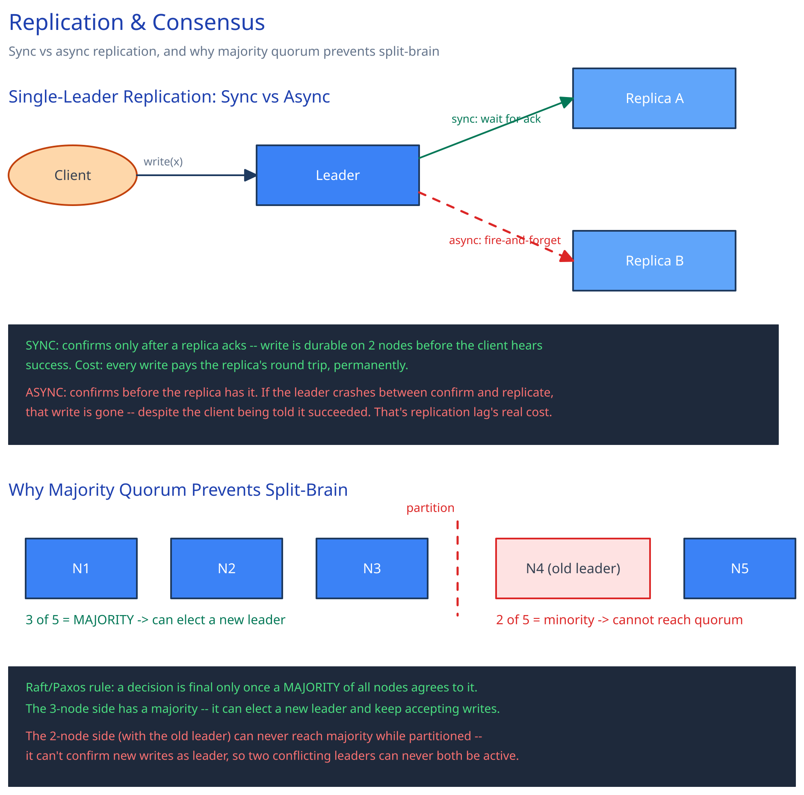

# Replication & Consensus

## Why replicate at all

A single database node has a ceiling on read throughput (only so many concurrent readers one machine can serve) and a durability problem (its disk dying loses the data). Replication answers both: copy the same data onto several nodes, and spread reads across the copies. [Data Partitioning & Sharding](data-partitioning-sharding.md) already draws this line for this guide — replication is the read-throughput-and-durability answer; sharding is the write-throughput-and-storage answer. They compose; neither substitutes for the other.

## Single-leader replication

All writes go to one leader; replicas apply the same write stream the leader produces. This gives a simple, unambiguous consistency story (there's exactly one node that's ever behind, never two disagreeing on what happened first) — but the leader is a write bottleneck, and it's the node a failover has to replace when it dies.

The sync-vs-async choice is where the real cost shows up:

- **Synchronous replication** — the leader waits for at least one replica to acknowledge the write before confirming it to the client. Durable: a write the client was told succeeded genuinely exists on more than one node. The cost is permanent and per-write: every write's latency now includes a round trip to that replica, and a slow replica slows every write, not just the ones that happen to hit it.
- **Asynchronous replication** — the leader confirms the write to the client immediately and ships it to replicas afterward. Fast writes. The cost is not "slightly stale reads" — it's data loss: if the leader crashes after confirming a write but before any replica received it, that write is gone, permanently, despite the client having been told it succeeded. Replication lag is the size of that loss window, not just a staleness inconvenience.

## Multi-leader and leaderless, briefly

- **Multi-leader** — more than one node accepts writes (typically one per region), and each replicates its writes to the others. This buys write availability during a regional partition (each side keeps accepting writes), at the cost of write conflicts: two regions can both accept a write to the same record before either has heard from the other. This is the same AP-leaning trade this guide's [Latency, Throughput & the CAP Theorem](../foundations/latency-throughput-cap.md) page walks through with a concrete `x=5` vs `x=9` conflict — multi-leader replication is that scenario, running continuously rather than only during an outage.
- **Leaderless (quorum-based)** — no node is distinguished as the leader; a write succeeds once `W` replicas acknowledge it, and a read is trusted once `R` replicas agree. Choosing `W + R > N` (total replicas) guarantees every read overlaps with every prior write on at least one replica. This trades a single source of truth for a tunable point between consistency and availability, chosen per-operation rather than fixed for the whole system.

## Consensus is a different problem than replication

Replication copies data. Consensus is how a set of nodes agrees on **one** decision despite failures and message delays — the canonical instance being "who is the leader right now" after the old one goes silent.

Here's the concrete failure a naive scheme produces: the old leader is still alive, but a network partition has cut it off from most replicas. If the replicas' rule is simply "promote a new leader after N seconds of silence," the reachable majority elects a new leader — while the old leader, still receiving writes from whichever clients can still reach it, keeps acting as leader too. Now there are two leaders, each accepting writes, each unaware of the other — split brain, and the two histories will conflict the moment the partition heals.

Real consensus protocols (Raft, Paxos) prevent this with one rule: a decision (like "X is the new leader") only becomes final once a **majority** of all nodes has agreed to it. This is exactly why the number has to be a majority and not some other fixed count — a majority of the nodes can never exist on both sides of a partition simultaneously. The old leader, cut off from more than half the cluster, cannot get majority agreement for anything; only the side with the majority can elect a new leader. Two simultaneous leaders becomes structurally impossible, not just unlikely.

## Interviewer follow-ups

**Why does a consensus quorum need to be a majority rather than any fixed number?**
Because a majority is the only threshold that can't exist on two sides of a partition at once. If 3 out of 5 nodes counted as quorum but you allowed, say, 2 to also act independently, both sides of a partition could reach "quorum" simultaneously — the entire guarantee depends on any two quorums necessarily overlapping in at least one node.

**What happens to writes during a leader election window?**
They're rejected or blocked — there is deliberately no leader to accept them until the election concludes with a majority. This is a real availability cost (a CP choice, in this guide's CAP terms) traded for the guarantee that no write is accepted by two conflicting leaders.

**Would you use synchronous replication for a payments ledger? Why, and what's the cost?**
Yes — losing a confirmed payment write because an async replica hadn't caught up yet is a correctness failure a ledger can't tolerate, so the latency cost of waiting for a replica ack on every write is the accepted price. A "like count" page in this same guide makes the opposite call for the opposite reason: losing a few increments is invisible, so it takes async replication's speed instead.

**Does adding more replicas always improve durability?**
Only up to what your replication mode actually uses — async replication with 5 replicas still loses unacknowledged writes on leader crash exactly like async with 1, because durability came from acknowledgment, not replica count. More replicas mainly buys read capacity and tolerance for losing more nodes at once, not a stronger write-durability guarantee by itself.
