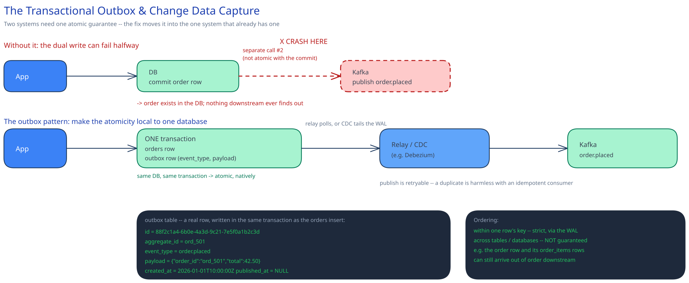

# The Transactional Outbox & Change Data Capture



## The dual-write problem, concretely

A service that must both commit a database write and publish an event about it — "insert the order row" *and* "tell Kafka `order.placed` happened" — cannot do both atomically by calling two separate systems. Walk the failure through: the DB commit succeeds, then the process crashes (or the network to Kafka blips, or the broker is momentarily unreachable) before the publish call completes. The order exists. Nothing downstream — email, inventory, analytics, [the payments case study's ledger](../case-studies/payments-system/00-overview.md) — ever finds out. Flip the order of operations and you get the opposite bug: publish first, and a crash before the DB commit means downstream systems react to an order that was never actually created.

This is the same shape of problem as [distributed transactions and sagas](distributed-transactions-saga.md) — two systems, one atomicity guarantee needed — but it's the version that shows up on nearly every service that touches a message broker at all, not just multi-step business workflows, which is why it earns its own page.

## The outbox pattern: make the atomicity local to one database

Instead of writing to the DB and separately calling Kafka, write the event into an `outbox` **table**, in the *same database transaction* as the business row:

```sql
BEGIN;
  INSERT INTO orders (id, user_id, total) VALUES ('ord_501', 'u_9', 42.50);
  INSERT INTO outbox (id, aggregate_id, event_type, payload, created_at)
    VALUES (gen_uuid(), 'ord_501', 'order.placed',
            '{"order_id":"ord_501","total":42.50}', now());
COMMIT;
```

Both inserts commit or roll back together, because they're one transaction in one database — the exact guarantee [ACID](../database-design/acid-vs-base.md) already gives you natively, for free, with no new infrastructure. A separate **relay** process then reads new outbox rows and publishes them to Kafka, marking each one sent (or deleting it) once the broker confirms.

Why this actually closes the gap: the *hard* atomicity requirement — order row and event, all-or-nothing — never leaves one database. What's left over is "read a row, publish it, mark it published," and that step can fail and retry freely, because publishing the same event twice is a minor, already-solved problem — an [idempotent consumer](../scalability-resilience/idempotency-keys.md) just ignores the duplicate — while publishing zero times is silent, permanent data loss. The pattern doesn't eliminate the at-least-once retry; it moves the retry to the one place where duplication is cheap instead of the one place where it's catastrophic.

A naive relay polls: `SELECT * FROM outbox WHERE published_at IS NULL ORDER BY id LIMIT 100 FOR UPDATE SKIP LOCKED`, publish each row, mark it published. This works, and at low volume it's genuinely the right amount of engineering — but it adds continuous read (and lock) load to the primary, and the polling interval sets a latency floor on how fast an event reaches Kafka.

## CDC as the relay done at the log level

Change Data Capture skips polling entirely: a CDC connector — **Debezium** is the real one to name — attaches to the database as a replica and tails its **replication log directly**: the MySQL binlog, or a Postgres logical replication slot. This is the exact same log the database already uses internally for [replication and failover](../database-design/db-replication-failover.md); CDC just gives you a second reader on it. Every committed row change becomes a structured event automatically, with no polling query and no risk of missing a write, because the connector is reading the database's own durable commit record, not trusting the app to remember an extra insert.

Debezium ships a feature built specifically for this combination — the **outbox event router** single-message-transform. It tails the `outbox` table's log entries like any other table, but unwraps them on the way out: it takes `aggregate_id` as the Kafka message *key* (so all events for one order land in [the same partition, ordered](../database-design/database-indexing.md)) and `payload` as the message *value*, discarding the outbox row's own bookkeeping columns. That gets you the outbox pattern's atomicity guarantee *and* CDC's no-polling, can't-miss-a-write relay, in one connector, instead of choosing between them.

The one operational trap worth naming unprompted: a replication slot (Postgres) or binlog retention window (MySQL) that the connector is meant to be reading is *held open* by the database until something consumes it. If the Debezium connector goes down or falls badly behind, the database keeps the log around waiting for it — and on Postgres specifically, an abandoned logical replication slot will grow the primary's WAL disk usage without bound until someone notices and drops the slot. Monitoring connector lag is not optional.

## Ordering: what you get for free, and what you don't

Within one row's key, the write-ahead log is strictly ordered, so CDC preserves that order downstream — two updates to the same order arrive in the order they committed, the same guarantee [Kafka's own per-partition ordering](kafka-distributed-log.md) gives once they're keyed by `aggregate_id`. What you do **not** get for free is ordering *across* tables or across databases: the `orders` row and its `order_items` rows are different tables, captured independently, and a consumer that genuinely needs "the order before its line items" still has to handle out-of-order arrival — buffer and reorder, or design the consumer so order doesn't matter (upserting rather than assuming a create always precedes an update).

## Interviewer follow-ups

**What happens if the CDC connector falls behind or the outbox table just grows forever?**
A polling relay's outbox table needs its published rows actually deleted (or moved to an archive table) or it grows unbounded and the poll query slows down as it scans past millions of already-sent rows. A CDC-based relay doesn't need deletion for correctness — Debezium reads the log, not the table's current contents — but the table itself still grows unless something prunes published rows on a schedule, and a badly-lagging connector is the other failure: on Postgres it holds WAL on the primary; on MySQL it holds binlog segments the server would otherwise have rotated away. Either way, connector lag is a metric you alert on, not just performance trivia.

**How would a downstream consumer detect and safely handle a duplicate event from an at-least-once outbox relay?**
The event should already carry a stable identifier — the outbox row's own `id`, or the domain event id — and the consumer checks it against a dedupe table or a unique constraint in the same transaction as the side effect it's about to apply, exactly the [idempotency key](../scalability-resilience/idempotency-keys.md) pattern. Without that check, "publish is retryable" just relocates the double-processing bug one hop downstream instead of removing it.

**Would you reach for the outbox pattern or full CDC for a small service with low write volume?**
The plain outbox-plus-polling-relay, and say so out loud — it's less infrastructure (no Debezium, no Kafka Connect cluster, no replication-slot monitoring) for a service publishing a few events a minute, and the polling latency floor of a second or two is irrelevant at that volume. CDC earns its operational cost once polling load or latency actually shows up in metrics, or once several services want the same "never miss a committed write" guarantee and stand up one shared Debezium deployment rather than each rolling its own relay.

**Why not just publish to Kafka first and write to the DB second, to avoid the whole problem?**
That only relocates the failure to the other order: a crash after the publish but before the DB commit means every downstream system now believes an order exists that the source of truth never actually created — arguably worse, since it invents state rather than merely failing to propagate it. There's no ordering of two independent calls that makes them atomic; only collapsing them into one system's transaction does.
