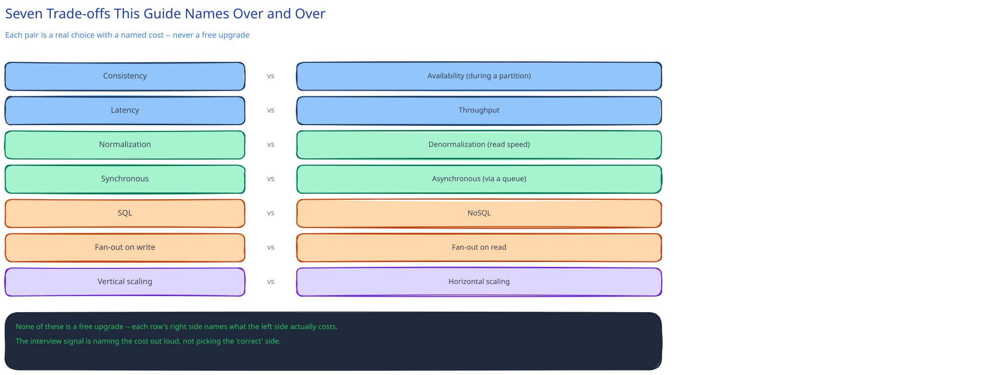

# Common Trade-offs & Pitfalls

Every module in this guide states its decisions as "why X, not Y" — [How to Approach a System Design Interview](how-to-approach-a-system-design-interview.md) explains why that phrasing specifically is what's being scored. This page collects the trade-offs that recur across nearly every system, so they're recognizable fast instead of re-derived from scratch each time.

## The recurring trade-offs, each with its real cost

- **Consistency vs. availability** — during a partition, reject a write to stay correct (CP) or accept it and reconcile later (AP). Named precisely in this guide's [CAP theorem page](../foundations/latency-throughput-cap.md); the mistake is treating this as a permanent, system-wide label rather than a per-operation choice.
- **Latency vs. throughput** — batching, queueing, and buffering all raise throughput by adding latency per item. Named in the same [CAP/latency page](../foundations/latency-throughput-cap.md) with a concrete p99 fan-out example.
- **Normalization vs. denormalization** — one source of truth (safe, more joins) vs. duplicated data for read speed (fast, needs a sync plan). This guide's [Normalization & Schema Design](../database-design/normalization-schema-design.md) page and the URL Shortener's `click_count` column are the same trade-off at two different scales.
- **Synchronous vs. asynchronous** — a queue decouples a caller from a slow dependency at the cost of not knowing the result immediately. Named throughout [Message Queues & Pub/Sub](../hld-building-blocks/message-queues-pubsub.md) and this guide's URL Shortener HLD (the click-analytics path).
- **SQL vs. NoSQL** — joins and multi-row transactions vs. schema flexibility and default horizontal write scaling. Covered in full in [SQL vs NoSQL](../database-design/sql-vs-nosql.md) — the real driver is query pattern, not preference.
- **Push vs. pull (fan-out on write vs. read)** — precompute and store the result for every reader (fast reads, expensive/wasted writes for readers who never look) vs. compute on demand (cheap writes, slower reads) — the classic tension in any feed or notification system.
- **Vertical vs. horizontal scaling** — a bigger machine (simple, hits a ceiling, single point of failure) vs. more machines (requires statelessness — cross-ref [The Client-Server Model](../foundations/client-server-model.md) — but scales past any single machine's limit).

## The pitfalls that show up across otherwise-different designs

- **Adding a component with no requirement behind it.** A cache, a queue, a second database — each should trace back to a specific number or constraint already on the table. This guide's own [rigor bar](../../01-hld-fundamentals.md) names this explicitly, and its [Practice Problems](../../04-practice-problems.md) module calls out the Parking Lot problem specifically for the opposite mistake: adding a cache and read replicas to a system whose actual scale never needed them.
- **Solving a read problem with a write-side tool, or vice versa.** [Data Partitioning & Sharding](../hld-building-blocks/data-partitioning-sharding.md) names this directly: reaching for sharding when a read replica would have solved it (or the reverse) is a common wrong turn, because both "look like" the fix for "the database is struggling."
- **Treating a distributed lock as sufficient on its own.** [Distributed Locks](../scalability-resilience/distributed-locks.md) names the fencing-token fix precisely because the lock alone doesn't survive a lock-holder pausing past its TTL — the resource has to enforce the token too.
- **Retrying a non-idempotent write.** The single most common retry bug this guide names, in [Circuit Breakers & Retries](../scalability-resilience/circuit-breakers-retries.md) and [Idempotency Keys](../scalability-resilience/idempotency-keys.md) both: a lost response doesn't mean the write didn't happen, and blindly retrying can double-charge or double-book.
- **Over-applying SOLID/patterns to code that doesn't need the flexibility.** Named explicitly in both [SOLID Principles](../low-level-design/solid-principles.md) and [Design Patterns](../low-level-design/design-patterns-in-system-design/00-overview.md) — an interface with exactly one implementation that will only ever have one implementation is indirection with no payoff, not good design.

## Interviewer follow-ups

**How do you tell a good trade-off answer from a memorized one, from the interviewer's side?**
A memorized answer states the choice; a real one names the specific requirement that tipped it and what was given up — "I chose async because the click count doesn't need to be exact and the redirect can't wait" is concrete in a way "I used a queue for scalability" isn't.

**Is it ever right to pick the "worse" option on one of these trade-offs?**
Constantly — this guide's own [ACID vs BASE](../database-design/acid-vs-base.md) page makes the case directly: a social app's like count deliberately takes eventual consistency (the "worse" option by a strict-correctness reading) because the alternative's cost buys nothing anyone would notice.

**What's the fastest way to demonstrate you know these trade-offs without reciting a list?**
Name the alternative the moment you make a choice, unprompted — "I'll cache this, at the cost of it being able to serve slightly stale data for up to the TTL" — rather than waiting for the interviewer to ask "but what about X."
