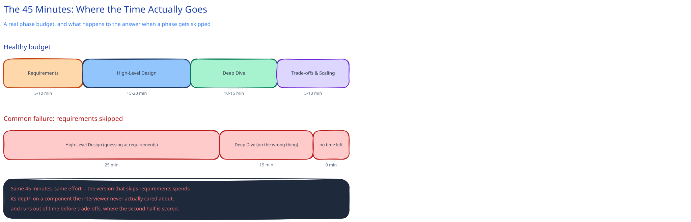

# How to Approach a System Design Interview

Every module in this guide's [Case Studies](../case-studies/url-shortener/README.md) works through the same chain: requirement → architecture decision → interface → schema. This page is the meta-version — the actual time budget and behavior that chain has to fit into during a real 45-60 minute interview, where the thing being evaluated is as much *how* you get to the design as the design itself.

## The shape of the 45 minutes

Roughly: 5-10 minutes on requirements, 15-20 on high-level design, 10-15 on going deep on one or two components (the interviewer usually picks which), and 5-10 on wrap-up/trade-offs/scaling. The single most common failure mode isn't a wrong answer — it's spending 25 minutes on requirements and HLD and leaving no time to go deep on anything, or the reverse: jumping to boxes in the first 2 minutes and designing for guesses instead of constraints, which this guide's own [Practice Problems](../case-studies/url-shortener/README.md) module calls out directly.

## Requirements: ask, don't assume

State functional requirements back to the interviewer in your own words before drawing anything — this catches a misunderstanding in 30 seconds instead of 20 minutes in. Then ask for the numbers that actually drive the architecture: scale (users, requests/day), read:write ratio, latency expectations, consistency needs. This guide's own worked examples ([the URL Shortener's HLD](../../01-hld-fundamentals.md) is the clearest instance) show why this matters concretely: a 100:1 read:write ratio is the single fact that justifies putting a cache in the design at all — skip asking, and you either guess right by luck or design the wrong system confidently.

## High-level design: boxes justified by requirements, not habit

Every box should trace back to a requirement already on the table. A cache, a queue, a second data store — each one should be a direct answer to a number or a constraint the interviewer gave you, not a default "systems have these" reflex. This is exactly the discipline this guide's [Rigor bar](../case-studies/url-shortener/README.md) names: if you can't say which requirement justifies a component, you're about to be asked why it's there, and "it's standard" is not going to hold up.

## Going deep: let the interviewer steer, then commit

When asked to go deeper on one component, that's a signal, not an interruption — it usually means the interviewer wants to see real depth on the specific decision they think matters most (a schema, a concurrency race, an algorithm choice). Commit to a specific answer rather than listing options and trailing off — "I'd use optimistic locking here because writes are rare and conflicts would be visible immediately" is a stronger answer than "you could use pessimistic or optimistic locking."

## Trade-offs: name the alternative, every time

Every real decision in this guide gets stated as "why X, not Y" with Y named explicitly — this isn't a stylistic quirk, it's the actual signal an interviewer is listening for. Saying "I chose a message queue" is an answer; saying "I chose a queue over a synchronous API call because the analytics write doesn't need to block the redirect, and the cost is eventual rather than immediate consistency on the click count" is a trade-off, and trade-offs are what the second half of most interviews are actually scoring.

## Interviewer follow-ups

**What if you don't know the answer to a specific follow-up?**
Say so, then reason toward an answer out loud from principles you do know — "I haven't worked with that specific tool, but here's how I'd think about it" reads as a stronger signal than a confident guess dressed up as certainty, and a wrong confident guess is worse than an honest gap.

**How do you handle a requirement that seems to conflict with another?**
Name the conflict explicitly and ask which one wins — this guide's [CAP theorem page](../foundations/latency-throughput-cap.md) is the canonical instance of exactly this move: strong consistency and full availability during a partition are a real conflict, and stating which one the system gives up (and why) is the answer, not picking silently.

**Is it bad to change your design mid-interview?**
No — revising a decision out loud when a new constraint surfaces ("actually, given that read:write ratio, I'd move the cache here instead") reads as adaptability, not inconsistency. What reads badly is silently ignoring a constraint that contradicts an earlier choice.
